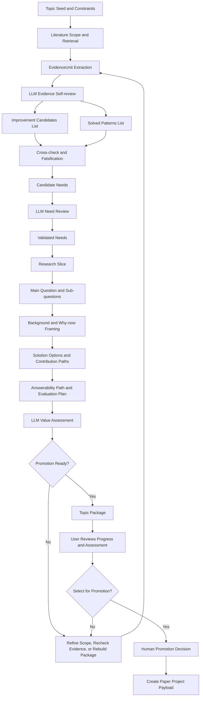
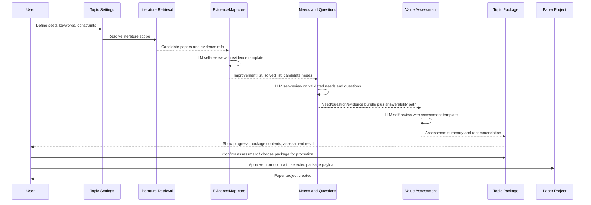

# Automated Topic Management - Roadmap

## Goal
- 为仓库补齐 `topic settings` 与 `paper-project` 之间的“选题决策中间层”，先以文档和契约为主，收敛 MVP 边界、对象模型、阶段计划与验证口径。

## Planning-mode context and merge policy
- Runtime mode signal: Default
- User confirmation when signal is unknown: not-needed
- Host plan artifact path(s): (none)
- Requirements baseline: `automated_topic_notes.md`, `docs/project/overview/requirements.md`
- Merge method: set-union
- Conflict precedence: latest user-confirmed > requirement.md > host plan artifact > model inference
- Repository SSOT output: `dev-docs/active/automated-topic-management/roadmap.md`
- Mode fallback used: non-Plan default applied: yes

## Input sources and usage
| Source | Path/reference | Used for | Trust level | Notes |
|---|---|---|---|---|
| User-confirmed instructions | chat (2026-03-17) | 先对齐思路、生成完整任务包、基于 roadmap 继续讨论 | highest | 明确要求当前不进入实现 |
| Topic design baseline | `automated_topic_notes.md` | 模块主线、对象模型、Phase 切分、风险清单 | high | 作为本任务的设计主输入 |
| Product requirements | `docs/project/overview/requirements.md` | 产品定位、in/out-of-scope、claims-evidence 约束 | high | 明确“不替代研究选题” |
| Existing API baseline | `docs/context/api/openapi.yaml` | 当前 topic / literature / paper-project 接口边界 | high | 用于识别现有缺口 |
| Existing active task | `dev-docs/active/topic-initial-pull-and-rule-preview/00-overview.md` | 区分 topic settings 改造与选题决策层 | medium | 避免与现有任务混 scope |
| Existing implementation baseline | `apps/backend/src/services/research-lifecycle-service.ts` | 明确当前 `createPaperProject` 输入边界 | medium | 用于后续 promotion 映射 |
| LLM 自审契约 | EvidenceReview / NeedReview / ValueAssessment 及 common envelope（字段与枚举见 02-architecture） | 三类自审产物形态、EvidenceMap-core/ValidatedNeed/TopicValueAssessment 对应、落地策略 | high | 契约内容已内嵌于 02-architecture，不依赖外部 schema 路径 |
| Model inference | N/A | 任务拆分、风险排序、MVP 收敛 | lowest | 仅用于填补未决项 |

## Non-goals
- 不在本任务包阶段直接修改前后端代码、数据库结构或 OpenAPI 合同。
- 不把 `topic settings` 直接升级成 `research question` 对象。
- 不在本阶段承诺完整 `EvidenceMap` 图谱增强、自动聚类、图形化可视化或多 agent 自动编排。
- 不让系统替代人工做研究路线决策、价值判断或自动 promote。
- 不把大多数中间审查节点设计成必须等待用户逐步确认的同步卡点。

## Open questions and assumptions
### Open questions (answer before execution)
- Q1: MVP 的 `EvidenceMap-core` 最小合同是什么，哪些字段和回路必须存在才能闭环？
- Q2: `TopicPackage` 在首版中是持久化快照对象，还是运行时聚合视图？
- Q3: promotion 是否强制人工审批，审批角色是否限于 owner / reviewer？
- Q4: 该模块在产品 IA 上是否独立成“选题工作台”，还是挂在“方向池”下的二级工作区？
- Q5: `TopicPackage` 与 `PaperProject` 的字段同步边界是否需要冻结策略？
- Q6: LLM 自审模板在 MVP 是统一默认模板，还是按 venue / contribution type 分层配置？
- Q7: 契约 SSOT 的正式存放位置（若将 JSON Schema 迁入 repo：docs/context 子目录 vs 独立包）及与 API/DB 的引用方式。

### Assumptions (if unanswered)
- A1: 首版按“文档与契约先行”推进，后续实现任务再拆分执行。 (risk: low)
- A2: MVP 必须包含 `EvidenceMap-core`，至少支持 evidence units、problem/solution/limitation 归档、support/challenge 链接与 refresh/recheck 回路；后置的是图谱增强与可视化。 (risk: low)
- A3: 现有 `topic settings` 继续保留“检索配置对象”定位，不直接承担研究命题语义。 (risk: low)
- A4: 新任务默认挂在 `F-001` 下，作为 research lifecycle governance 的上游决策层扩展。 (risk: medium)
- A5: 默认流程中，大多数审查节点由 LLM 按模板执行自审；用户主要查看进展、确认 assessment，并从 `TopicPackage` 中选择晋升对象。 (risk: low)

## Merge decisions and conflict log
| ID | Topic | Conflicting inputs | Chosen decision | Precedence reason | Follow-up |
|---|---|---|---|---|---|
| C1 | 模块定位 | 继续扩展 `topic settings` vs 新建决策层 | 新建 topic-to-paper 的中间决策层 | 用户要求先对齐方案；设计稿主线明确存在中间层 | 在 roadmap 与 architecture 中固化边界 |
| C2 | MVP 范围 | 先做完整 EvidenceMap vs 完全不做 EvidenceMap | MVP 保留 `EvidenceMap-core`，后置完整图谱增强 | 用户指出无 EvidenceMap 难以闭环；设计稿流程本身存在回路 | 在 architecture 中定义 core vs enhanced 边界 |
| C3 | 任务治理映射 | 继续复用现有 topic 任务 vs 新建复杂任务包 | 新建 `T-014` | 当前 `T-013` 仅处理 topic settings/rule preview | registry 新增 requirement/task 映射 |
| C4 | promotion 方式 | 自动评分驱动立项 vs 人工审批 | 人工审批必需 | 产品 requirements 明确不替代研究判断 | 在 architecture doc 中写成 invariant |
| C5 | 审查执行模式 | 大量 user checkpoint vs LLM 自审为主 | LLM 自审为主，user 负责监督与最终确认 | 用户明确要求保持自动化流程 | 在 process model 和 architecture 中固化 |

## Scope and impact
- Affected areas/modules:
  - `dev-docs/active/automated-topic-management/`
  - `.ai/project/main/registry.yaml`
  - `.ai/project/main/{dashboard.md,feature-map.md,task-index.md}` (generated)
- External interfaces/APIs:
  - 仅定义未来拟新增的 topic decision / promotion 契约方向，不在本阶段落代码
- Data/storage impact:
  - 本任务仅产出文档与治理映射；后续实现阶段预计新增选题中间对象持久化结构
- Backward compatibility:
  - 首版规划要求与现有 `/topics/settings`、`/topics/{topicId}/literature-scope`、`/paper-projects` 兼容

## Consistency baseline for dual artifacts (if applicable)
- [x] Goal is semantically aligned with host plan artifact
- [x] Boundaries/non-goals are aligned
- [x] Constraints are aligned
- [x] Milestones/phases ordering is aligned
- [x] Acceptance criteria are aligned
- Intentional divergences:
  - (none)

## Project structure change preview (may be empty)
This section is a non-binding, early hypothesis to help humans confirm expected project-structure impact.

### Existing areas likely to change (may be empty)
- Modify:
  - `docs/context/api/`
  - `docs/context/glossary.json`
  - `docs/context/architecture-principles.md`
  - `apps/backend/src/`
  - `apps/desktop/src/renderer/`
- Delete:
  - (none)
- Move/Rename:
  - (none)

### New additions (landing points) (may be empty)
- New module(s) (preferred):
  - `dev-docs/active/automated-topic-management/`
  - `<TBD> topic-assessment or topic-workspace backend module`
  - `<TBD> topic workspace frontend area`
- New interface(s)/API(s) (when relevant):
  - `<TBD> /topics/{topicId}/needs`
  - `<TBD> /topics/{topicId}/question`
  - `<TBD> /topics/{topicId}/value-assessment`
  - `<TBD> /topics/{topicId}/promotion`
- New file(s) (optional):
  - `roadmap.md`, `00~05`, `.ai-task.yaml`

## Process model
### Flowchart


### Sequence diagram


### Review automation model
- 默认模式：
  - 中间审查节点由 LLM 按模板执行自审
  - 用户默认不需要逐步批准每个节点
- 用户交互保留在三个关键点：
  - 查看流程进展与当前状态
  - 查看并确认 `assessment` 结果
  - 从一个或多个 `TopicPackage` 中选择是否晋升
- 需要模板化的 LLM 自审节点：
  - evidence extraction review（产出形态：evidence_review template，对应 EvidenceMap-core EvidenceUnit）
  - improvement vs solved cross-check
  - candidate need falsification review（产出形态：need_review template，对应 ValidatedNeed）
  - question/package consistency review
  - value assessment review（产出形态：value_assessment template，对应 TopicValueAssessment）
- 上述三份 template 的字段与 common envelope 已内嵌于 02-architecture，实现时以该文档为准。
- 模板要求：
  - 需绑定 evidence refs
  - 需输出 objections / confidence / next action
  - 需允许 venue-aware 或 contribution-aware 扩展

### EvidenceMap-core output model
- Layer 1: `EvidenceUnit`
  - 单篇文献或单条证据抽取单元
  - 包含 paper/source refs、problem、solution、claimed benefit、assumptions、limitations、confidence
- Layer 2: `Improvement Candidates List`
  - 从证据中抽出的“可改进之处”候选
  - 只能作为线索，不能直接等于真实需求
- Layer 3: `Solved Patterns List`
  - 当前已有工作已较充分解决的问题模式与方案族
  - 用于防止伪 gap 和 limitation harvesting 偏差
- Layer 4: `Candidate Needs`
  - improvement list 与 solved list 交叉审查后的候选需求
  - 必须带 support/challenge links
- Layer 5: `Validated Needs`
  - 经人工确认后仍成立、可进入后续 question/value 阶段的真实需求

### TopicPackage generation order
1. `Validated Needs`
   - 先确定 package 服务的是哪一个或哪一组真实需求
2. `Research Slice`
   - 明确问题空间边界、适用场景、目标对象
3. `Main Question and Sub-questions`
   - 形成主问题、子问题、贡献切口
4. `Research Background`
   - 说明为什么这个问题成立、为什么现有工作仍不足
5. `Solution Options`
   - 一组候选研究方案或贡献路径，而不是单一路径拍板
6. `Answerability Path`
   - 说明评测路径、可回答性、所需数据/基线/资源
7. `Value Assessment Summary`
   - 汇总 significance/originality/answerability/venue fit 与 reviewer objections
8. `Title Candidates`
   - 标题后置，作为 package 的外显表达，不驱动前序判断
9. `Promotion Payload`
   - 生成可映射到 `createPaperProject` 的最小 payload

## Phases
1. **Phase 1**: Planning baseline and governance registration
   - Deliverable: 完整任务包、roadmap、registry 映射
   - Acceptance criteria: 文档结构完整，目标/边界/MVP 路线一致，治理索引可查询
2. **Phase 2**: Domain model and contract finalization
   - Deliverable: `EvidenceMap-core / ValidatedNeed / TopicQuestion / TopicValueAssessment / TopicPackage / PromotionDecision` 的正式边界与字段草案；LLM 自审模板的正式形态以 EvidenceReview / NeedReview / ValueAssessment 及 common envelope 为契约基线，对象与三份 template 的字段级对应表已写入 02-architecture（内嵌、无外部路径引用）。
   - Acceptance criteria: 每个对象有清晰职责、与现有 topic/paper 契约的映射明确；02-architecture 中已写出对象与 LLM 自审契约的对应关系及 artifact landing strategy。
3. **Phase 3**: MVP implementation plan
   - Deliverable: 后端、前端、数据、验证的分阶段执行方案
   - Acceptance criteria: 可拆成可执行的实现任务，不混淆 discovery/MVP/enhancement
4. **Phase 4**: Evidence-first and lifecycle integration expansion
   - Deliverable: `EvidenceMap` 完整化、recheck 机制、与 `paper-project` 深度整合的后续计划
   - Acceptance criteria: 明确哪些进入 MVP，哪些后置

## Step-by-step plan (phased)
> Keep each step small, verifiable, and reversible.

### Phase 0 - Discovery
- Objective: 确认现有 topic/literature/paper-project 的契约边界，以及本模块应补的中间层职责。
- Deliverables:
  - 边界结论：`topic settings` != `research question`
  - 现状结论：当前缺的是 decision layer，不是 retrieval layer
- Verification:
  - 对照 `automated_topic_notes.md`
  - 对照 `docs/context/api/openapi.yaml`
  - 对照 `apps/backend/src/services/research-lifecycle-service.ts`
- Rollback:
  - N/A

### Phase 1 - Planning bundle creation
- Objective:
  - 创建可 handoff 的完整任务包，并将其注册到项目治理层。
- Deliverables:
  - `.ai-task.yaml`
  - `roadmap.md`
  - `00-overview.md`
  - `01-plan.md`
  - `02-architecture.md`
  - `03-implementation-notes.md`
  - `04-verification.md`
  - `05-pitfalls.md`
- Verification:
  - 任务目录完整
  - 状态与 registry 一致
- Rollback:
  - 删除 `dev-docs/active/automated-topic-management/`
  - 回退 registry 新增 requirement/task 条目后重新 `sync`

### Phase 2 - Domain and contract alignment
- Objective:
  - 基于设计稿，把 `EvidenceMap-core`、中间对象、状态流转、promotion 规则与现有 paper lifecycle 映射清楚；将 LLM 自审契约（common envelope + EvidenceReview / NeedReview / ValueAssessment）内嵌于 02-architecture，并写出对象与契约的字段级对应及 artifact landing strategy。
- Deliverables:
  - `EvidenceMap-core` 最小字段与回路合同
  - Evidence outputs 分层定义：improvement / solved / candidate need / validated need
  - LLM 自审节点与 review template 边界；common envelope 必填字段及三份 template 关键字段（见 02-architecture 内嵌小节）
  - 对象与 EvidenceReview/NeedReview/ValueAssessment 的字段级对应表（见 02-architecture）
  - Artifact landing strategy：Phase 1 存 EvidenceReview 于 LiteraturePipelineArtifact.payload，NeedReview/ValueAssessment 为 topic-level artifact；Phase 2 可晋升为一类表（见 02-architecture）
  - 对象职责表
  - `TopicPackage` 的内容结构与生成顺序
  - promotion payload 设计方向
  - MVP 与 enhancement 边界
- Verification:
  - 每个对象都能回答“为什么存在、由谁写、被谁消费”
  - `EvidenceMap-core` 能支撑 improvement list、solved list、validated needs 的闭环
  - LLM 自审产物的字段要求与 02-architecture 内嵌的 common envelope + 三份 template 一致
  - `TopicPackage` 能支撑后续 research framework 与写作引用
  - 大多数节点无需用户逐步确认，流程仍能自动推进
  - 流程存在 evidence refresh -> need recheck -> question/value reassess 的闭环
  - `TopicPackage -> createPaperProject` 映射具备最低可执行性
- Rollback:
  - 如果对象拆分过深，退回到 `EvidenceMap-core + 四对象闭环`

### Phase 3 - Implementation decomposition
- Objective:
  - 把执行工作拆成独立实现任务，而不是在一个大任务里混做。
- Deliverables:
  - backend task slice（shared contracts、repository、service、controller、routes；见 02-architecture 后端契约与实现基线、03-implementation-notes integration notes）
  - frontend task slice
  - docs/context task slice
  - verification strategy（测试矩阵与清单见 04-verification）
- Verification:
  - 每个实现任务都有独立输入、输出、验收
  - 测试执行顺序：shared schema test -> repository test -> service test -> routes test
- Rollback:
  - 若拆分过细导致治理成本过高，回收为单个 MVP 实现任务

### Phase 4 - Post-MVP evolution
- Objective:
  - 明确 `EvidenceMap`、价值评估增强、portfolio 管理、lifecycle integration 的后续顺序。
- Deliverables:
  - 后续 enhancement backlog
  - 非 MVP 范围说明
- Verification:
  - backlog 顺序与设计稿一致
  - 不把图谱增强项和高级编排挤进 MVP
- Rollback:
  - 维持 Phase 2/3 输出，不推进增强项

## Verification and acceptance criteria
- Build/typecheck:
  - N/A（本任务为文档与治理任务）
- Automated tests:
  - `node .ai/scripts/ctl-project-governance.mjs sync --apply --project main`
  - `node .ai/scripts/ctl-project-governance.mjs lint --check --project main`
- Manual checks:
  - 检查 roadmap 是否明确给出模块边界、MVP 和 open questions
  - 检查 `00~05` 是否足以支撑多轮讨论与后续 handoff
  - 检查 registry 中 requirement/task 映射是否可查询
- Acceptance criteria:
  - 新任务包完整落盘并可被治理脚本识别
  - roadmap 明确区分 planning、MVP、enhancement
  - 文档已记录关键未决问题，便于下一轮讨论直接收敛

## Risks and mitigations
| Risk | Likelihood | Impact | Mitigation | Detection | Rollback |
|---|---:|---:|---|---|---|
| 将 `topic settings` 错当成研究命题层 | med | high | 在文档中强制区分 profile/settings 与 question/package | 讨论时出现对象职责重叠 | 回退到“中间决策层”边界定义 |
| MVP 因完全缺少 `EvidenceMap` 而无法形成闭环 | high | high | 把 `EvidenceMap-core` 纳入 MVP，保留最小回路与 recheck 机制 | need/question/value 无法回溯到证据或无法重审 | 收敛为最小 core 合同，不做增强特性 |
| MVP 被 `EvidenceMap` 增强实现拖大 | high | high | 明确后置自动聚类、可视化、复杂图谱与多角色编排 | roadmap/plan 出现图谱 UI 或高级编排范围 | 收敛回 `EvidenceMap-core` |
| 与现有 `paper-project` 契约衔接不清 | med | high | 提前定义 `TopicPackage -> createPaperProject` 映射方向 | promotion 讨论无法落到 payload | 补充映射表，冻结复杂字段 |
| 任务治理映射漂移 | low | med | 同步 registry 并运行 sync/lint | governance warning/error | 回退 registry 变更后重建 |

## Optional detailed documentation layout (convention)
If you maintain a detailed dev documentation bundle for the task, the repository convention is:

```text
dev-docs/active/automated-topic-management/
  roadmap.md
  00-overview.md
  01-plan.md
  02-architecture.md
  03-implementation-notes.md
  04-verification.md
  05-pitfalls.md
```

Suggested mapping:
- The roadmap's Goal/Non-goals/Scope -> `00-overview.md`
- The roadmap's Phases -> `01-plan.md`
- The roadmap's Architecture direction -> `02-architecture.md`
- Decisions/deviations during execution -> `03-implementation-notes.md`
- The roadmap's Verification -> `04-verification.md`

## To-dos
- [x] Confirm planning-mode signal handling and fallback record
- [x] Confirm input sources and trust levels
- [x] Confirm merge decisions and conflict log entries
- [x] Confirm open questions
- [x] Confirm phase ordering and DoD
- [x] Confirm verification/acceptance criteria
- [x] Confirm rollout/rollback strategy
