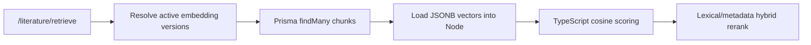
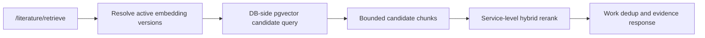

# 02 Architecture

## Current Architecture

## Problem
- The service currently pulls all candidate chunk vectors into Node before vector scoring.
- With unscoped retrieval, the candidate set is all evidence-ready active versions.
- Current active corpus already has about 24.8k embedding chunks.
- Each current embedding is 3072 dimensions.
- This makes unscoped retrieval memory/serialization-heavy and can fail before scoring.

## Target Architecture

## Recommended Storage Strategy
- Use an additive native vector column rather than replacing JSONB immediately.
- Keep `vector Json` during migration as:
  - rollback source.
  - parity-check source.
  - compatibility source for tests and tools that still rely on JSONB vectors.
- Add a native pgvector column with an explicit dimension aligned to the active embedding profile.
- Current active profile evidence points to `text-embedding-3-large` with 3072 dimensions.

## Dimension Policy
- Near-term policy:
  - one active literature retrieval embedding dimension at a time.
  - native vector index dimension follows the active profile.
  - incompatible embedding versions are skipped as today.
- Future policy options:
  - separate tables or columns per dimension.
  - profile-specific native vector indexes.
  - migration-time re-embedding when the active profile changes.

## Query Shape
- Generate query embedding through the active retrieval profile.
- Use Postgres native vector distance to fetch bounded top candidate chunks.
- Apply existing service-level logic after DB candidate selection:
  - lexical score.
  - metadata score.
  - stale warning filtering.
  - same-work dedup.
  - evidence-per-literature grouping.

## Migration Safety
- Additive first:
  - extension and new vector column.
  - backfill from JSONB.
  - dual-write on new embeddings.
  - dual-read/parity checks.
- Cutover later:
  - route retrieval through pgvector candidate query.
  - keep JSONB fallback until several verification runs pass.
- Removal last:
  - only remove JSONB vector storage after a separate cleanup task.

## Open Design Questions
- Should the native vector column be represented in Prisma as `Unsupported("vector")` or managed through raw SQL only?
- Should the first implementation use HNSW or IVFFlat for the local corpus size and expected 5k-paper target?
- Should native vector indexing be required for partial visual indexes, or should partial indexes remain JSONB-compatible fallback until full migration?
- Should unscoped retrieval continue to be allowed after pgvector cutover, or should it still enforce a maximum candidate policy?
