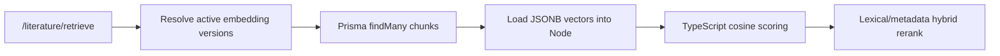
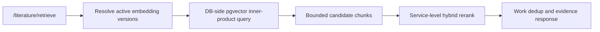

# 02 Architecture

## Current Architecture

## Problem
- The service currently pulls all candidate chunk vectors into Node before vector scoring.
- With unscoped retrieval, the candidate set is all evidence-ready active versions.
- Current active corpus already has about 24.8k embedding chunks.
- Each current embedding is 3072 dimensions.
- This makes unscoped retrieval memory/serialization-heavy and can fail before scoring.

## Target Architecture

## Recommended First-Phase Storage Strategy
- Use an additive native vector column rather than replacing JSONB immediately.
- Keep `vector Json` during migration as:
  - raw provider-vector source.
  - rollback source.
  - parity-check source.
  - compatibility source for tests and tools that still rely on JSONB vectors.
- Add a native pgvector column with an explicit dimension aligned to the active embedding profile.
- Current active profile evidence points to `text-embedding-3-large` with 3072 dimensions.
- First-phase decision: use `vector(3072)` storing L2-normalized vectors.
- Keep full precision in the first phase; do not use `halfvec(3072)` as the primary storage column during the storage migration.
- The implementation migration must verify `vector(3072)` support in a temporary Postgres database before cutover.

## Storage Shape Decision
- First implementation pass: add a native pgvector column to `LiteratureEmbeddingChunk`.
- Rationale:
  - The current system has one active retrieval embedding profile/dimension at a time.
  - A chunk currently has one retrieval vector in practice.
  - The JSONB `vector` can remain the raw provider vector while the native column becomes the normalized retrieval vector.
  - The write path already persists `LiteratureEmbeddingVersion` plus `LiteratureEmbeddingChunk` as the embedding snapshot authority.
  - Keeping the native vector on the chunk row minimizes migration and repository churn.
- Treat the native column as the first pgvector candidate store, not as a permanent architectural lock-in.
- Keep retrieval code behind a repository candidate-query method so a later table split is a persistence-layer substitution, not a service-layer rewrite.

## Final Schema Field Naming
- Field name decision: use `retrievalVector` for the native pgvector column.
- During additive migration:
  - `vector Json` remains the raw provider vector for rollback and parity.
  - `retrievalVector Unsupported("vector(3072)")?` stores the normalized retrieval vector.
- During final cleanup:
  - remove legacy `vector Json` from the repo-prisma DB SSOT.
  - make `retrievalVector Unsupported("vector(3072)")` required after coverage and stable gates pass.
  - do not rename `retrievalVector` back to `vector`.
- Rationale:
  - `vector` currently means raw provider-vector JSONB.
  - `retrievalVector` names the business purpose and remains valid if implementation details such as pgvector operators or acceleration change later.
  - Names such as `vectorNative` or `pgvectorVector` encode migration or storage mechanics rather than stable retrieval semantics.
  - Names such as `normalizedVector` describe one invariant but not the field's ownership or retrieval purpose.
- Evolution guardrail:
  - any stable consumer that currently reads `LiteratureEmbeddingChunk.vector` must be audited during cleanup.
  - consumers that need retrieval similarity should move to repository-level pgvector methods, not keep JSONB vectors alive as a secondary authority.
  - consumers that need non-retrieval raw embedding artifacts must declare separate ownership before `vector Json` is removed.

## Prisma And Raw SQL Boundary
- Represent the native pgvector column in `prisma/schema.prisma` using `Unsupported("vector(3072)")`.
- Keep the field nullable in the first migration window so existing chunk creation and rollback paths remain safe.
- Use Prisma schema only for SSOT visibility, drift detection, and context contract generation.
- Do not depend on Prisma Client for pgvector behavior:
  - extension enablement belongs in migration SQL.
  - vector backfill and dual-write conversion belong in repository-scoped raw SQL.
  - inner-product candidate queries using pgvector operators belong in repository-scoped raw SQL.
- Rationale:
  - Pure raw SQL without schema representation would hide the column from repo-prisma SSOT and LLM-readable DB context.
  - Pure Prisma Client access would not expose the pgvector operators and index behavior needed for performant candidate selection.
  - A mixed boundary keeps the persistence contract visible while keeping performance-critical vector operations explicit.

## Separate Table Deferral Criteria
- Do not create a separate `LiteratureEmbeddingVectorIndex` table for the first pass unless one of these becomes true:
  - the same chunk needs multiple dense vectors for different models, dimensions, or embedding profiles.
  - standard fulltext, partial visual, OCR-derived, summary-only, or rerank-specific indexes need to coexist for the same literature instead of replacing the active version.
  - vector candidate-store lifecycle needs independent backfill, repair, activation, health checks, rebuilds, or rollback outside the chunk lifecycle.
  - vector storage or future acceleration maintenance makes the main chunk table too heavy for vacuum, backup, migration, or rebuild windows.
  - evaluator parity needs multiple native index candidates to remain active side-by-side.
- Long-term rule: split to a separate table when vector storage changes from a one-to-one chunk attribute into a one-to-many index asset.

## Dimension Policy
- Near-term policy:
  - one active literature retrieval embedding dimension at a time.
  - native vector column is fixed to `vector(3072)` for the current active profile.
  - incompatible embedding versions are skipped as today.
- Rationale:
  - fixed `vector(3072)` catches profile/dimension mismatch early.
  - full precision gives the cleanest parity baseline against the current JSONB vectors.
  - half precision and reduced-dimension strategies are future acceleration decisions, not first-phase storage decisions.
- Future policy options:
  - separate tables or columns per dimension.
  - profile-specific native vector candidate stores.
  - migration-time re-embedding when the active profile changes.

## Operator And Norm Policy
- First-phase decision: use pgvector `<#>` for DB-side exact candidate ordering.
- The native `vector(3072)` column stores L2-normalized vectors, not raw provider vectors.
- The query embedding must be L2-normalized before SQL.
- Do not rely on provider output being unit length:
  - backfill must compute raw norm distribution from JSONB vectors.
  - write path must reject or quarantine zero-norm, non-finite, wrong-dimension, or abnormal-norm vectors.
  - native vector rows must verify `vector_norm(...)` is close to `1`.
- Score mapping:
  - `<#>` returns negative inner product.
  - `dot = -1 * (native_vector <#> query_vector_normalized)`.
  - `vector_score = clamp((dot + 1) / 2, 0, 1)` to preserve the current `normalizedCosine` scale.
- Rationale:
  - current TypeScript scoring computes normalized cosine from raw vectors at query time.
  - inner product over normalized vectors is equivalent to cosine similarity.
  - choosing `<#>` now keeps the exact path aligned with a likely future `vector_ip_ops` acceleration path without selecting that acceleration in the first phase.

## Query Shape
- Generate query embedding through the active retrieval profile.
- L2-normalize the query embedding.
- Use Postgres exact inner-product ordering to fetch bounded top candidate chunks.
- Query within the already resolved active/evidence-ready embedding version set.
- Allow unscoped requests only as bounded candidate retrieval; the DB query and service response must not become unbounded full-corpus materialization.
- Do not hard-code `status = INDEXED`; active partial versions such as `PARTIAL_INDEXED` must remain retrievable when they are the literature's active embedding version.
- Apply existing service-level logic after DB candidate selection:
  - lexical score.
  - metadata score.
  - stale warning filtering.
  - same-work dedup.
  - evidence-per-literature grouping.

## Repository And Service Boundary
- First-phase decision: pgvector-specific persistence behavior is repository-owned.
- Repository owns:
  - raw SQL for `<#>` candidate ordering.
  - access to the normalized native `vector(3072)` column.
  - candidate limit and per-literature cap enforcement.
  - DB-side active/evidence-ready embedding-version filters supplied by the service.
  - vector score mapping from negative inner product to the existing normalized cosine scale.
  - candidate-query telemetry.
- Service owns:
  - resolving active/evidence-ready embedding versions.
  - L2-normalizing the query vector before passing it to the repository.
  - lexical score, metadata score, stale-warning filtering, same-work dedup, evidence grouping, and final topK.
  - cutover/shadow-read orchestration and parity evaluation.
- Repository method input shape:
  - compatible active/evidence-ready `embeddingVersionIds`.
  - normalized query vector.
  - `candidate_limit`.
  - `per_literature_candidate_cap`.
  - include/exclude stale context if the implementation pushes stale filtering below service.
- Repository method output shape:
  - chunk identity and text fields needed for rerank/evidence.
  - literature and embedding version identifiers.
  - `vector_score`.
  - raw inner-product diagnostic value.
  - candidate-query telemetry.
- Boundary constraints:
  - do not return raw JSONB vectors to the service on the pgvector path.
  - do not expose `candidate_limit` as a public API parameter in the first phase.
  - do not let controller or service code compose pgvector SQL.
  - a future separate candidate store must be swappable behind the same repository method.

## Candidate Window And Rerank Policy
- First-phase decision: DB candidate retrieval uses an internal rerank window, not a public API parameter.
- Existing request bounds remain the public contract:
  - `top_k`: default `10`, range `1..30`.
  - `evidence_per_literature`: default `3`, range `1..5`.
- Candidate limit formula:
  - `candidate_limit = clamp(top_k * evidence_per_literature * profile_multiplier, 200, ceiling)`.
  - unscoped ceiling: `1200`.
  - scoped ceiling: `2000`.
- Profile multipliers:

| Profile | Multiplier | Rationale |
| --- | ---: | --- |
| `general` | 8 | vector-heavy default profile still needs lexical/metadata rerank room |
| `topic_exploration` | 10 | topic exploration benefits from broader evidence diversity |
| `writing_evidence` | 10 | evidence chunks and fulltext paragraphs need rerank room |
| `paper_management` | 12 | lexical and metadata weights are highest, so vector-only prefilter needs the widest window |

- Per-literature cap:
  - `per_literature_candidate_cap = clamp(evidence_per_literature * 2, 4, 12)`.
  - apply after active/evidence-ready/stale filtering and before service rerank.
  - the goal is to prevent one highly similar literature from consuming most of the candidate window.
- Rationale:
  - DB `<#>` ranks by vector similarity only.
  - final hits are ranked after lexical, metadata, stale filtering, same-work dedup, and evidence grouping.
  - overfetch protects literature-level topK from chunk-level vector-only truncation.
- Required telemetry:
  - `candidate_limit`.
  - `candidate_returned`.
  - `candidate_limit_hit`.
  - `per_literature_candidate_cap`.
  - `filtered_embedding_version_count`.
  - `filtered_chunk_count`.
  - scoped vs unscoped mode.
  - DB similarity-query latency.
  - post-rerank drop rate.

## First-Phase Boundary
- The first phase is an exact DB-side candidate retrieval pass.
- It solves the immediate failure mode:
  - avoid loading all active JSONB vectors through Prisma into Node.
  - return only bounded candidate chunks to the service layer.
- It intentionally does not solve every retrieval-scale problem:
  - Postgres still computes exact inner products over the filtered candidate set.
  - unscoped retrieval can still become expensive as active chunk count grows.
  - no native vector index or acceleration strategy is selected or tuned in this phase.
  - no long-term multi-candidate-store strategy is implemented in this phase.
- Future acceleration/index selection is deferred until first-phase parity and performance evidence shows a concrete need.

## Unscoped Retrieval Boundary
- First phase keeps unscoped retrieval as a compatibility path because upstream workflows may rely on full-corpus evidence discovery.
- Unscoped retrieval is not a long-term unbounded performance commitment.
- Required first-phase boundaries:
  - return only bounded top candidate chunks from the DB candidate query.
  - keep active embedding version, evidence-ready, stale-warning, and partial-index semantics intact.
  - record filtered candidate count and DB similarity-query latency separately for scoped and unscoped calls.
  - define scoped retrieval as the stable path for predictable performance.
- Degradation policy is deferred to implementation evidence:
  - if active chunk count or DB latency crosses an accepted threshold, unscoped retrieval should require scope narrowing or return a clear recoverable error instead of timing out or exhausting memory.
  - exact threshold values should be chosen from first-phase measurements, not guessed in this design pass.

## Migration Cutover State Machine
- `schema_prepare`:
  - create/enable `vector` extension.
  - add nullable `retrievalVector` native column with type `vector(3072)`.
  - represent the column in Prisma as `Unsupported("vector(3072)")`.
  - keep all reads on the JSONB path.
- `backfill`:
  - read raw JSONB vectors.
  - validate dimension, finite values, and non-zero norm.
  - L2-normalize and write native vectors.
  - record raw norm distribution, native norm distribution, invalid row count, and coverage.
  - quarantine/report invalid rows and block cutover for affected active/evidence-ready versions.
- `dual_write`:
  - write raw JSONB vector and normalized native vector for new embedding chunks.
  - keep JSONB as the rollback and parity source.
  - prevent a new embedding version from becoming retrieval-active if native vector coverage is incomplete.
- `shadow_read_parity`:
  - keep user-visible results on JSONB retrieval.
  - run pgvector candidate retrieval as shadow evidence where practical.
  - compare topK overlap, rank drift, score drift, candidate window hit rate, scoped/unscoped latency, stale filtering, partial visual index behavior, and same-work dedup.
- `feature_flag_cutover`:
  - keep pgvector retrieval behind a flag.
  - enable in controlled environments/profiles before default-on rollout.
  - allow automatic per-request JSONB fallback only as a canary safety net.
  - record every canary fallback reason and count.
  - treat any canary fallback as promotion-blocking evidence.
  - do not silently swallow parity, coverage, or norm failures.
- `stabilization`:
  - remove automatic per-request JSONB fallback before stable/default-on pgvector mode.
  - keep explicit feature-flag rollback to JSONB while the first phase is stabilizing.
  - keep JSONB vectors only until stable pgvector gates and rollback drill pass.
  - require repeated parity and latency evidence before default-on rollout.
- `finalize_cleanup`:
  - remove the legacy JSONB retrieval read path.
  - remove the raw JSONB vector column from `LiteratureEmbeddingChunk` through repo-prisma schema cleanup.
  - make `retrievalVector` the required native retrieval vector field after coverage has been proven.
  - remove automatic fallback code/config/tests if any canary-only remnants remain.
  - remove explicit rollback flag and shadow-read-only code after stable proof.
  - remove compatibility docs/tests that imply permanent JSONB/pgvector dual-track retrieval.
  - regenerate DB context and governance artifacts after schema cleanup.

## Rollout And Configuration Boundary
- Decision: use one finite rollout mode instead of multiple independent feature booleans.
- Allowed migration modes:
  - `jsonb_only`: user-visible retrieval reads JSONB only.
  - `shadow_pgvector`: user-visible retrieval reads JSONB; pgvector runs only for parity evidence.
  - `pgvector_canary`: user-visible retrieval reads pgvector; automatic JSONB fallback is allowed only as an observable canary safety net.
  - `pgvector_default`: user-visible retrieval reads pgvector; automatic per-request JSONB fallback is removed, but explicit JSONB rollback may still exist through stabilization.
  - `finalized`: pgvector is the only retrieval authority; JSONB retrieval, fallback, shadow, rollback, and migration control-plane content are removed.
- Invalid combinations:
  - pgvector user-visible reads with shadow-only mode.
  - automatic fallback outside `pgvector_canary`.
  - explicit JSONB rollback in `finalized`.
  - JSONB backend selection as a stable runtime option.
- Migration-only controls:
  - rollout mode storage/config.
  - shadow parity sampling and scope.
  - canary scope.
  - canary fallback switch and fallback reason telemetry.
  - explicit JSONB rollback switch.
  - migration backfill/quarantine wiring.
- Long-term pgvector tuning may remain after final cleanup:
  - candidate window floor and ceilings.
  - profile multipliers.
  - per-literature candidate cap.
  - scoped/unscoped degradation thresholds.
  - DB candidate-query timeout.
  - telemetry sampling.
- Not runtime-configurable:
  - pgvector vs JSONB backend after final cleanup.
  - automatic JSONB fallback.
  - pgvector operator choice for first-phase semantics.
  - `vector(3072)` dimension for this migration.
  - `retrievalVector` field name.
  - norm/data-quality gates.
- Configuration implementation guardrail:
  - keep migration controls internal; do not expose them as public retrieval API parameters.
  - validate mode transitions and fail fast on invalid states.
  - remove migration controls from config contracts during `finalize_cleanup`.

## Implementation Phase Boundaries
- Phase 1 - Infrastructure foundation:
  - owns schema preparation, raw SQL scaffolding, migration-only artifacts, rollout mode scaffolding, telemetry, and temporary-Postgres verification.
  - must leave user-visible retrieval on JSONB.
- Phase 2 - Small-scale migration and validation:
  - owns representative backfill and `shadow_pgvector` parity on a small set.
  - should include `LIT-0252` plus standard fulltext records.
  - must validate retrieval semantics before throughput.
- Phase 3 - Large-scale data migration:
  - owns broad backfill, dual-write, activation blockers, coverage, quarantine, throughput, retry, and recovery evidence.
  - must not switch user-visible retrieval reads.
- Phase 4 - Cutover acceptance:
  - owns mode promotion from `shadow_pgvector` through `pgvector_canary` to `pgvector_default`.
  - validates parity, latency, candidate-window pressure, scoped/unscoped behavior, and partial visual index behavior.
  - must prove canary fallback count is `0` before `pgvector_default`.
- Phase 5 - Final cleanup and legacy removal:
  - owns deletion of JSONB retrieval storage/read paths, migration-only artifacts, rollout controls, fallback, rollback, shadow-read-only paths, compatibility tests, and obsolete docs.
  - is part of migration completion, not optional cleanup.
- Boundary rule:
  - Phase 3 is data migration only.
  - Phase 4 is read-path cutover and acceptance.
  - keeping these separate preserves diagnosability when coverage, parity, or latency fails.

## Migration-Only Durable Artifacts
- Decision: use durable database records during migration, but treat them as migration control-plane artifacts only.
- Recommended records:
  - `LiteratureEmbeddingVectorBackfillRun` for one backfill/repair attempt and aggregate evidence.
  - `LiteratureEmbeddingVectorQuarantineIssue` for row-level blockers that must be fixed before cutover.
- `LiteratureEmbeddingVectorBackfillRun` should capture:
  - run status and target scope.
  - target dimension and target column.
  - workset and totals as compact JSON.
  - error code/message and timestamps.
- `LiteratureEmbeddingVectorQuarantineIssue` should capture:
  - run id, literature id, embedding version id, chunk row id, and chunk id.
  - issue code, severity, status, and resolution timestamp.
  - observed dimension, observed norm, and compact details.
- These records must not store full vector payloads.
- These records must not be read by user-facing retrieval requests.
- These records exist to support:
  - resumable backfill.
  - repeated repair attempts.
  - coverage/quarantine cutover gates.
  - activation blocking during the migration window.
  - final cleanup readiness checks.
- Lifecycle rule:
  - keep these artifacts through `schema_prepare`, `backfill`, `dual_write`, `shadow_read_parity`, `feature_flag_cutover`, and `stabilization`.
  - remove the tables and related repository/service/test code during `finalize_cleanup`, or export a static migration report and delete the runtime tables.
  - after cleanup, new embedding failures use the existing indexing/job error path and do not create long-lived vector quarantine records.

## Cutover Guardrails
- Native vector coverage must be complete for active/evidence-ready embedding versions before pgvector read cutover.
- Backfill errors should not silently skip rows.
- Backfill errors also should not force destructive rollback of schema preparation.
- Preferred policy: write migration-only quarantine issues for invalid rows, block cutover for affected active retrieval, and keep JSONB serving user traffic.
- New embedding versions cannot become retrieval-active unless their raw JSONB vectors and normalized native vectors are both complete.
- Automatic fallback is migration-only:
  - shadow read is not fallback because user-visible reads are still JSONB.
  - canary cutover may use automatic JSONB fallback only as an observable safety net.
  - any canary fallback blocks promotion.
  - stable/default-on pgvector mode must not keep automatic per-request JSONB fallback.
- Rollback is explicit and flag-based in the first phase:
  - switch reads back to JSONB.
  - keep native vectors for investigation and repair.
  - rollback support is removed during `finalize_cleanup` after stable proof.

## Cutover Gates
- Hard blockers:
  - active/evidence-ready native vector coverage is `100%`.
  - unresolved quarantine rows affecting active/evidence-ready retrieval are `0`.
  - wrong-dimension, NaN, Infinity, and zero-norm counts are `0` for active/evidence-ready versions.
  - canary automatic fallback count is `0` before promotion.
  - stable/default-on pgvector mode has no automatic per-request JSONB fallback code path.
- Initial adjustable thresholds:
  - native norm tolerance: `abs(norm - 1) <= 1e-5`.
  - native norm tolerance may relax to `1e-4` only after shadow evidence shows stable floating-point behavior and the change is recorded.
  - score drift between JSONB `normalizedCosine` and native inner-product mapping: P95 `<= 1e-4`, max `<= 1e-3`.
  - final topK overlap: scoped `>= 0.9`, unscoped `>= 0.8`.
  - `candidate_limit_hit` above `20%` across repeated shadow queries blocks default-on rollout.
  - latency: when JSONB baseline is measurable, pgvector P95 must be no higher than `0.7x` JSONB P95.
  - if JSONB baseline fails for unscoped retrieval, record the failure and require pgvector to complete bounded retrieval without Node full-vector loading.
- Observed but not initially hard-blocking:
  - median and P95 rank drift.
  - profile-specific multiplier pressure.
  - post-rerank drop rate.
- Adjustment rule:
  - data quality, coverage, and fallback blockers are not adjustable in first-phase cutover.
  - parity/performance thresholds may be adjusted once after shadow-read evidence, and the adjustment must be documented before promotion.

## Final Cleanup Policy
- Stable/default-on terminal state must have one retrieval path: pgvector.
- The following must be removed after stable gates pass:
  - JSONB retrieval vector column and repo-prisma schema field.
  - JSONB retrieval repository methods or branches used only for fallback/parity.
  - automatic fallback and explicit rollback feature flags.
  - shadow-read-only parity code.
  - migration-only rollout mode/configuration, shadow/canary/fallback settings, and rollback controls.
  - migration-only backfill/quarantine tables and runtime code.
  - tests that preserve JSONB retrieval as a supported stable path.
  - tests that preserve migration rollout states as stable runtime behavior.
  - tests that preserve vector quarantine as stable runtime behavior.
  - documentation that describes JSONB fallback as ongoing behavior.
- Terminal schema requirement:
  - `retrievalVector` is the only retrieval vector field on `LiteratureEmbeddingChunk`.
  - the legacy `vector` field name is not reused for normalized pgvector storage.
  - no stable repository/service consumer depends on `vector Json`.
- Cleanup is blocked until:
  - stable pgvector mode passes repeated cutover gates.
  - rollback drill succeeds before cleanup.
  - no canary fallback events remain unresolved.
  - no open migration-only quarantine issue remains for retained chunk rows.
  - migration-only rollout/config contracts are removed or reduced to stable pgvector tuning only.
  - DB context can be regenerated from the cleaned schema.
- After cleanup, any future rollback is a new migration/recovery task, not a retained runtime dual path.

## Short-To-Mid Evolution Path
- Short term:
  - add normalized native vector storage to `LiteratureEmbeddingChunk`.
  - keep JSONB parity checks and explicit feature-flag rollback.
  - run backfill and shadow-read parity before feature-flag cutover.
  - remove canary automatic fallback before stable/default-on pgvector mode.
  - add a bounded repository method for exact pgvector inner-product candidate retrieval.
  - apply the internal candidate window policy before service rerank.
  - leave lexical, metadata, stale, evidence activation, and same-work dedup in service-level rerank logic.
  - finalize by removing legacy JSONB retrieval storage and code after stable gates pass.
- Mid term, if separate table criteria are met:
  - create a shadow vector-index table.
  - represent the table/vector column in Prisma with `Unsupported(...)` after validating its native type/dimension.
  - backfill from the chunk native vector column; JSONB retrieval vectors are not assumed available after final cleanup.
  - dual-write new embeddings to both stores.
  - run parity queries between chunk-column pgvector and table-backed pgvector.
  - switch the repository candidate-query implementation behind a feature flag.
  - decide separately whether to keep or remove the chunk native vector column.
- Second-phase alternatives if first-phase parity or latency is weak:
  - tune profile multipliers, floors, and scoped/unscoped ceilings using telemetry.
  - add lexical or metadata candidate union before hybrid rerank.
  - add topic/metadata prefiltering or require scope narrowing for costly unscoped retrieval.
  - evaluate native acceleration/index paths aligned with normalized inner product.
  - split to a separate candidate store if multiple retrieval strategies need side-by-side lifecycle.

## Open Design Questions
- Which measured active-chunk or latency threshold should trigger unscoped retrieval degradation or scope narrowing?
