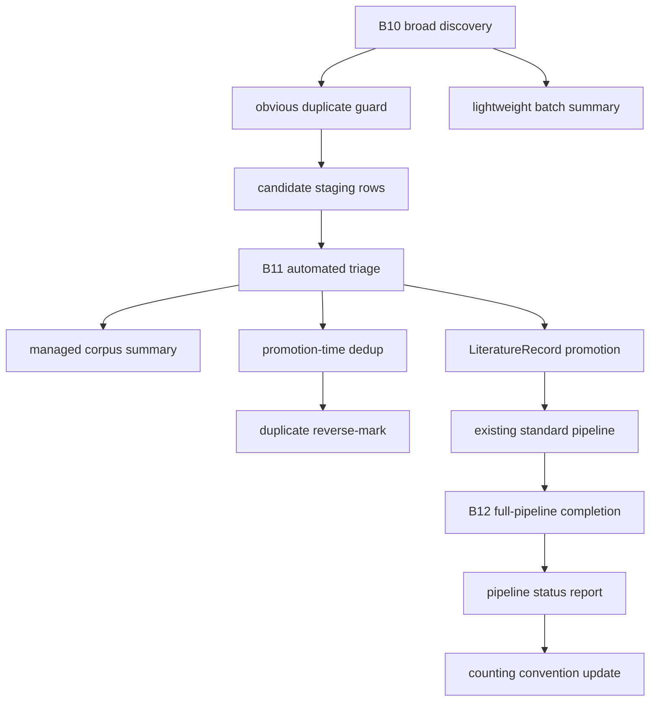

# 02 Architecture

## Corpus Layers


## Layer Semantics

### Candidate Pool
- Broad metadata-first discovery surface.
- Designed for recall, trend scan, citation expansion, and future filtering.
- Must preserve source provenance and dedup identifiers.
- Does not imply evidence readiness.
- Lives in dedicated candidate staging tables, not in `LiteratureRecord`.
- May emit lightweight batch summaries for reproducibility and debugging.

### Managed Pipeline Corpus
- Promoted subset of the candidate pool.
- Lives in `LiteratureRecord` and enters the existing standard literature pipeline.
- Designed for staged processing, blocking, retry, and pipeline completion.
- Must include stable direction/role tags.
- Is not effective literature until the full standard pipeline is complete.

### Effective Literature
- Evidence-ready subset used by topic selection, experiment-base design, and paper implementation.
- Must satisfy the full standard literature pipeline.
- May include documented exceptions such as OCR-required or source-missing blockers.

## Batch Data Flow



## Candidate Staging Tables

### `LiteratureDiscoveryBatch`
- `id`
- `batchCode`
- `directionScope`
- `sourceProviders`
- `queryLedger`
- `summaryStats`
- `status`
- `errorSummary`
- `createdAt`
- `updatedAt`
- `completedAt`

### `LiteratureDiscoveryCandidate`
- `id`
- `batchId`
- `title`
- `normalizedTitle`
- `abstractText`
- `authors`
- `year`
- `venue`
- `doiNormalized`
- `arxivId`
- `openalexId`
- `semanticScholarId`
- `dblpUrl`
- `sourceUrl`
- `sourceProvider`
- `sourcePayload`
- `dedupKey`
- `duplicateReason`
- `duplicateConfidence`
- `status`
- `directionScores`
- `roleScores`
- `relevanceScore`
- `implementationScore`
- `theoryScore`
- `decisionReason`
- `decisionAt`
- `matchedCandidateId`
- `matchedLiteratureId`
- `promotedLiteratureId`
- `createdAt`
- `updatedAt`

## Candidate Lifecycle
- `DISCOVERED`: default status for a newly staged non-duplicate B10 candidate.
- `DUPLICATE`: candidate matched an existing candidate or `LiteratureRecord`.
- `REJECTED`: B11 decides the candidate should not enter the managed corpus.
- `DEFERRED`: B11 decides the candidate may be useful later but should not be promoted in the current run.
- `READY_FOR_PROMOTION`: B11 accepts the candidate and it is ready for the promotion operation.
- `PROMOTED`: candidate has created or linked a `LiteratureRecord`.

Allowed transitions:
- `DISCOVERED -> DUPLICATE`
- `DISCOVERED -> REJECTED`
- `DISCOVERED -> DEFERRED`
- `DISCOVERED -> READY_FOR_PROMOTION`
- `READY_FOR_PROMOTION -> PROMOTED`
- `READY_FOR_PROMOTION -> DUPLICATE`

Lifecycle boundaries:
- Do not add separate retry, queue, or audit states in the initial implementation.
- Operational failures stay in `decisionReason` and batch summary data.
- B11 may re-evaluate `DEFERRED` candidates in a later run and set a new current status.

## Deduplication Boundary
- Candidate staging is the standard ingress for newly acquired external literature.
- Candidate staging runs only lightweight obvious-duplicate checks:
  - exact DOI match.
  - exact arXiv ID match.
  - exact OpenAlex or Semantic Scholar ID match.
  - normalized title plus year plus first-author match.
- Candidate-stage duplicate checks may mark or link candidates, but must not delete candidates or create authoritative literature merges.
- B11 promotion reuses the existing `LiteratureRecord` deduplication and link/merge behavior before creating a new managed-corpus record.
- If B11 identifies a duplicate, the candidate record is reverse-marked:
  - `status=DUPLICATE`.
  - `matchedCandidateId` or `matchedLiteratureId` is set.
  - `duplicateReason`, `duplicateConfidence`, `decisionReason`, and `decisionAt` are recorded.
- Curated seeds should still enter candidate staging, but may be auto-promoted in the same run after provenance and dedup checks are recorded.

## Lightweight Schema Boundary
- Initial implementation uses only:
  - `LiteratureDiscoveryBatch`
  - `LiteratureDiscoveryCandidate`
- Do not add a separate candidate decision-log table in the initial implementation.
- The candidate row stores the current lifecycle state and latest decision only.
- The lifecycle enum stays limited to `DISCOVERED`, `DUPLICATE`, `REJECTED`, `DEFERRED`, `READY_FOR_PROMOTION`, and `PROMOTED`.
- Batch summaries are for debugging and rerun hygiene, not strong audit.
- If later review requires decision history, add it as a separate migration after B10/B11 prove useful at scale.

## Minimal Indexing Boundary
- First-version indexes should support lookup and batch operations:
  - `LiteratureDiscoveryCandidate.batchId`
  - `LiteratureDiscoveryCandidate.status`
  - `LiteratureDiscoveryCandidate.dedupKey`
  - `LiteratureDiscoveryCandidate.doiNormalized`
  - `LiteratureDiscoveryCandidate.arxivId`
  - `LiteratureDiscoveryCandidate.openalexId`
  - `LiteratureDiscoveryCandidate.semanticScholarId`
  - `LiteratureDiscoveryCandidate.normalizedTitle, year`
  - `LiteratureDiscoveryCandidate.matchedLiteratureId`
  - `LiteratureDiscoveryCandidate.promotedLiteratureId`
- Do not make `dedupKey` or external IDs globally unique in the first version.
- B10/B11 deduplication logic remains the authority; indexes only make lookup cheap.

## Current Prisma SSOT Shape

This shape has been applied to `prisma/schema.prisma` and to the local dev database through the scoped versioned migration `20260606113000_add_literature_discovery_candidate_staging`. The scoped migration intentionally excludes unrelated `TopicResearchRecord` drift from the read-only local DB diff.

```prisma
model LiteratureDiscoveryBatch {
  id              String                         @id
  batchCode       String
  directionScope  String[]                       @default([])
  sourceProviders String[]                       @default([])
  queryLedger     Json                           @default("{}")
  summaryStats    Json                           @default("{}")
  status          String
  errorSummary    String?
  createdAt       DateTime                       @db.Timestamptz(6)
  updatedAt       DateTime                       @db.Timestamptz(6)
  completedAt     DateTime?                      @db.Timestamptz(6)
  candidates      LiteratureDiscoveryCandidate[]

  @@index([batchCode])
  @@index([status, createdAt])
  @@index([updatedAt])
}

model LiteratureDiscoveryCandidate {
  id                    String                         @id
  batchId               String
  title                 String
  normalizedTitle       String
  abstractText          String?
  authors               String[]                       @default([])
  year                  Int?
  venue                 String?
  doiNormalized         String?
  arxivId               String?
  openalexId            String?
  semanticScholarId     String?
  dblpUrl               String?
  sourceUrl             String?
  sourceProvider        String
  sourcePayload         Json                           @default("{}")
  dedupKey              String?
  duplicateReason       String?
  duplicateConfidence   Float?
  status                String                         @default("DISCOVERED")
  directionScores       Json                           @default("{}")
  roleScores            Json                           @default("{}")
  relevanceScore        Float?
  implementationScore   Float?
  theoryScore           Float?
  decisionReason        String?
  decisionAt            DateTime?                      @db.Timestamptz(6)
  matchedCandidateId    String?
  matchedLiteratureId   String?
  promotedLiteratureId  String?
  createdAt             DateTime                       @db.Timestamptz(6)
  updatedAt             DateTime                       @db.Timestamptz(6)
  batch                 LiteratureDiscoveryBatch       @relation(fields: [batchId], references: [id], onDelete: Cascade)
  matchedCandidate      LiteratureDiscoveryCandidate?  @relation("LiteratureDiscoveryCandidateMatch", fields: [matchedCandidateId], references: [id], onDelete: SetNull)
  duplicateCandidates   LiteratureDiscoveryCandidate[] @relation("LiteratureDiscoveryCandidateMatch")
  matchedLiterature     LiteratureRecord?              @relation("LiteratureDiscoveryCandidateMatchedLiterature", fields: [matchedLiteratureId], references: [id], onDelete: SetNull)
  promotedLiterature    LiteratureRecord?              @relation("LiteratureDiscoveryCandidatePromotedLiterature", fields: [promotedLiteratureId], references: [id], onDelete: SetNull)

  @@index([batchId, status])
  @@index([status, createdAt])
  @@index([dedupKey])
  @@index([doiNormalized])
  @@index([arxivId])
  @@index([openalexId])
  @@index([semanticScholarId])
  @@index([normalizedTitle, year])
  @@index([matchedCandidateId])
  @@index([matchedLiteratureId])
  @@index([promotedLiteratureId])
}
```

Required back-reference fields on `LiteratureRecord`:

```prisma
model LiteratureRecord {
  // existing fields stay unchanged
  discoveryMatchedCandidates  LiteratureDiscoveryCandidate[] @relation("LiteratureDiscoveryCandidateMatchedLiterature")
  discoveryPromotedCandidates LiteratureDiscoveryCandidate[] @relation("LiteratureDiscoveryCandidatePromotedLiterature")
}
```

Draft notes:
- Do not add `@@unique` for `dedupKey`, DOI, arXiv ID, OpenAlex ID, or Semantic Scholar ID in the first version.
- Do not add a Prisma enum for candidate status in the first version; keep `status String` and enforce allowed values in B10/B11 code.
- Do not add `CandidateDecisionLog`, source-specific candidate tables, or candidate queue tables in the first version.
- `LiteratureRecord` back-reference names are intentionally explicit because the candidate model has both matched and promoted literature links.
- Do not apply the full local DB diff directly; it includes unrelated drift outside candidate staging.

## Tagging Model
- Managed corpus tags:
  - `corpus:managed`
  - one or more `direction:*` tags.
  - one `collection:*` role tag.
  - `triage:<confidence>`.
- Effective literature tags:
  - `corpus:effective`
  - existing direction and collection tags.
  - batch/promotion tags.

## Counting Model
- Do not use raw `LiteratureRecord` as the progress denominator.
- Do not use candidate pool size as evidence-ready size.
- Report each layer separately:
  - candidates discovered.
  - managed corpus accepted.
  - effective literature completed.
  - blocked items.
  - excluded/non-corpus records.
- Reproducible report:
  - `tools/literature-scaleout-counting-report.mjs`.
- Compatibility aliases:
  - `adaptive_corpus_records` maps to `managed_corpus_records`.
  - `pipeline_complete_records` maps to `effective_literature_records`.

## Resolved Decisions
- Candidate pool records use dedicated staging tables.
- Candidate staging rows do not count as managed corpus or effective literature before B11 acceptance.
- B10 writes candidate staging rows and lightweight batch summaries.
- B11 promotion creates or links `LiteratureRecord` rows and then uses the existing standard pipeline unchanged.
- B11 is the authoritative deduplication boundary; B10 only prevents obvious candidate duplication.
- Duplicate decisions found at B11 are reverse-marked back onto candidate staging rows.
- Broad candidates are not eligible for standard literature retrieval until promoted into `LiteratureRecord` and processed by the existing retrieval gates.
- B13 counting contract is locked before B10 implementation so candidate discovery cannot inflate managed or effective literature counts.
- B10 implementation is script-first:
  - dry-run by default.
  - `--apply` writes candidate staging rows.
  - provider errors are recorded in query-ledger artifacts and do not create lifecycle statuses.
  - low-quality canary candidates are marked/reasoned, not deleted.
