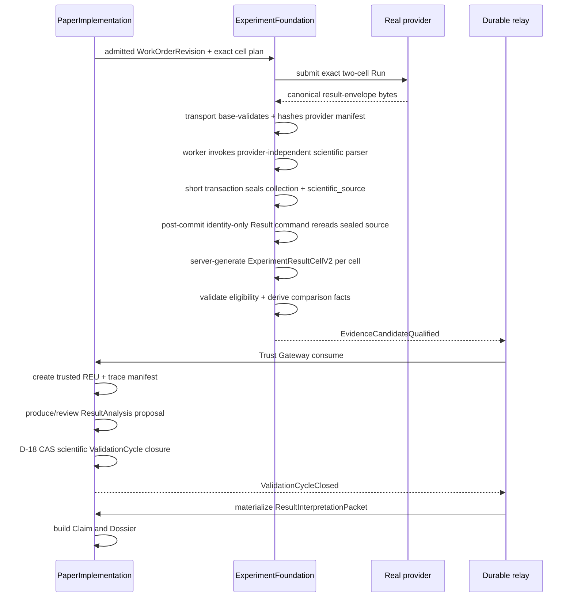

# T-136 Scientific Evidence to Paper Closure — Architecture

## Context and current state

The current implementation has two strong halves separated by an intentional product gap:

1. PI can admit an exact WorkOrder revision; EF can materialize and execute an immutable two-cell Run on real PAI, collect exact parser-bound output and replay without duplicate Jobs. The completed real outputs remain `diagnostic_only`.
2. EF has typed v2 scientific-result/validation contracts and a sole scientific writer. A passed validation can emit `EvidenceCandidateQualified`; the durable relay and PI Evidence Trust Gateway can mint a trusted v2 REU and trace manifest. PI also has D-18 readiness/control-only closure. Scientific-kind closure and post-closure Packet materialization are explicitly closed.

T-136 connects these existing authorities. The task must not create a generic data pipe or make cloud job success equivalent to scientific success.

External compute and external result import are different boundaries. EF may use PAI as an external compute adapter only when EF creates the exact job/Attempt, monitors the Attempt and collects the bound artifact. The product does not accept numbers or completed result packages produced outside that controlled lifecycle.

## Current blockers confirmed in code

- `ExperimentFoundationV2ScientificValidationService` exposes `recordExperimentResult` and `validateScientificBatch`, but no non-test route/controller/caller currently invokes them.
- `recordExperimentResult` currently accepts caller-composed metric/artifact observations after checking a succeeded real-provider Attempt; metric values are not yet derived by authoritative reread of an exact collected output.
- Metric observations currently lack stable observation identity, statistic/sample-size/uncertainty semantics and an exact source-artifact/parser derivation binding.
- Real PAI collection writes `diagnostic_only` provisional output, not `ExperimentResultCellV2`.
- The real-provider transport already sees and base-validates the canonical result envelope, verifies exact lineage/parser bindings and computes a provider result-manifest hash, but its typed `outputs` are currently not preserved as a scientific source.
- `ExperimentFoundationProvisionalOutputV2` already provides collection-scoped immutable output identity/hash rows and a single `(collectionAttemptId, outputKind)` slot, but its current output-class constraint permits only `diagnostic_only`; no `scientific_source` class or direct Result→source binding exists.
- The current scientific rule engine validates metric/artifact contract shape only. Its `passed` status is evidence eligibility, not a positive hypothesis outcome, and no deterministic cross-cell comparison facts exist yet.
- `PaperImplementationValidationCycleClosureV2Service` rejects `scientific_evidence_assessed` as not implemented.
- `PaperImplementationResultClaimDossierService.createResultInterpretationPacket` rejects materialization until a closure-event increment exists.
- The `EvidenceCandidateQualified` → PI Trust Gateway → `RunEvidenceUnitRegistered` bridge is already wired and must be reused.

## Target sequence



## Domain ownership and sole-writer rules

PaperImplementation and ExperimentFoundation are peer bounded contexts. Their integration is a two-way exact contract/event relationship, not a parent-child call graph and not shared mutable storage. PaperProject supplies lifecycle scope but does not broker execution; Literature is not on the required PI↔EF path.

| Artifact/action | Owner | Sole writer/authority | Required input authority |
|---|---|---|---|
| Provider payload, Attempt, collection | EF | Existing real-provider control services/workers | Frozen Run/Cell/TaskSpec/Bundle |
| Canonical `scientific_source` | EF | Real-provider worker + provider-independent parser/source sealer | Base-valid canonical envelope + succeeded exact Attempt + frozen parser/result schema |
| `ExperimentResultCellV2` | EF | `ExperimentFoundationV2ScientificValidationService` | Committed canonical `scientific_source` + exact collection/Attempt/Run chain + frozen parser/derivation |
| `ScientificValidationReportV2` | EF | Same scientific validation service | Complete ordered result batch + exact EvaluationProtocol; eligibility status and deterministic comparison facts remain separate |
| `EvidenceCandidateV2` | EF | Same validation transaction/outbox | Passed validation report |
| v2 REU + trace manifest | PI | `PaperImplementationEvidenceTrustGatewayService` | Qualified event + EF authoritative reread + PI current authority |
| ResultAnalysis proposal | PI runtime/human review | Existing proposal/runtime admission path | Trusted REUs and current Cycle scope |
| Scientific disposition/selected exit | PI | `PaperImplementationValidationCycleClosureV2Service` | Exact accepted proposal + primary comparison fact + D-18 watermark |
| ResultInterpretationPacket | PI | New closure-event materializer | Immutable `ValidationCycleClosed` + closure/proposal/evidence reread |
| Claim/Dossier | PI | Existing result/claim/dossier service | Closed Packet and project accounting |

### Historical capability placement

- Research/theory design belongs to PI.
- Experiment design is split by authority: PI owns hypothesis and exact cells; EF owns reusable protocol/recipe assets and readiness/materialization.
- Model/training execution belongs to EF.
- Data analysis is split by authority: EF owns factual observations and protocol validation; PI owns contextual interpretation and scientific disposition.
- UI/navigation placement is deferred and cannot change these ownership rules.

## Phase 0 freeze boundary

P0 uses invariant freeze plus late binding. A frozen item may change only through an explicit contract revision and re-baseline; a late-bound item may vary freely only while satisfying the frozen authority, provenance, preregistration, idempotency and release contracts.

| Concern | P0 contract | Late-bound implementation |
|---|---|---|
| Scientific result | Server-generated typed summary/provenance envelope, source derivation and canonical identity/hash | Provider raw files, parser module and adapter-specific extraction |
| Assignment timing | Pre-run parser/schema freeze; parse while canonical bytes are in memory; atomic source sealing; post-commit identity-only Result generation | Concrete worker/module names and command transport |
| EF intake | Separate result-recording and complete-batch-validation domain actions | One orchestration wrapper versus separate transport commands |
| Evaluation | Pre-run immutable protocol revision/hash and complete ordered cells | Workload-specific metrics, thresholds and directions selected before that Run |
| PI conclusion | Server-derived three-state disposition and admitted selected exit from the primary registered relation | Domain-specific proposal interpretation, limitations and claim ceiling |
| EF source storage | Confirmed B/B-lite + B2 + DB-B: additive `scientific_source`, direct Result relation, exact eight-field spine, closed tuples/composite constraints and no historical trust upgrade | DB-SSOT implementation mechanics and separately authorized named-local application |
| PI Packet/storage | Closure event authority, business key and replay semantics | Internal module/file placement and additive PI migration only if its separate census proves a gap |
| P5 | Real EF-managed two-cell eligibility, bounded operations and zero-duplicate acceptance | Exact model, dataset, provider assets, parameters, region and budget |

## Interfaces and contracts

### ExperimentFoundation scientific intake

- Evolve the existing `ExperimentResultCellV2`, `ValidateScientificBatchV2Request`, `ScientificValidationReportV2` and `EvidenceCandidateV2` contract family additively; P0 freezes the exact schema revision rather than treating today's observation-bearing input as final.
- Preserve result recording and complete-batch validation as two distinct EF domain actions. P1 may expose one orchestration wrapper or separate transport commands; neither presentation may merge writer authority or validate a partial batch.
- The product-facing result-generation interface MUST accept identity/idempotency only. The interface MUST NOT accept metric values, observation arrays, statistical conclusions or caller-authored result/content/validation/candidate hashes.
- The provider transport MUST stop at one fetch, canonical-envelope/base-lineage validation, parser-binding verification and provider-manifest hashing. Only `collect()` returns an internal ephemeral strict success containing the ordinary succeeded outcome plus a readonly `ValidatedProviderResultEnvelope`; the transport MUST NOT interpret metric/statistical meaning or write scientific source/Result state.
- The ephemeral return type is not a product DTO or persistence contract. The return value contains no reusable credential and does not authorize retaining provider locators; the worker consumes the return value in the current collection attempt and performs no second provider fetch.
- The EF worker MUST branch on `collect` before transport dispatch, recompute envelope UTF-8 byte size/content hash, load and compare the frozen ExecutionBundle, Run/RunCell, TaskSpec and EvaluationProtocol bindings, then pass the already validated canonical envelope to a provider-independent `ScientificSourceParser` while the bytes are still in memory.
- The parser uses the pre-run parser profile plus structural scientific result schema, returns keyed observation/artifact drafts and performs no persistence, identity allocation, protocol admission or canonical hashing.
- A pure source sealer MUST exact-match the EvaluationProtocol slots, assign protocol order/observation identity and server-generate canonical source identity/hash/kind/class. The sealer returns a source row draft and performs no repository write.
- Collection orchestration assigns operational output ordinals/timestamps/state/event fields; the repository atomically persists terminal collection state, ordinal-1 diagnostic output and optional ordinal-2 scientific source. No external service, provider fetch or parser work occurs inside that transaction.
- Only after the source-sealing transaction commits may the identity-only Result command reload the exact persisted source/collection/Attempt/Run chain, copy sealed observations without reinterpretation and compute the B2 projection, derivation and Result identity/content hash server-side.
- The interface is internal orchestration over an EF-owned collected Attempt, not a manual/upload import API. The contract MUST NOT accept naked numbers, CSV/Notebook payloads, external-cluster logs or third-party completed run bundles.
- Scientific intake MUST require:
  - committed v2 cutover;
  - enabled scientific-validation capability;
  - succeeded `real_provider` Attempt;
  - exact Run manifest, cell, TaskSpec, parser and protocol bindings;
  - complete ordered cells before final batch validation.
- Raw provider payloads and provider diagnostics MUST NOT be copied into scientific evidence or durable API responses.
- Literature-reported baseline values remain source-anchored literature context and MUST NOT be converted into `ExperimentResultCellV2` or PI REU records.

### Confirmed internal collection handoff T-B

The transport handoff is deliberately backend-internal and operation-specific:

```ts
type CollectSucceededOutcomeV1 = Readonly<
  ExperimentFoundationAliyunNormalizedProviderOutcomeV1 & {
    operation: 'collect';
    provider_status: 'Succeeded';
    normalized_state: 'succeeded';
    external_job_ref: ExperimentFoundationAliyunRealExternalJobRefV1;
    result_manifest_hash: string;
  }
>;

interface ValidatedProviderResultEnvelopeV1 {
  readonly handoff_schema_version:
    'ExperimentFoundationValidatedProviderResultEnvelope@v1';
  readonly canonical_envelope_json: string;
  readonly envelope_content_hash: string;
  readonly envelope_byte_size: number;
}

interface RealProviderCollectSuccessV2 {
  readonly outcome: CollectSucceededOutcomeV1;
  readonly validated_result: ValidatedProviderResultEnvelopeV1;
}
```

Contract rules:

1. `outcome.result_manifest_hash` is the only provider-manifest field. Do not duplicate the hash in `validated_result`, add a handoff hash or extend the shared normalized outcome with a nullable envelope member.
2. The canonical JSON string is the exact already-validated UTF-8 content. The worker reparses the canonical JSON and recomputes byte size/content hash before scientific preparation; a mutable parsed object is not passed across the boundary.
3. Provider-manifest composition remains transport authority because the manifest includes transport-only operational locator hashing. The worker validates the returned envelope and exact DB bindings but does not reimplement the provider adapter manifest algorithm.
4. The worker dispatches `collect` through a narrowed branch. Submit/sync/reconcile/cancel retain their existing return type and behavior.
5. The handoff lives only for the claimed collection command lifetime and is not serialized to an event, response, repository record or diagnostic log.

Frozen error categories and retry semantics:

| Stable reason | Owner | Retry | State effect |
|---|---|---|---|
| `REAL_PROVIDER_RESULT_READER_UNAVAILABLE` | transport/configuration | never | collection failed; no outputs |
| `REAL_PROVIDER_RESULT_READ_FAILED` | transport/reader | only for an explicit `TransientExactResultReadError`; unknown/not-found/authorization failures are nonretryable | prepared collection is released only for the typed transient case; otherwise failed |
| `REAL_PROVIDER_RESULT_INVALID` | transport | never | collection failed; bounded failure facts only |
| `REAL_PROVIDER_RESULT_BINDING_DRIFT` | transport | never | collection failed before handoff |
| `REAL_PROVIDER_RESULT_HANDOFF_CONFLICT` | worker | never | collection failed before parser invocation |
| `SCIENTIFIC_SOURCE_AUTHORITY_READ_FAILED` | worker/repository | only for a typed transient repository failure | release for bounded retry; no output commit |
| `SCIENTIFIC_SOURCE_PREPARATION_FAILED` | parser/sealer boundary | never for unexpected pure parser/sealer defects | collection failed under a preparation-specific reason; no source |
| `SCIENTIFIC_SOURCE_COMMIT_FAILED` | repository transaction | only for a typed transient transaction failure | full rollback and bounded retry |
| `SCIENTIFIC_SOURCE_COMMIT_CONFLICT` | repository constraints/CAS | never | conflict/terminal; no alternate row |

`not_scientific` reasons such as unsupported parser/schema, missing required observation/statistic/uncertainty and unexpected semantic items are expected domain outcomes rather than transport/worker exceptions. They may be recorded in bounded diagnostic/operator state but do not fail the valid provider collection. Because the reason codes in the preceding table become command/event/status facts, the codes belong to the shared stable reason-code family even though `RealProviderCollectSuccessV2` remains backend-internal.

### Field-level semantic authority

| Field family | Semantic origin / sole assigner | Allowed downstream action |
|---|---|---|
| Workload observation/artifact slots, ordinals, statistic/uncertainty requirements, comparison direction/thresholds | Exact EvaluationProtocol revision | Parser and sealer may read; no other component may admit or alter workload semantics. |
| Provider-independent scientific result structure/version/hash | Versioned scientific result-schema registry | Bundle authority selects a compatible immutable ref; no workload metric or threshold is authored here. |
| Parser profile and result-schema refs | ExecutionBundle revision authority | TaskSpec materializer copies exact refs and includes them in TaskSpec hash. |
| Canonical envelope JSON, byte size/content hash and provider manifest hash | Provider transport | Worker only recomputes/checks and consumes the canonical envelope in memory. |
| Keyed observation/artifact drafts | Provider-independent parser | No ids, ordinals, source/Result hashes, persistence or protocol admission. |
| Observation ids/order, canonical M-B2 manifest, source id/hash/kind/class/schema | Pure source sealer | Collection orchestration may only add operational row fields and submit the draft for atomic persistence. |
| Output ordinal, timestamps, collection/event/idempotency/outbox state | Collection orchestration | Repository enforces CAS/constraints and atomically persists without reinterpreting scientific content. |
| B2 Result projection, derivation hash, Result id/content hash | EF scientific Result service | Sealed observation values are copied exactly; validation reads but cannot rewrite them. |
| Eligibility and deterministic comparison facts | EF scientific validation service | PI consumes the qualified facts; EF cannot assign disposition or exit. |
| Scientific disposition and selected exit | PI closure service | Packet stores only an exact Closure ref; Claim/Dossier read view projects the immutable Closure facts. |

### Scientific result semantic envelope

- Result scope retains exact Run, manifest, RunCell, TaskSpec, succeeded real-provider Attempt and frozen protocol lineage.
- Collection may persist both the existing diagnostic envelope and one new canonical `scientific_source` root manifest. Historical `diagnostic_only` rows remain ineligible and are never relabeled.
- The canonical source manifest binds its collection/Attempt/RunCell/TaskSpec, upstream provider-manifest hash, parser profile version/hash, frozen result-schema identity, typed summaries and hash-bound raw artifact refs. One root manifest can reference multiple raw artifacts without introducing a child-source ledger.
- Result derivation directly binds one committed canonical source through the confirmed relational fields `collectionAttemptId`, `sourceOutputId`, `sourceOutputHash`, `sourceOutputKind`, `sourceOutputClass`, `parserProfileVersion`, `parserProfileHash` and `derivationHash`.
- Each metric observation has a stable identity/order and typed metric, split, value, value type, unit, statistic kind, sample count and uncertainty/explicit-none semantics required by the protocol. EvaluationProtocol owns the workload-specific slots and requirements; the result schema owns only their structural representation.
- Large raw samples, predictions and logs remain immutable hash-bound artifacts. The Result contains summaries and refs only—no raw provider payload and no generic `metadata` bag.
- Cross-cell deltas, threshold relations and other deterministic comparison facts do not belong to an individual cell Result; EF derives them from the complete ordered batch under the preregistered protocol.
- ExperimentResult contains no `supports_hypothesis`, scientific disposition, selected exit, Claim or free-form final conclusion field.

### Confirmed canonical scientific-source manifest M-B2

One collection may seal at most one canonical source with fixed `outputKind=scientific_result_manifest`, `outputClass=scientific_source` and manifest schema `ExperimentFoundationScientificSourceManifest@v1`:

```ts
interface ScientificSourceManifestV1 {
  manifest_schema_version: 'ExperimentFoundationScientificSourceManifest@v1';
  output_kind: 'scientific_result_manifest';
  output_class: 'scientific_source';
  authority: {
    collection_attempt_id: string;
    execution_attempt_id: string;
    provenance: 'real_provider';
  };
  execution_lineage: {
    execution_bundle_revision_id: string;
    execution_bundle_revision_hash: string;
    run_id: string;
    run_manifest_hash: string;
    run_cell_id: string;
    cell_key: string;
    cell_ordinal: number;
    training_task_spec_id: string;
    training_task_spec_hash: string;
  };
  evaluation_protocol: {
    evaluation_protocol_id: string;
    revision_id: string;
    revision_sequence: number;
    content_hash: string;
  };
  interpretation_binding: {
    provider_result_envelope_schema: string;
    parser_profile_version: string;
    parser_profile_hash: string;
    scientific_result_schema_version: string;
    scientific_result_schema_hash: string;
  };
  upstream: {
    provider_result_manifest_hash: string;
  };
  ordered_observations: ScientificObservationV1[];
  ordered_artifacts: ScientificArtifactRefV1[];
}

interface ScientificArtifactRefV1 {
  artifact_key: string;
  ordinal: number;
  artifact_kind: string;
  content_hash: string;
  byte_size: number;
  media_type: string;
}
```

Assignment and compatibility rules:

1. Collection/Attempt, ExecutionBundle, Run/Cell, TrainingTaskSpec and parser identities already exist in the current authority models. `cell_ordinal` comes from the exact RunCell/TaskSpec and is cross-checked rather than parser-assigned.
2. The full EvaluationProtocol tuple is resolved through the Run's frozen VersionLock dependency, never through the protocol's mutable current-revision pointer.
3. `scientific_result_schema_version/hash` is an additive T-136 contract derived from a versioned provider-independent schema registry. ExecutionBundle authority selects and freezes the immutable binding, TaskSpec materialization copies the binding and the exact TaskSpec hash indirectly binds the provider envelope. Worker/parser compare the binding before source sealing; neither authors nor mutates the binding, and no ProviderResultEnvelope version bump is required solely to repeat these fields.
4. `artifact_key` and artifact ordinal are preregistered semantic slots. Provider filename and storage locator are operational metadata; no nonexistent stable artifact database id is invented.
5. `sourceOutputId` is deterministically derived from Collection plus fixed source kind, is not a manifest field and is excluded from `sourceOutputHash`. The database relation still binds Result to both source id and exact source hash/kind/class.
6. The source hash is `SHA256(domain='ef-scientific-source-hash-v1', canonicalJson(manifest))`. The complete input is the M-B2 manifest defined in this section. The hash itself, row timestamps, database metadata, provider job/locator, logs, retries, durations, credentials, diagnostics and command idempotency keys are excluded.
7. Duplicate lineage in the self-contained manifest is intentional: relational constraints establish live database integrity, while the sealed snapshot establishes portable auditability. The sealer compares authoritative rows before commit; duplicated fields are never independently caller-writable.

### Confirmed statistic and uncertainty union

The scientific source and Result use a closed-core discriminated union rather than flat optional fields or a generic metadata/plugin bag. The contract is provider-independent and may evolve only through an explicit versioned additive contract.

```ts
type StatisticV1 =
  | { kind: "point"; sample_size: 1 }
  | {
      kind: "mean" | "median" | "proportion" | "minimum" | "maximum" | "sum";
      sample_size: number;
    }
  | {
      kind: "quantile";
      sample_size: number;
      probability: number;
    };

type UncertaintyV1 =
  | { kind: "none"; reason: "not_required_by_protocol" }
  | { kind: "standard_deviation"; value: number }
  | { kind: "standard_error"; value: number }
  | {
      kind: "confidence_interval";
      level: number;
      lower: number;
      upper: number;
      method_key: string;
    };
```

Validation invariants:

1. `sample_size` is always a positive integer; `point` requires exactly `1`.
2. `quantile.probability` and confidence-interval `level` are finite and strictly inside `(0, 1)`.
3. SD/SE values are finite and non-negative. Confidence bounds are finite and satisfy `lower <= upper` in the observation unit.
4. Observation values and every numeric statistic/uncertainty member reject `NaN`, positive/negative infinity and non-numeric provider encodings.
5. `none` is explicit, never an omitted field, and is legal only when the frozen EvaluationProtocol marks uncertainty as not required for that observation slot.
6. When the protocol requires uncertainty, missing or wrong-kind uncertainty prevents scientific-source sealing; the valid provider collection may retain diagnostic facts but cannot create Result/evidence.
7. `method_key` is a stable semantic identifier admitted by the frozen EvaluationProtocol. The parser profile may declare support and extract the value but cannot admit a method that the protocol did not preregister. Provider-specific calculation details stay in the hash-bound raw artifact or parser profile.
8. Statistic kind, uncertainty policy/kind, sample-size expectation and any confidence method are preregistered before Run submission and cannot be changed after observing results.

### Confirmed observation identity and canonical order

Each expected metric observation is a preregistered semantic slot, not a parser-created row. The frozen protocol/result schema supplies at least:

```ts
type ObservationSlotV1 = {
  observation_key: string;
  ordinal: number;
  metric_key: string;
  split_key: string;
  value_type: ExperimentFoundationV2MetricValueType;
  unit: string;
  statistic: StatisticRequirementV1;
  uncertainty: UncertaintyRequirementV1;
};
```

- `observation_key` is unique within the protocol revision and stable semantic scope, for example `test.accuracy.mean`.
- The typed `statistic` requirement includes canonical parameters when needed, for example quantile probability `0.95`, so multiple quantiles cannot collide.
- `ordinal` is unique and frozen before Run submission. Canonical arrays follow ascending protocol ordinal; provider/parser emission order is ignored.
- Each expected slot must match exactly once. Missing, duplicate or unexpected metric observations prevent scientific-source sealing.
- Raw artifacts use a separate preregistered `artifactKey`/`ordinal` namespace and canonical array; artifacts never occupy metric-observation slots.

EF derives the stable observation id with a domain-separated hash:

```text
observationId = SHA256(
  "ef-observation-v1",
  runCellId,
  protocolRevisionHash,
  observation_key
)
```

Value, statistic payload, uncertainty, parser profile and source hash are deliberately excluded from observation identity. A changed value or derivation under the same slot therefore conflicts under one identity rather than creating a second observation.

Implementation naming note: canonical JSON and TypeScript DTOs use the repository-wide `snake_case` spelling shown above. Database columns retain Prisma `camelCase`. This is one projection boundary, not two semantic contracts.

### Confirmed canonicalization and hash layers

| Hash | Semantic input | Explicit exclusions |
|---|---|---|
| Provider manifest hash | canonical provider result envelope and its existing exact source/parser bindings | retries, log timing, credentials |
| `sourceOutputHash` | complete M-B2 manifest: schema/kind/class, Collection/Attempt/provenance, exact ExecutionBundle/Run/Cell/TaskSpec/Protocol lineage, parser/result-schema bindings, upstream provider-manifest hash and protocol-ordered observations/artifacts | source hash/id, row timestamps, provider job/locator, logs, retries, durations, credentials, diagnostics, database metadata and command idempotency keys |
| `derivationHash` | domain/version, exact source id/hash, parser profile version/hash, result-schema identity/hash and derivation-rule version | observations supplied by caller, runtime request metadata |
| `resultContentHash` | exact Result lineage/relational source identities, derivation hash and ordered immutable Result observations/artifact refs | Result hash itself, creation/update timestamps, retries, locators, idempotency request key |

Canonical JSON rules:

1. Use one versioned canonicalizer and domain separator per hash type; raw `JSON.stringify` call sites cannot define scientific identity independently.
2. Object keys use stable canonical ordering. Observation and artifact arrays use frozen protocol ordinals rather than lexical or parser order.
3. All numeric values must be finite; normalize negative zero to zero before serialization.
4. Runtime rounding is prohibited. Any precision/rounding rule belongs to the preregistered metric/result schema and is applied before canonicalization.
5. Equivalent semantic input produces byte-identical canonical JSON and hash. Same business identity with changed canonical bytes is an idempotency conflict, not an update or second row.

### Confirmed relational spine and manifest split

| Location | Confirmed contents | Reason |
|---|---|---|
| Existing/new `ProvisionalOutputV2` source row | existing output identity, `collectionAttemptId`, fixed scientific source kind, `scientific_source` class, canonical `outputHash`, canonical manifest snapshot | Reuses collection authority and makes one sealed root source addressable. |
| Result relational spine | `collectionAttemptId`, `sourceOutputId`, `sourceOutputHash`, `sourceOutputKind`, `sourceOutputClass`, `parserProfileVersion`, `parserProfileHash`, `derivationHash` | Makes exact source/parser/derivation provenance queryable and enforceable without normalizing every metric. |
| Canonical scientific source manifest | upstream provider-manifest hash, frozen result-schema identity, ordered typed summaries, statistic/sample-size/uncertainty, hash-bound raw artifact refs | Keeps scientific payload extensible but sealed by one canonical source hash. |
| Result canonical snapshot | immutable per-cell observations plus the same source/parser/derivation identities | Supports deterministic content hashing and evidence export; the snapshot does not replace relational constraints. |

Required relational invariants:

1. A fixed scientific-source output kind plus the existing collection/kind uniqueness permits at most one canonical scientific source root per collection.
2. Result directly references the exact source collection/id/hash/kind/class tuple; a JSON-only source claim is insufficient.
3. Result `executionAttemptId` and `collectionAttemptId` must resolve to the same collection/Attempt chain.
4. Result source class is always `scientific_source`; `diagnostic_only` can never satisfy the relation.
5. Parser profile version/hash and `derivationHash` are server-assigned, immutable Result facts and participate in canonical Result hashing.
6. Scientific summaries are not promoted into database columns merely for query convenience; validation reads the sealed typed contract through repositories.

### Confirmed physical PostgreSQL contract DB-B

The current runtime target is local PostgreSQL. `prisma/schema.prisma` remains deployment-neutral SSOT and contains no hard-coded host; disposable relational verification uses loopback PostgreSQL, while named-local development uses the `postgres` database and `my_researcher_dev` schema. A real P5 provider may execute remotely, but EF/PI authority remains in the local control-plane database for the current product boundary.

DB-B is an additive, version-gated migration that reuses `ExperimentFoundationProvisionalOutputV2` and `ExperimentFoundationExperimentResultV2`; no source, observation or artifact child table is introduced.

`ExperimentFoundationProvisionalOutputV2` gains only the exact composite reference target:

```prisma
@@unique(
  [id, collectionAttemptId, outputHash, outputKind, outputClass],
  map: "ef_provisional_output_exact_source_unique"
)
```

Replace the three existing class/kind/manifest-version CHECKs with one closed tuple CHECK named `ef_provisional_output_contract_check`:

```text
diagnostic branch:
  outputClass = diagnostic_only
  outputKind IN (
    simulation_lifecycle_trace,
    simulation_provider_metadata,
    simulation_collection_log,
    real_provider_result_envelope,
    real_provider_diagnostic_log
  )
  manifestSchemaVersion = v1

scientific branch:
  outputClass = scientific_source
  outputKind = scientific_result_manifest
  manifestSchemaVersion = ExperimentFoundationScientificSourceManifest@v1
```

The existing `@@unique([collectionAttemptId, outputKind])` remains the one-canonical-source-per-collection fence. Existing ordinal and collection FKs remain unchanged.

`ExperimentFoundationExperimentResultV2` adds these Prisma `String?` columns:

| Column | Physical role |
|---|---|
| `collectionAttemptId` | Exact source Collection and same-Attempt binding |
| `sourceOutputId` | Direct canonical source row identity |
| `sourceOutputHash` | Exact immutable source content identity |
| `sourceOutputKind` | Fixed `scientific_result_manifest` discriminator |
| `sourceOutputClass` | Fixed `scientific_source` eligibility fence |
| `parserProfileVersion` | Frozen parser contract version |
| `parserProfileHash` | Frozen parser contract content identity |
| `derivationHash` | Server-derived source-to-Result transformation identity |

Nullable column types exist only so the migration can preserve historical Result rows without fabricated provenance. The SQL CHECK `ef_experiment_result_source_contract_check` closes both valid states:

```text
legacy branch:
  schemaVersion = v1
  all eight new source fields are NULL

source-bound branch:
  schemaVersion = v2
  all eight new source fields are NOT NULL
  provenance = real_provider
  sourceOutputKind = scientific_result_manifest
  sourceOutputClass = scientific_source
  parserProfileVersion is non-blank
  sourceOutputHash, parserProfileHash and derivationHash match sha256:<64 lowercase hex>
```

The existing `ef_experiment_result_schema_version_check` changes from `schemaVersion = v1` to `schemaVersion IN (v1, v2)`. New scientific validation accepts only source-bound Result v2; Result v1 remains readable but evidence-ineligible.

Required unique/index and FK names are frozen as follows:

| Name | Contract |
|---|---|
| `ef_experiment_result_collection_unique` | unique Result `collectionAttemptId`; PostgreSQL permits multiple legacy nulls |
| `ef_experiment_result_source_unique` | unique Result `sourceOutputId`; one source cannot produce multiple Results |
| `ef_experiment_result_collection_fkey` | `(collectionAttemptId, executionAttemptId)` → Collection `(id, executionAttemptId)` |
| `ef_experiment_result_source_fkey` | `(sourceOutputId, collectionAttemptId, sourceOutputHash, sourceOutputKind, sourceOutputClass)` → Output `(id, collectionAttemptId, outputHash, outputKind, outputClass)` |

All new FKs use `ON DELETE RESTRICT ON UPDATE RESTRICT`. The two unique Result indexes cover the expected Collection/source lookups; DB-B adds no parser/derivation hash indexes without an observed query requirement.

Migration and recovery contract:

1. Add the eight nullable columns; perform no DML backfill.
2. Replace the ProvisionalOutput CHECKs, expand the Result schema-version CHECK and add the Result all-or-none source CHECK.
3. Create exact unique indexes and composite FKs only after existing rows pass read-only preflight counts.
4. Verify empty, legacy-row and new-v2-row paths on randomized disposable PostgreSQL. Negative fixtures cover mixed-null fields, diagnostic source binding, cross-Collection/cross-Attempt binding, reused source, malformed hashes and legacy-v1 validation admission.
5. Named-local application requires a recovery point and separate approval; use migration deploy, never `prisma migrate dev`. DB-B includes no cloud database or paid provider operation.
6. Operational backout disables new writers and keeps the additive schema. Destructive column/constraint removal is allowed only on disposable or confirmed pre-write databases; once a v2 source/Result exists, rollback preserves data and uses a forward corrective migration.

### Assignment timeline and sole writers

| Time | Value/state assigned | Sole assigner | Persistence boundary |
|---|---|---|---|
| T0a — protocol/schema freeze | workload slots/comparison rules; generic result-schema version/hash | EvaluationProtocol revision authority; scientific result-schema registry | Immutable refs exist before bundle/Run admission |
| T0b — ExecutionBundle freeze | compatible parser profile and result-schema refs | EF bundle revision authority | Before real Run submission |
| T1 — TaskSpec materialization | exact copied parser/schema bindings for the cell | EF materializer as projection writer; no semantic authorship | Before provider submission; bindings participate in TaskSpec hash |
| T2 — execution/collection creation | Attempt id and CollectionAttempt id bound to exact RunCell/TaskSpec | EF execution service and real-provider worker | Existing authority writes |
| T3 — provider return | strict collect outcome with sole provider-manifest hash; canonical JSON/content hash/byte size handoff | Provider transport | Ephemeral transport→worker `RealProviderCollectSuccessV2`; one fetch and no scientific write |
| T4a — scientific extraction | keyed observation/artifact drafts | Provider-independent parser | Outside the database transaction; no identity/hash/persistence/protocol admission |
| T4b — source sealing | protocol match/order, observation ids, deterministic source id, M-B2 source hash/kind/class/schema | Pure EF source sealer | Outside the database transaction; returns an immutable draft and performs no I/O |
| T5 — collection commit | output ordinals `1=diagnostic`, `2=scientific_source`; timestamps, collection/event/idempotency/outbox state | EF collection orchestration; repository is atomic persistence authority | One short CAS transaction; no external fetch or parsing |
| T6 — Result generation | exact sealed-observation projection, B2 fields, derivation hash, Result id/content hash | EF scientific Result service | Separate identity-only idempotent command after T5 commit; no value reinterpretation |
| T7 — batch validation | eligibility status and deterministic comparison facts | EF scientific validation service | Only after complete ordered Results exist |
| T8a — paper conclusion | `positive | negative | inconclusive` and selected exit | PI closure service | After trusted evidence and an exact accepted contextual proposal |
| T8b — paper products | Packet, Claim and Dossier lineage | PI closure-event materializer and existing Claim/Dossier services | Derived after immutable closure; no feedback into conclusion identity |

The timing is an invariant, not a UI/API sequence. A caller cannot assign any scientific value at any time. Projection writers copy exact frozen values without gaining semantic authority. A parser and sealer cannot persist authoritative rows, transport cannot own scientific semantics, and Result generation cannot observe uncommitted source state or reinterpret a sealed value.

### Collection/parse failure matrix

| Condition | Collection outcome | Diagnostic output | `scientific_source` | Result/evidence |
|---|---|---|---|---|
| Result reader unavailable, unauthorized or deterministic read failure | failed with stable nonretryable reason | bounded failure facts only | none | prohibited |
| Explicitly typed transient reader/repository failure within retry budget | remains prepared; command released for bounded retry | none added before success | none | prohibited until retry succeeds |
| Provider envelope, lineage or parser binding invalid | failed | bounded failure facts only | none | prohibited |
| Envelope/handoff byte, content-hash or DB-binding recomputation conflicts | failed with nonretryable handoff/binding reason | bounded failure facts only | none | prohibited |
| Envelope valid; parser returns `not_scientific` for unsupported profile/schema, missing/invalid required slot/statistic/uncertainty or unexpected semantic item | collected | persisted at ordinal 1 | none | prohibited |
| Envelope valid; scientific parse succeeds | collected | persisted | exactly one sealed canonical source | eligible for separate post-commit Result generation |
| Sealed source replay is byte-identical | unchanged | unchanged | return existing source | Result replay returns existing identity/content |
| Same business identity with changed source/result content | unchanged/conflict | unchanged | no replacement | reject; no alternate authority row |
| Unexpected parser/sealer defect or deterministic preparation conflict | failed under preparation-specific reason after bounded policy | bounded failure facts only | none | prohibited; never mislabeled as provider invalid |
| Atomic collection commit fails | prepared until explicit retry or terminal constraint conflict | no partial row | no partial row | prohibited until a complete commit exists |

Expected parser insufficiency is represented by the `sealed | not_scientific` result union, not exceptions. Only explicitly typed transient read/repository failures are retryable. Unknown or deterministic failures cannot rely on lease expiry as their ordinary recovery mechanism. Any reason code persisted to command/event/status is part of the stable shared reason-code contract even when the handoff TypeScript type remains backend-internal.

### Evidence eligibility versus scientific disposition

- EF validation status answers whether the evidence is complete, source-valid, typed, protocol-supported and deterministically comparable.
- EF comparison facts may state exact cells, observed effect/relation and uncertainty state under the frozen protocol, but they are not contextual paper conclusions.
- A valid supporting, contradicting or indeterminate result batch is evidence-eligible and may emit EvidenceCandidate. Validation `failed`/`unsupported` is reserved for untrustworthy, incomplete, drifted or unsupported evidence.
- PI consumes trusted facts and remains the sole authority for `positive | negative | inconclusive`, selected exit, Claim and Dossier.

### Confirmed bounded artifact rule ART-B

M0-SCI v1 should make one deliberately bounded evidence claim: an artifact ref is **declared by the exact EF-controlled Run and sealed inside the canonical provider envelope/source hash**. Such a ref is not an EF byte-verified artifact unless EF independently fetches those bytes and verifies their content hash. The current one-envelope-fetch path performs no such independent artifact fetch.

| Question | Confirmed ART-B rule | Complexity boundary |
|---|---|---|
| May `ordered_artifacts` be empty? | Yes, when the frozen EvaluationProtocol requires no artifact declaration. | Do not invent placeholder artifacts. |
| May a protocol require artifacts? | The protocol may require exact artifact-ref slots and metadata for audit/reproduction. | Eligibility may check declared key/kind/hash/size/media type, not unobserved byte content. |
| May a scientific conclusion depend on artifact bytes? | Not in M0-SCI v1. P5 must derive the registered comparison from typed observations that EF actually parsed and sealed. | No second provider read, object fan-out, download cache or artifact lifecycle subsystem in P1. |
| Is a new verification-level field required? | No. `ExperimentFoundationScientificSourceManifest@v1` gives every artifact ref the same fixed declared-and-hash-sealed semantics. | A per-row flag would suggest mixed guarantees that v1 cannot actually provide. |
| How is byte verification added later? | Introduce a new manifest/protocol capability version with explicit object retrieval, byte-hash verification, limits, retention and failure semantics. | Never silently strengthen the meaning of the v1 ref. |

ART-B preserves the exact controlled-run provenance claim while preventing the product from presenting provider-declared artifact metadata as independently verified evidence. The user confirmed ART-B on 2026-08-05.

### Confirmed comparison contract CMP-B1

The user confirmed CMP-B1 on 2026-08-05. M0-SCI v1 supports a closed two-cell, same-unit, directional absolute-difference rule rather than a generic expression DSL. EvaluationProtocol freezes left/right cell slots, one observation key, direction, two non-overlapping thresholds and one uncertainty policy before Run submission. EF validation emits one ordered factual comparison per registered rule.

```ts
type ScientificComparisonUncertaintyPolicyV1 =
  | Readonly<{ kind: 'not_required_by_protocol' }>
  | Readonly<{
      kind: 'confidence_interval_guard';
      confidence_level: number;
      method_key: string;
    }>;

interface ScientificDirectionalDifferenceRuleProjectionV1 {
  readonly effect_kind: 'absolute_difference';
  readonly direction: 'higher_is_support' | 'lower_is_support';
  readonly support_min: number;
  readonly contradiction_max: number;
  readonly uncertainty_policy: ScientificComparisonUncertaintyPolicyV1;
}

interface ScientificComparisonFactV1 {
  readonly schema_version: 'ExperimentFoundationScientificComparisonFact@v1';
  readonly comparison_fact_id: string;
  readonly ordinal: number;
  readonly comparison_key: string;
  readonly evaluation_protocol_revision_hash: string;
  readonly rule_hash: string;
  readonly rule_projection: ScientificDirectionalDifferenceRuleProjectionV1;
  readonly left_observation_ref: ScientificObservationRefV1;
  readonly right_observation_ref: ScientificObservationRefV1;
  readonly raw_effect: Readonly<{
    kind: 'absolute_difference';
    value: number;
    unit: string;
  }>;
  readonly raw_effect_interval: Readonly<{
    lower: number;
    upper: number;
    unit: string;
  }> | null;
  readonly registered_relation:
    | 'supports_registered_expectation'
    | 'contradicts_registered_expectation'
    | 'indeterminate';
  readonly relation_reason:
    | 'support_band_met'
    | 'contradiction_band_met'
    | 'decision_gap'
    | 'uncertainty_interval_not_decisive';
  readonly comparison_fact_hash: string;
}
```

The rule is admitted only when both protocol slots declare the same unit, thresholds/confidence level are finite and valid, `method_key` is nonblank when required and `contradiction_max < support_min`. Validation rejects non-finite observed/effect values. `raw_effect = left.value - right.value`. Validation uses `oriented_effect = raw_effect` for `higher_is_support` and `oriented_effect = -raw_effect` for `lower_is_support`, so a larger oriented value always means stronger registered support.

- Without an uncertainty guard, `oriented_effect >= support_min` yields support, `oriented_effect <= contradiction_max` yields contradiction and the open band between them yields `indeterminate/decision_gap`.
- With `confidence_interval_guard`, both observations must already carry protocol-admitted confidence intervals with the exact unit, confidence level and method key. Validation computes the conservative raw interval `[left.lower - right.upper, left.upper - right.lower]`; lower-is-support reverses and negates the interval bounds before band evaluation. The whole oriented interval must clear the support or contradiction threshold, otherwise the relation is `indeterminate/uncertainty_interval_not_decisive`.
- The derived raw interval is a deterministic Cartesian envelope used for conservative band evaluation, not a newly calibrated effect confidence interval. EF must not copy the per-observation confidence level onto the derived range or claim joint/effect coverage that the protocol did not establish.
- Missing, malformed or mismatched protocol-required confidence intervals are completeness/protocol failures and create no eligible Candidate. A valid interval that spans multiple decision regions is valid indeterminate evidence; the two cases are never conflated.
- `comparison_fact_id` is deterministically derived from Run, protocol revision hash and comparison key. The protocol supplies the ordinal. `comparison_fact_hash` covers the exact rule projection, observation refs/hashes, raw effect, optional raw interval, relation and reason.
- `rule_projection` is a value-preserving copy of the immutable EvaluationProtocol rule for audit and cross-domain reread; EF validation cannot edit the thresholds or uncertainty policy.
- `support_check` and `contradiction_check` are deliberately absent. One relation plus one closed reason avoids three persisted result fields that could conflict.
- Relative change, ratio, equivalence/non-inferiority, arbitrary formulas, multi-cell/multi-metric composition and multiple-comparison correction require a later version. Provider-specific statistics and optional expression bags are prohibited.
- The fact contains no hypothesis prose, PI disposition, selected exit or Claim language. Eligibility remains a separate report field, and PI remains the conclusion authority.

### Current PI authority/storage census

- The admitted ResultAnalysis runtime already has an immutable `runtime_artifact_id` and `final_artifact_hash`; the pair can be reused as proposal identity instead of adding a proposal table. The current multi-scenario artifact is migration input, not yet the exact one-proposal scientific-closure contract.
- `PaperImplementationValidationCycleClosureV2` already stores closure kind, scientific disposition, selected exit, accepted proposal id/hash, D-18 watermark and closure hashes. No new closure table or closure data column is required.
- The current scientific closure service explicitly rejects `scientific_evidence_assessed`, and the current request contract still permits `corrected_scientific_disposition`. P3 must replace that caller-authored conclusion seam rather than expose the seam as the final product contract.
- `PaperImplementationResultInterpretationPacket` lacks an exact closure id/hash and Packet content hash. Confirmed PKT-S requires a small additive four-field PI Packet migration but no copied proposal/disposition/exit columns.

### Confirmed deterministic proposal/disposition rule DISP-S

The user confirmed DISP-S on 2026-08-05 and rejected the earlier pending DISP-B downgrade choice as unnecessary semantic complexity. EvaluationProtocol freezes exactly one `primary_comparison_key` before Run submission. The matching CMP-B1 fact is the sole direction-bearing input to Closure; additional ordered facts may inform proposal limitations/claim ceiling but cannot vote, average or implicitly alter disposition.

P3 versions the admitted ResultAnalysis final artifact into one actual-result contextual proposal bound to the exact Cycle watermark, primary fact and ordered evidence refs/hashes. Legacy multi-scenario artifacts remain readable but are ineligible for `scientific_evidence_assessed` closure.

```ts
interface ScientificClosureProposalV1 {
  readonly proposal_id: string;
  readonly proposal_hash: string;
  readonly validation_cycle_id: string;
  readonly closure_watermark_hash: string;
  readonly primary_comparison_fact_ref: ScientificComparisonFactRefV1;
  readonly ordered_evidence_refs: readonly ScientificEvidenceRefV1[];
  readonly interpretation_summary: string;
  readonly reliability_assessment: ScientificReliabilityAssessmentV1;
  readonly limitations: readonly ScientificLimitationV1[];
  readonly claim_ceiling: ScientificClaimCeilingV1;
}

interface CloseScientificValidationCycleRequestV1 {
  readonly validation_cycle_id: string;
  readonly expected_cycle_version: number;
  readonly expected_closure_watermark_hash: string;
  readonly closure_kind: 'scientific_evidence_assessed';
  readonly accepted_proposal_id: string;
  readonly expected_proposal_hash: string;
  readonly idempotency_key: string;
}
```

The proposal contains no proposed/final disposition, selected exit, review recommendation or closure identity/hash. Invoking the authorized close command with the exact proposal ref is the approval action; no `accept`, `correct`, `downgrade` or approval boolean is added to the domain request. If the proposal is unacceptable, the caller does not close the Cycle and instead regenerates/selects a proposal or corrects evidence/protocol through a new revision/Run.

The closure service maps the primary registered relation exactly:

| Primary CMP-B1 relation | Final scientific disposition | Selected exit source |
|---|---|---|
| `supports_registered_expectation` | `positive` | admission-frozen `decision_if_positive` |
| `contradicts_registered_expectation` | `negative` | admission-frozen `decision_if_negative` |
| `indeterminate` | `inconclusive` | admission-frozen `decision_if_inconclusive` |

The selected exit mapping must exist before Run submission. The proposal/caller cannot submit disposition, selected exit or closure hashes. Scientific caution that does not invalidate the registered direction belongs in proposal limitations and `claim_ceiling`; an alleged direction error requires corrected evidence/protocol and a new Run rather than a post-result override.

Assignment remains explicit: EvaluationProtocol authors the primary comparison and exit mappings pre-run; CMP-B1 validation assigns the registered relation; ResultAnalysis authors only hash-bound contextual interpretation/reliability/limitations/claim ceiling; the authorized caller decides whether to invoke Closure; the closure service alone assigns disposition, selected exit, accepted proposal refs and closure identities/hashes.

The existing Closure storage is sufficient for DISP-S. No Review table or review-decision/reason/support column is added. Existing `closureInputHash` binds the exact identity/CAS/proposal request, while authenticated/local invocation audit may record the caller as operational metadata outside the scientific conclusion model. The current `corrected_scientific_disposition` request field must be removed from the scientific contract.

### Confirmed reference-centered Packet boundary PKT-S

The user finalized PKT-S on 2026-08-05. Reuse the existing Packet table and add only `schemaVersion`, `closureId`, `closureSnapshotHash` and `packetContentHash`. The existing `validationCycleId` remains part of the exact authority tuple. Do not add copied `acceptedProposalId/hash`, `scientificDisposition`, `selectedExitKey` or relay event id/hash fields.

```ts
interface ResultInterpretationPacketAuthorityBindingV2 {
  readonly schema_version: 'PaperImplementationResultInterpretationPacket@v2';
  readonly validation_cycle_id: string;
  readonly closure_id: string;
  readonly closure_snapshot_hash: string;
  readonly packet_content_hash: string;
}
```

The physical migration is additive and version-gated:

- Legacy Packet rows keep all four new fields null, remain readable and are ineligible for the new scientific Claim/Dossier path.
- New v2 rows require all four fields under a closed all-null/all-present CHECK; nullable columns are historical compatibility only.
- `(closureId, closureSnapshotHash, validationCycleId)` references the exact same-domain Closure tuple under `RESTRICT`; add the matching Closure unique target without adding Closure data fields.
- Non-null `closureId` is unique, so one scientific Closure can own at most one Packet. Historical rows are not backfilled or trust-upgraded.

The sole materializer is an internal `ValidationCycleClosed` consumer, not a public create request:

1. Verify the event envelope, then reread the exact immutable Closure by id/hash. A control-only Closure produces no scientific Packet.
2. Reread the Closure-bound proposal and trusted REU/trace/comparison refs. Assemble Packet-owned result summary, reliability, claim implications, gate, trace and policy fields outside the write transaction.
3. Compute `packetContentHash` over the v2 schema, exact Cycle/Closure id/hash and Packet-owned canonical semantic fields. `closureSnapshotHash` transitively binds proposal, disposition and selected exit, so those values are not repeated.
4. In one short PI transaction, reread the exact Closure tuple and insert the Packet, or return the byte-identical existing Packet. The same `closureId` with changed canonical content is a terminal conflict.
5. Mark the durable event delivered only after both the existing semantic projection consumer and Packet materializer succeed. Both consumers are replay-idempotent; partial success is recovered by replay and no distributed transaction is introduced.

`packetContentHash` excludes row timestamps, delivery attempts, event leases and database metadata. Relay event identity remains in relay/inbox/outbox operational state instead of entering Packet scientific identity.

Claim/Dossier reads use a server-side `ClosedInterpretationPacketView = Packet + exact Closure + accepted Proposal`. The API may display disposition, selected exit and proposal fields, but the read service projects those values from Closure rather than storing another Packet-owned copy. Packet materialization can never feed back into Closure identity or conclusion authority.

### Protocol preregistration

- Before a real Run is submitted, the admitted WorkOrder/EvaluationProtocol revision MUST freeze and hash the ordered cells, metric semantics, units/aggregation, comparison direction, thresholds, unique `primary_comparison_key` and positive/negative/inconclusive exit mappings used by validation and PI conclusion mapping.
- Every result, validation report, proposal admission and closure MUST reference the same pre-run protocol identity or an explicitly compatible immutable derivative.
- After any result exists, changing the protocol, threshold, direction or exit rules cannot reinterpret the existing Run. The changed protocol requires a new revision and new Run.
- Proposal rejection creates no Closure or event. Any correction to facts, comparison direction/thresholds, primary selection or exit mappings requires a new immutable protocol revision and new Run.

### EF→PI evidence handoff

- Preserve `EvidenceCandidateQualified` as the only handoff event.
- Preserve the existing durable relay and PI Evidence Trust Gateway reread of EF validation/candidate authority.
- The gateway remains responsible for current PI branch/revision/head matching and for atomically writing REU, trace manifest, inbox and `RunEvidenceUnitRegistered` outbox.
- Rejected evidence remains terminal and creates no partial REU.

### PI scientific closure

- `CloseScientificValidationCycleRequestV1` is an authority action containing identities, CAS expectation, exact proposal reference and idempotency—not approval flags or free-form conclusion output.
- Confirmed DISP-S maps the primary CMP-B1 relation to:
  - `scientific_disposition`: `positive | negative | inconclusive`;
  - `selected_exit_key` from the admitted Cycle plan;
  - accepted proposal id/hash.
- Closure MUST re-evaluate the D-18 watermark in the write transaction.
- The closure snapshot/hash canonically includes the Closure kind, Cycle identity/version, accepted proposal id/hash, primary comparison fact identity/hash/relation, final scientific disposition, selected exit, current effective admitted branches/revisions, head Runs/cells, eligible REUs and active-real-attempt count. Packet identity, event-delivery state and Packet-owned interpretation fields are not inputs to closure identity.

### Post-closure Packet

- Only `ValidationCycleClosed` may trigger Packet materialization.
- Packet structure is assembled from the immutable closure, accepted ResultAnalysis proposal and trusted evidence refs.
- Direct pre-closure creation remains closed. Packet replay is idempotent and cannot mutate the closure.
- Claims and Dossier consume the `ClosedInterpretationPacketView`; Packet supplies interpretation-owned fields while the exact Closure supplies proposal/disposition/exit. Project-level failed/cancelled/negative/inconclusive accounting continues under existing policy.
- The current table census proves that the scientific-v2 Packet authority binding needs an additive PI migration; confirmed PKT-S limits the delta to four fields on the existing table and adds no second Packet store.

## Capability and rollout matrix

| Stage | Scientific intake | PI scientific closure | Real-provider intake/control | Database/provider posture |
|---|---|---|---|---|
| Unit/contract | false/injected service | false/injected service | false | No network; in-memory/fixture |
| Relational gate | process-scoped test composition | process-scoped test composition | false | Disposable PostgreSQL only |
| Named-local smoke | separately authorized window | separately authorized window | false | Recovery point required; no cloud |
| Real P5 acceptance | bounded process-scoped window | bounded process-scoped window | bounded process-scoped window | Explicit user authorization, cost and credential controls |
| Final resting state | false unless separately retained | false unless separately retained | false | Durable events may drain/replay |

Capability shutdown MUST prevent new intake without invalidating or deleting already committed evidence/closure. Durable relay drain/replay remains independently operable.

The capability matrix governs verification windows, not release status. Successful P0-P4 tests establish `implementation_complete_unreleased` only. Until the P5 real two-cell acceptance records `M0-SCI: passed`, the product cannot enable or claim the real scientific-closure capability. Passing `M0-SCI` permits a separate controlled enablement decision and does not mutate capability flags automatically. Other M0 previews and the deferred desktop UI are independent of the gate; `M0-SCI` is also distinct from governance milestone `M-001`.

## Data and schema strategy

- Default decision: reuse existing v2 scientific, evidence and closure tables/contracts.
- Confirmed option B/B-lite reuses `ExperimentFoundationProvisionalOutputV2` for a new `scientific_source` output class and binds each Result directly to one canonical root source manifest.
- Confirmed B2 uses the minimal relational spine defined by DB-B. Do not weaken the spine to a single source id, and do not expand the spine into metric/statistic columns without a new evidence-backed decision.
- Confirmed DB-B maps the spine to eight version-gated nullable columns, two exact composite FKs, two unique Result ownership indexes and one exact ProvisionalOutput reference tuple. Nullable storage is historical compatibility only; Result v2 cannot persist a partial source spine.
- The database must enforce a distinct scientific source class, at most one canonical source root for the collection/source kind, exact source ownership by the same collection/Attempt chain and an immutable direct Result→source relation. Historical `diagnostic_only` rows remain unchanged and ineligible.
- Do not add a provider-specific source table, source-child graph or independently mutable derivation ledger. Raw artifact multiplicity remains inside the canonical hash-bound source manifest unless later evidence proves a separate normalized relation is required.
- No generic JSON/EAV scientific payload, second mutable manifest or provider-specific database column.
- An additive Prisma migration is required for the EF output-class/direct-source binding because the current Result row relationally binds only ExecutionAttempt while the current provisional-output class permits only `diagnostic_only`.
- DB-B and PKT-S were materialized in the Prisma SSOT and one additive migration on 2026-08-08. The migration preserves historical rows, adds the exact source/Closure relations and ownership fences, and passed disposable-PostgreSQL deployment, zero-drift and relational assertion checks. Named-local application has not occurred and remains a separate recovery-point and approval gate.
- Any migration MUST be additive, use `prisma/schema.prisma` as SSOT, receive reviewed diff/recovery/rollback evidence and preserve legacy writer closure.
- No cross-domain PI↔EF foreign keys or ORM cascades; cross-domain bindings remain exact external ids/hashes/events.

## Failure and idempotency model

- Result record conflict: same deterministic identity with changed canonical content rejects.
- Metric-bearing product request: rejects before source resolution or Result persistence.
- Provider-envelope/lineage/parser-binding mismatch: collection fails and creates no scientific source or Result.
- Handoff byte/content/authority mismatch: collection fails under a stable nonretryable reason; the worker never attempts scientific parsing.
- Valid collection with scientific-parser/schema failure: preserve collection/diagnostic facts, create no scientific source and therefore no Result; do not misreport the scientific-parser failure as provider collection failure.
- Unexpected parser/sealer failure: use a preparation-specific reason and explicit bounded retry/termination policy; never leave an ordinary claimed command waiting only for lease expiry.
- Collected-source/parser/derivation mismatch during post-commit generation: rejects before Result persistence; a succeeded Attempt alone is insufficient proof of metric origin.
- Manual/external result submission without an exact EF-owned succeeded real-provider Attempt rejects before result persistence.
- Incomplete batch: no validation report/candidate/outbox commit.
- Unsupported protocol rule: terminal unsupported validation; no eligible candidate.
- Relay mismatch: terminal inbox rejection; no REU/trace.
- Stale D-18 watermark/proposal/head or active Attempt: closure rejects; no closure/event.
- Closure replay: same idempotency/envelope returns existing closure; changed payload conflicts.
- Packet relay replay: same event/business key returns existing Packet; changed envelope conflicts.
- Partial infrastructure failure is recovered through durable inbox/outbox replay, never by minting alternate authority rows.

## Observability and safety

- Log stable reason codes, aggregate identities and canonical hashes; do not log raw provider output, credentials or unrestricted model text.
- Every acceptance summary records exact command/run id, target fingerprint, capability state, provider operation counts, row/event counts, pass/fail checks and a canonical SHA-256.
- Large raw outputs remain untracked or outside the repository; durable docs retain a compact digest.
- Real provider work uses short-lived credentials, bounded no-auto-retry calls and explicit cost/operation ceilings.

## Confirmed P5 eligibility and authorization boundary P5-ELIG-S

P5-ELIG-S is the final P0 decision. It freezes a small deterministic eligibility contract while leaving provider, model, dataset, assets, parameters, region and budget values late-bound to one exact P5 package.

The eligibility validator admits only a new immutable PI-bound WorkOrder/Cycle/Run with exactly two ordered EF-managed real-provider cells. The cells declare exactly one differing experimental factor; all other comparison-critical inputs must be identical or hash-equivalent, and both cells use the same execution/collection path, parser version, metric semantics, unit and aggregation. Each cell owns exactly one authorized `CreateJob` operation. Scientific inputs remain typed observations parsed and sealed by EF; external/manual results and conclusions that depend on unfetched artifact bytes are ineligible.

The exact execution package canonically binds WorkOrder/Cycle/Run/EvaluationProtocol, both cells, ExecutionBundle/TaskSpec/parser/result-schema and asset/dataset hashes; provider/model/runtime/region parameters; the two-operation ceiling; per-operation and total cost ceilings with currency; the process-scoped capability set and authorization window; a credential reference/cleanup policy without secret material; and the named-local target/recovery fingerprint. Any change produces a new package hash and requires a fresh preflight and user authorization.

Assignment and timing are closed:

| Value | Sole assigner | Assignment time |
|---|---|---|
| Cells, differing factor, metric/direction/thresholds, primary comparison and three exits | EvaluationProtocol author | Before Run submission |
| Exact provider/workload/assets/parameters/region, operation/cost ceilings and package hash | P5 package builder | After P0-P4 gates, before authorization |
| `eligible` or stable ineligibility reasons | P5 eligibility service | Before any provider call; no human override |
| Exact package hash, capability/window/budget and credential-handling authorization | User/operator authority | After successful preflight, before capability opening |
| Job/result/operation/cost facts | EF/provider adapter | During the bounded run |
| Relation, disposition and selected exit | EF validator then PI Closure service | After sealed results; never assigned by the user |
| `M0-SCI: passed` and cleanup/replay census | Acceptance verifier | Only after the full chain and cleanup checks pass |

Authorization is operational rather than scientific. The user does not authorize or select a desired disposition. Supporting, contradicting and indeterminate results are equally capable of passing P5 when the registered chain is correct. A failed/cancelled Job or package drift fails that attempt; no hidden substitution or automatic `CreateJob` resubmission is allowed. A retry means a new immutable Run/package hash and a new authorization.

P5-ELIG-S reuses the existing default-off, process-scoped capability-window pattern. It requires a versioned eligibility validator, one hash-bound execution package and one generated acceptance record, not a generic policy engine, approval table, UI workflow or standing capability enablement.

## P0 decision status

All P0 authority, evidence, comparison, conclusion, Packet and P5 eligibility decisions are now frozen. Exact P5 workload values remain intentionally late-bound and are not an open architecture decision.

## P2 implementation checkpoint — 2026-08-08

- The product boundary is now three narrow REST operations: identity-only source→Result generation, identity-only complete-batch validation and read-only validation lookup. It introduces no observation/value import DTO and no repository access from routes/controllers.
- Repository validation reads are version-explicit: product validation uses `loadSourceBoundRunResults` (`schemaVersion=v2`), while `loadRunResults` remains the historical v1 reader used only by explicit test/migration compatibility composition.
- `ScientificValidationReportV2` remains persisted as historical `schema_version=v1`; new reports add optional-for-history but required-for-P2 `ordered_comparison_results`. Validation hashes conditionally cover that field, so old report hashes reread unchanged and all new CMP-B1 facts are hash-bound.
- Canonical comparison schemas retain semantic relation/reason and status/fact unions for domain validation and persistence. REST responses use a closed field-equivalent serialization projection solely because Fastify cannot compile those semantic unions; the projection adds no authoring authority and does not replace canonical validation.
- CMP-B1 is a pure deterministic service with domain-separated observation/rule/fact hashes. It has no PI imports and emits no disposition, exit or Claim vocabulary.
- Artifact admission is explicit and versioned at the protocol slot: `required_rule_id=null` means trace-only, while a non-null id must resolve one artifact rule with the same kind and exact required cardinality. The provider `artifact_key` is a logical key and is never inferred from legacy `file_name`; the bound rule's parser requirement is checked against the source interpretation binding before sealing and again during validation.
- `primary_comparison_key`, `decision_if_positive`, `decision_if_negative` and `decision_if_inconclusive` are optional only in the shared schema for historical reads. New protocol freeze and P2 product validation require all four, with the primary key resolving exactly one preregistered CMP-B1 rule. EF still emits only comparison facts; PI P3 remains the sole disposition/exit writer.
- Candidate/outbox persistence, relay and PI Trust Gateway remain the sole existing cross-domain path. No table, migration, parallel gateway or second conclusion authority was added in P2.
- Runtime scientific validation remains protected by the existing committed-cutover assertion and default-false capability flag. Durable validation reads remain available after intake is disabled.

## Late-bound decision status

1. Resolved in P2: separate identity-only Result and validation commands plus one read endpoint preserve the two EF domain actions without introducing an orchestration authority.
2. Provider-specific raw artifact layout remains late-bound behind the frozen parser/source contract; logical artifact-slot/rule admission is no longer late-bound.
3. Exact P5 model, dataset, assets, parameters, region and budget remain late-bound.
4. Desktop UI/navigation and user-facing presentation remain deferred.
