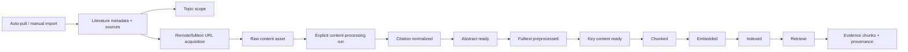

# 02 Architecture

## Current Full Chain

## Boundary Rules
- Collection writes metadata, source records, dedup signals, and scope associations.
- Collection import has conservative metadata dedup by DOI, arXiv ID, then title-authors-year hash; it does not globally coalesce downloaded PDF files by checksum.
- Collection MUST NOT enqueue expensive content-processing stages.
- Fulltext acquisition writes raw assets and provenance, then marks downstream readiness as available/stale according to existing stage rules.
- Content-processing runs remain explicit and ordered.
- Retrieve reads active indexed versions and reports stale/degraded conditions.

## Upgrade Architecture Targets

## Implemented Foundation Pass - 2026-05-08

- Added `fulltext-acquisition` as a separate durable job surface from content-processing backfill.
- Kept single-paper `content-assets/download` for explicit manual downloads, with stronger URL, redirect, MIME/PDF, size, and timeout safety gates.
- Added `/settings/literature-acquisition` for Unpaywall, downloader, source throttle, and quality-scorer profile settings.
- Added Prisma persistence for fulltext acquisition jobs/items and per-source runtime state; content-processing backfill remains separate.
- Preserved provenance through acquisition candidates, resolver source kind, final URL, redirect chain, checksum, byte size, and content asset metadata.
- Bound fulltext acquisition items to registered content assets with a nullable FK so later asset cleanup cannot leave silent dangling references.
- Applied acquisition source throttle/cooldown state inside the fulltext acquisition worker; broader auto-pull source pacing remains a separate roadmap item.
- Retrieval now excludes stale active index versions by default; diagnostics can request `include_stale`.
- Chunk metadata now advertises the shadow `section-aware-key-content-v2` profile while retaining `flat-classified-v1` as the previous profile.

### Source Acquisition
- Source fetchers should expose source-specific diagnostics, rate-limit state, and retry eligibility.
- Run summaries should distinguish:
  - fetched
  - parse rejected
  - incomplete
  - duplicate
  - signal rejected
  - scorer rejected
  - selected
  - imported new/existing

### Scoring
- Quality scoring should be a typed profile with:
  - provider
  - model/endpoint
  - timeout
  - retry policy
  - score schema
  - provenance
  - budget controls

### Fulltext Acquisition
- Remote download should be treated as an acquisition operation, not just a file fetch.
- Safety gates must run before and during fetch.
- The resulting raw asset remains local-path-backed so downstream processing does not need a second source-kind model.

### Parser
- Parser diagnostics should remain stage-local but operator-visible.
- GROBID remains external.
- OCR is either an explicit child task or remains a clear blocker.

### Retrieval Evaluation
- Evaluation data should be separated from product fixtures.
- Retrieval quality should be measured at literature, chunk, and provenance levels.

### Work Identity and Dedup
- Canonical work identity is computed, not persisted: prefer `doi:<normalized-doi>`, then `arxiv:<normalized-arxiv-id>`, then `tay:<title-author-year-sha1>`, with `literature:<id>` as the fallback.
- Work identity also carries weaker aliases so retrieval can group split historical records that share a title-author-year key even when one record has DOI and another has arXiv metadata.
- Collection import remains conservative: it fills missing DOI/arXiv/authors/year/abstract, keeps existing non-empty user-facing fields, merges tags and source provenance, and does not delete duplicate literature records.
- Retrieval applies work-level dedup after scoring and before `top_k`, keeping the highest-ranked literature hit for each canonical work group.
- Structured cluster candidates are persisted separately from literature records:
  - `LiteratureCluster` stores the candidate/decision envelope and representative pointer.
  - `LiteratureClusterMember` stores member role, relation type, confidence, and review decision status.
  - `LiteratureClusterEvidence` stores pairwise provenance signals such as `pdf_sha256`, `text_fingerprint`, `title_author_year`, and `title_similarity`.
- Candidate generation never mutates or deletes literature records and never auto-confirms a merge. It can propose exact same-PDF, exact normalized-text, exact title-author-year, and conservative fuzzy near-duplicate same-work clusters.
- Retrieval consumes only `confirmed` same-work clusters with `accepted` members. `candidate`, `rejected`, and `split` clusters remain review data and do not change query results.
- Raw PDF asset checksum coalescing remains out of scope: duplicate PDFs can be detected as cluster evidence, but storage cleanup/reuse is a separate operation.

## KEY_CONTENT_READY Execution Policy
- `llm_gateway` is the unattended batch/default method: it is suitable when the system should complete without a curated dossier.
- `codex_curated` and `manual_curated` are first-class curation modes, not backend agent calls. They require an exported curation bundle, an imported `key_content.v1` dossier, and active-fulltext checksum compatibility before `KEY_CONTENT_READY` can proceed.
- Curated imports have a dry-run route that validates source-ref repair, checksum compatibility, downstream stale impact, and diagnostics without mutating pipeline artifacts.
- Backfill treats curated `KEY_CONTENT_READY` work as a curation handoff: dry-runs report `curation_required_count`, and jobs blocked by `KEY_CONTENT_CURATION_REQUIRED` settle as `PARTIAL` with item-level `WAITING_FOR_DOSSIER`, not as provider failures.
- Cutover is mode-specific rather than one global toggle:
  - keep `llm_gateway` as the default for unattended bulk operation;
  - use `codex_curated` for high-value evidence workflows where human/agent review is expected;
  - use `manual_curated` for offline or provider-free workflows.

## Evaluator Evidence Policy
- A 10-paper/25-query pass is necessary but not sufficient for broad cutover when the sample is arXiv-only.
- The evaluator-v2 fixture under `artifacts/evaluator/` is the reusable sample/query dossier for the next formal run; reports that omit fixture samples or queries should remain audit warnings.
- `.ai/scripts/literature-e2e-v2-runner.mjs` is the durable runner for that fixture. It supports `light`, `current-arxiv`, `v2-smoke`, and `full` modes so smoke runs and broad-cutover runs share one report shape.
- Formal reports should carry query-set labels: `baseline`, `holdout`, `paraphrase`, and `adversarial`.
- Broad-cutover reports should also carry `blind` query-set labels; blind recall@5 is a gate when blind queries are present.
- Formal reports should include DOI/Unpaywall samples, parser-edge or `OCR_REQUIRED` samples, and rights-gated/no-OA samples before source acquisition quality is considered broadly covered.
- Per-literature timing and LLM token/cost telemetry are required for budget decisions. Missing telemetry is an audit warning even when the functional chain passes.
- Cutover gates are mode-specific: `current-scope` may pass with audit warnings documented; `broad-cutover` requires the functional report to pass and the report audit to have zero warnings/errors.
- Cutover operations are artifact-driven:
  - `preflight` checks report/audit quality and can warn when CI/mock evidence is missing.
  - `cutover` requires the latest run id to be confirmed and requires attached CI/mock evidence.
  - `rollback` produces a conservative operator plan without mutating product data.
- Embedding and retrieval query embedding telemetry are emitted through the backend LLM gateway surfaces so the formal evaluator can attribute request count, retry count, token count, elapsed time, and estimated embedding cost by phase.
- Reports distinguish `sample_count` from `processable_sample_count`; rights-gated and OCR-required fixtures are expected blockers rather than failed indexed samples.
- Local real E2E raw PDFs are stored outside the repo under `/Volumes/DataDisk/Paper/Auto/<run-id>`; normalized text, artifacts, indexes, reports, and audit files remain under `.ai/.tmp/literature-e2e/<run-id>/`.
- Raw PDF lifecycle cleanup is non-destructive by default. The local lifecycle script can quarantine stale duplicate PDFs only when another checksum-identical copy remains retained and protected paths from active manifests are excluded from actions.

## Auto-Pull Source Runtime Policy
- Auto-pull collection source fetches use the same source runtime state table as fulltext acquisition so source health does not split into two incompatible cooldown models.
- Source throttle settings now cover `arxiv`, `crossref`, `zotero`, `unpaywall`, and `download`.
- Crossref/arXiv/Zotero source fetches record request/success/failure state before importing or scoring candidates.
- Retryable source failures (`SOURCE_RATE_LIMIT`, transient `SOURCE_UNREACHABLE`) can enter cooldown; invalid source config and other client-side `AppError` failures stay non-retryable so retry jobs do not sleep behind a false cooldown.

## Possible DB Changes
- Source cooldown/rate-limit state has additive persistence in `LiteratureSourceRuntimeState`.
- Download/acquisition history has additive persistence in `LiteratureFulltextAcquisitionJob` and `LiteratureFulltextAcquisitionItem`.
- Structured cluster decisions have additive persistence in `LiteratureCluster`, `LiteratureClusterMember`, and `LiteratureClusterEvidence`.
- Scorer provenance may require structured run-attempt metadata.
- Any persisted schema changes MUST use DB SSOT (`prisma/schema.prisma`) and refresh `docs/context/db/schema.json`.

## Risk Areas
- SSRF/unsafe redirects in URL acquisition.
- Provider rate limits and accidental retry storms.
- Hidden drift between OpenAPI/API index/shared contracts.
- Batch backfill duplicating outputs or activating partial indexes.
- Retrieval metrics that pass trivial smoke tests but fail realistic evidence queries.
