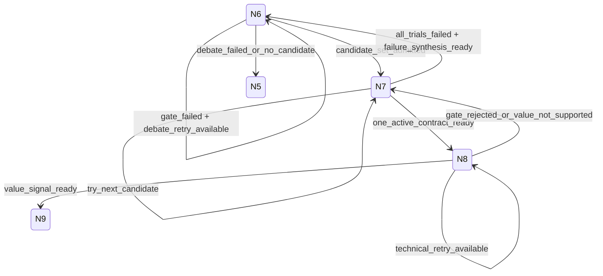

# v1b Node Policy Alignment

Status: finalized policy discussion log. Runtime-contract truth now lives in the shared v1b WorkflowHarness contracts and the T-107 exit decision in `08-exit-gate-review.md`; if this historical log conflicts with those artifacts, the executable contracts and exit decision win.

## Purpose
Capture node-level policy decisions before runtime changes. These decisions define what `WorkflowHarness` may automate, where human/delegated authority is required, where model-like invocation is allowed, and how replay/idempotency should converge.

## Global Result Shape
Normalized v1b node runners should converge on one stable result family:
- `succeeded`: target authority was written and downstream handoff is consumable.
- `succeeded_with_warning`: target authority was written; warnings and accepted risks must carry forward.
- `blocked`: deterministic policy blocked target authority creation.
- `requires_human_review`: automation cannot continue until a human/delegated payload or decision is supplied.
- `failed`: technical/provider failure; no fallback to another execution mode.

Mode differences belong in provenance, not alternate DTOs.

## Provider Spec Policy
Every normalized v1b node needs an explicit provider spec, including deterministic nodes with no model invocation.

Provider classes:
- `node_execution_provider`: the runtime that executes the node procedure.
- `authority_input_provider`: the actor/source allowed to provide final semantic authority input.
- `support_snapshot_provider`: the deterministic source of frozen support state used by gates.
- `semantic_support_provider`: the structured semantic processing path used by Codex support slots.
- `model_invocation_provider`: the provider/model path for model-like nodes; this must be null on deterministic/human-recording nodes unless the node policy explicitly defines a model-like invocation slot.

Codex is the default semantic support provider for v1b where semantic processing is needed. Codex support is not authority by itself, not route scheduling, and not a deterministic gate. It produces structured support artifacts that the node runner normalizes before authority writes or route decisions.

N2 and N3 must reject direct model provider config. If `model_option_id`, raw `provider_id`, raw `model_id`, timeout/model settings, provider fallback, or debate config appear in N2 or N3 node input, the runner should return `blocked` with `INVALID_NODE_PROVIDER_SPEC` or fail schema validation before authority creation. A declared Codex semantic support slot is allowed only when the node policy below names that slot.

### Semantic Execution Mode
Each node attempt may use at most one semantic execution mode:

```ts
type V1bSemanticExecutionMode =
  | 'none'
  | 'codex_assisted'
  | 'provider_llm'
  | 'mocked_llm'
  | 'human_delegated';
```

Rules:
- `codex_assisted`, `provider_llm`, and `mocked_llm` are mutually exclusive within one node attempt;
- `model_option_id` is valid only when `execution_mode='provider_llm'`;
- provider/model/timeout values must resolve from the profile registry and must not be supplied by routes/services;
- deterministic nodes may use `codex_assisted` only through explicit semantic support slots, not through `model_invocation_provider`;
- exact replay must reuse the frozen semantic support artifact instead of re-invoking Codex/provider by default;
- changing prompt pack, profile id, semantic execution mode, provider model, or support artifact hash creates a new attempt identity.

### Codex Semantic Support Artifact
Codex support slots should emit a compact, gate-consumable artifact:

```ts
type CodexSemanticSupportArtifact = {
  support_artifact_ref: TopicSelectionFunctionalRef,
  support_artifact_hash: string,
  node_id: V1bNodeId,
  slot_id: string,
  execution_mode: 'codex_assisted',
  profile_id: string,
  input_handoff_hash: string,
  prompt_pack_version: string,
  structured_output_hash: string,
  normalized_signal_hash: string,
  policy_version_id: string,
}
```

Codex support artifacts may contain semantic classifications, drafted structured payloads, grouping, failure synthesis, axis scores, and loopback recommendations. They must not contain raw hidden reasoning, secrets, raw provider responses, direct authority write commands, or ad hoc route targets.

### Invocation/Profile Matrix

| Node | Default semantic role | Authority write path | Allowed semantic modes | Provider/model policy |
|---|---|---|---|---|
| N1 | none; optional external audit only | deterministic snapshot gate | `none` | provider/model config invalid |
| N2 | Codex drafts or revises constraint profile structure | delegated/human payload plus deterministic profile gate | `codex_assisted`, `human_delegated`, fixture in tests | provider LLM invalid by default |
| N3 | Codex classifies blocker/warning/repair-route context when needed | deterministic readiness gate | `codex_assisted`, fixture in tests | provider LLM invalid |
| N4 | Codex generates research slice options by default | `AgentOrchestrator` output plus deterministic option gate | `codex_assisted`, `mocked_llm`, `provider_llm` | `provider_llm` only through registry profile |
| N5 | Codex reviews option selection and risk acceptance under delegation | accepted selection payload plus deterministic selection gate | `codex_assisted`, `human_delegated`, fixture in tests | provider LLM invalid |
| N6 | Codex generates topic-question candidates and loopback triage by default | `AgentOrchestrator` output plus deterministic candidate-set gate | `codex_assisted`, `mocked_llm`, `provider_llm` | debate/canary only by registry profile and admission |
| N7 | Codex groups candidates, synthesizes failures, and scores N8 debate admission | deterministic contract materialization gate | `codex_assisted`, `human_delegated`, fixture in tests | provider LLM invalid for N7B authority |
| N8 | Codex runs compact value-assessment debate by default | `AgentOrchestrator` output plus deterministic value gate | `codex_assisted`, `mocked_llm`, `provider_llm` | deep/provider canary only by frozen N8 debate admission |
| N9 | no new semantic interpretation; optional external audit only | deterministic disposition from normalized N8 signal | `none` | provider/model config invalid |
| N10 | none | deterministic package gate | `none` | provider/model config invalid |
| N11 | none | deterministic v1c input-bundle publication gate | `none` | provider/model config invalid |

The matrix means Codex is the default semantic processor for semantic work. It does not mean Codex owns authority, deterministic validation, idempotency, or route scheduling.

### Codex Semantic Support Adapter Contract
All Codex semantic work must enter v1b through one adapter contract. Individual nodes must not create bespoke Codex/provider paths.

Required call path:

```text
WorkflowHarness
  -> SemanticSupportAdapter or AgentOrchestrator
  -> Codex semantic execution
  -> deterministic normalizer
  -> node deterministic gate
  -> authority write or route signal
```

N4, N6, and N8 may use `AgentOrchestrator` because their Codex output is a model-like draft for a deterministic gate. N2, N3, N5, and N7 should use the lighter `SemanticSupportAdapter` because their Codex output is support or delegated payload candidate material, not provider-style model authority.

#### Slot Spec

```ts
type SemanticSupportSlotSpec = {
  slot_id: string;
  node_id: V1bNodeId;
  execution_mode: 'codex_assisted';
  profile_id: string;
  input_refs: TopicSelectionFunctionalRef[];
  input_hash: string;
  output_contract: string;
  allowed_effect:
    | 'support_only'
    | 'delegated_payload_candidate'
    | 'model_draft_for_gate';
  target_gate_id: string;
  required_for_progress: boolean;
  fallback_policy:
    | 'deterministic_fallback'
    | 'requires_human_or_delegated_payload'
    | 'technical_retry_or_block';
  slot_policy_version: string;
}
```

Allowed effects:
- `support_only`: Codex may classify, group, score, or summarize. Output cannot become authority input.
- `delegated_payload_candidate`: Codex may draft an accepted payload candidate, but only a valid delegation/human authority provider can submit it to the gate.
- `model_draft_for_gate`: Codex output is the structured model draft consumed by the node deterministic gate.

#### Slot Allowlist

| Slot | Node | Effect | Required for progress | Fallback |
|---|---|---|---|---|
| `n2_constraint_profile_semantic_support` | N2 | `delegated_payload_candidate` | no, if accepted human payload exists | `requires_human_or_delegated_payload` |
| `n3_readiness_classification` | N3 | `support_only` | no | `deterministic_fallback` |
| `n4_research_slice_option_draft` | N4 | `model_draft_for_gate` | yes | `technical_retry_or_block` |
| `n5_slice_selection_review` | N5 | `delegated_payload_candidate` | no, if accepted human payload exists | `requires_human_or_delegated_payload` |
| `n6_question_candidate_draft` | N6 | `model_draft_for_gate` | yes | `technical_retry_or_block` |
| `n6_loopback_triage` | N6 | `support_only` | no | `deterministic_fallback` |
| `n7_candidate_grouping` | N7 | `support_only` | no, when one candidate exists | `deterministic_fallback` |
| `n7_failed_trial_synthesis` | N7 | `support_only` | yes, when trial exhaustion must loop to N6 | `technical_retry_or_block` |
| `n7_n8_debate_admission_review` | N7 | `support_only` | no | `deterministic_fallback` |
| `n8_value_assessment_draft` | N8 | `model_draft_for_gate` | yes | `technical_retry_or_block` |

No other Codex slot is valid in T-107 without updating this allowlist and route/profile policy.

#### Adapter Output

```ts
type SemanticSupportAdapterResult = {
  slot_spec_hash: string;
  support_artifact_ref: TopicSelectionFunctionalRef;
  support_artifact_hash: string;
  execution_status:
    | 'succeeded'
    | 'failed'
    | 'blocked_by_policy';
  normalized_output_ref: TopicSelectionFunctionalRef | null;
  normalized_output_hash: string | null;
  output_contract: string;
  allowed_effect:
    | 'support_only'
    | 'delegated_payload_candidate'
    | 'model_draft_for_gate';
  provenance_ref: TopicSelectionFunctionalRef;
  prompt_packet_hash: string;
  structured_output_hash: string | null;
  adapter_policy_version: string;
}
```

The adapter result is not authority. The node gate decides whether the normalized output can become:
- an authority payload candidate;
- a gate-admitted model draft;
- a support signal for route normalization;
- a blocked/failed attempt.

#### Deterministic Normalization Rules
The adapter normalizer must verify:
- slot id is present in the allowlist;
- node id matches the requested slot;
- execution mode is exactly `codex_assisted`;
- `input_hash` matches the frozen input refs;
- output conforms to the declared `output_contract`;
- output effect does not exceed `allowed_effect`;
- route targets, blocker codes, warning codes, reason codes, and condition codes are drawn from fixed enums;
- output includes affected refs only from the frozen input context;
- output does not include authority write commands, downstream node calls, raw provider config, secrets, hidden reasoning, or mutable "latest/current" refs.

If normalization fails, the node receives `blocked_by_policy` or `failed` according to the slot fallback policy. The harness must not reinterpret raw Codex text to rescue the attempt.

#### Replay And Idempotency
Every Codex support slot must include these replay components:
- slot id;
- node id;
- input refs and input hash;
- profile id;
- prompt packet hash;
- output contract id;
- structured output hash;
- normalized output hash;
- adapter policy version;
- target gate id.

Exact replay reuses the frozen `support_artifact_ref` and `support_artifact_hash`. It must not re-invoke Codex by default.

Changing the slot spec, profile id, prompt pack, input hash, output contract, adapter policy, or normalized output hash creates a new node attempt identity. It must not overwrite a previous authority artifact or route decision.

#### Failure Semantics
Codex failure must stay typed:
- optional support slot failure may fall back to deterministic classification when the slot says `deterministic_fallback`;
- delegated payload slot failure returns `requires_human_review` unless another valid accepted payload exists;
- model-draft slot failure follows node technical retry policy and then blocks;
- adapter normalization failure is a policy block, not a semantic rejection of the topic;
- raw Codex unavailability must not trigger provider LLM fallback unless the node attempt was explicitly configured as `provider_llm`.

#### Harness Acceptance
Required adapter-level acceptance cases:
- every allowed Codex slot produces a normalized artifact hash consumed by the target node gate;
- unknown slot id blocks before Codex execution;
- `model_option_id` with `codex_assisted` blocks;
- Codex output with ad hoc route target blocks;
- Codex output with authority write command blocks;
- Codex output with mutable latest/current refs blocks;
- exact replay reuses frozen support artifact and does not call Codex again;
- prompt/profile/input hash drift creates a new attempt identity;
- N2/N5 delegated payload candidates cannot write authority without delegation/human acceptance;
- N3/N7 support-only artifacts cannot write authority;
- N4/N6/N8 model drafts cannot write authority without deterministic gate admission.

## Deterministic Gate And Recovery Matrix

### Gate Purpose
Deterministic gates are not success-only validators. Each gate must normalize the current node attempt into one machine-consumable outcome so `WorkflowHarness` can route without inspecting natural-language rationale or raw Codex/provider output.

Every gate consumes frozen input refs/hashes, normalized semantic artifacts when present, policy version, and output schema version. Every gate emits an authority admission decision plus a typed route signal. Gates must not call Codex/provider, generate semantic content, write downstream authority, or schedule the next node.

### Gate Result Shape

```ts
type DeterministicGateResult = {
  gate_id: string;
  node_id: V1bNodeId;
  source_attempt_id: string;
  input_hash: string;
  semantic_artifact_hash: string | null;
  gate_status:
    | 'admitted'
    | 'admitted_with_warnings'
    | 'blocked'
    | 'retryable_failure'
    | 'requires_human_review'
    | 'terminal_no_advance';
  authority_write_allowed: boolean;
  authority_kind: string | null;
  route_signal: string;
  block_reasons: string[];
  warning_context: string[];
  loopback_target: V1bNodeId | 'terminal' | null;
  retry_budget_key: V1bRouteBudgetKey | null;
  gate_policy_version: string;
  gate_result_hash: string;
}
```

`gate_result_hash` includes gate id, node id, source attempt id, frozen input hash, normalized semantic artifact hash when present, gate status, authority kind, route signal, normalized block reasons, warning context, loopback target, retry budget key, gate policy version, and output schema version. It excludes generated ids, timestamps, trace ids, repository ids, and raw Codex/provider text.

### Outcome Semantics

| Gate status | Meaning | Authority write | Route policy input |
|---|---|---:|---|
| `admitted` | Gate accepted the artifact without blocking warnings | yes | mainline or typed semantic non-pass route |
| `admitted_with_warnings` | Gate accepted authority but warnings/risks must carry forward | yes | mainline with warning context |
| `blocked` | Frozen input, policy, hash, authority boundary, or overreach violation | no | block or typed loopback only when policy allows |
| `retryable_failure` | Technical, parse, format, or model-draft usability failure | no | same-node bounded retry |
| `requires_human_review` | Missing accepted payload, missing delegation, or external authorization needed | no | wait state |
| `terminal_no_advance` | Valid decision that intentionally stops or loops without downstream authority | decision authority only when applicable | terminal or explicit loopback |

Semantic non-pass is not automatically a failure. For example, N8 may admit a valid `TopicValueAssessment` whose result is `value_not_supported`; that writes assessment authority and routes to N7 feedback rather than N9.

### Per-Node Gate Matrix

| Gate | Inputs | Authority admitted | Admission route signal | Recovery/block outcomes |
|---|---|---|---|---|
| `N1IntakeSnapshotGate` | explicit v1a bundle refs/hash, title-card ref, policy/schema | `V1bIntakeSnapshot` | `invoke_n2_constraint_profile` | `blocked` on missing/stale/drifted v1a input, title-card mismatch, blocked trace |
| `N2ConstraintProfileGate` | N1 handoff, accepted profile payload, optional Codex support artifact, authority provider | `ResearchConstraintProfile` | `invoke_n3_readiness_gate` | `requires_human_review` for missing accepted payload; `blocked` for unscoped Codex/provider authority, actor violation, payload conflict, intake hash drift |
| `N3ReadinessGate` | N1/N2 refs/hashes, readiness support snapshot, optional Codex classification | `V1bIntakeReadinessAssessment` | `invoke_n4_slice_generation` | `blocked` or typed repair for intake/profile/support/risk issues; Codex cannot set `can_invoke_next` |
| `N4SliceOptionGate` | N3 context packet, execution spec, Codex/mock/provider draft, invocation provenance | `ResearchSliceOptionSet` and options | `invoke_n5_slice_selection` | `retryable_failure` for unusable draft; `blocked` for invalid execution spec, unknown refs, claim-ceiling or risk carry-forward violations |
| `N5SliceSelectionGate` | N4 handoff, accepted decision payload, optional Codex delegated review | `SliceSelectionDecision`; `ResearchSlice` only for `select` | `invoke_n6_candidate_generation` for `select` | `terminal_no_advance` for `park`/`reject`; loopback to N4 for `request_more_options`; `requires_human_review` for missing payload/delegation; `blocked` for invalid option/risk |
| `N6CandidateSetGate` | N5 handoff, candidate draft, semantic review, optional loopback triage | `TopicQuestionCandidateSet` | `invoke_n7_contract_materialization` | `retryable_failure` for technical/unusable draft; `blocked` or loopback for no admissible candidate, semantic failure, idempotency conflict |
| `N7ContractGate` | N6 candidate set, grouping, accepted candidate/delegation, trial ledger, N8 debate admission | `TopicQuestion` and `TopicQuestionContract` | `invoke_n8_value_assessment` | loopback to N7 next candidate, N6 synthesis, terminal park/reject, or `blocked` for hash/provider/trial violations |
| `N8ValueGate` | N7 handoff, N8 debate admission, value assessment draft, invocation provenance | `TopicValueAssessment`; N9 handoff or N7 feedback | `invoke_n9_value_disposition` for supported value; `return_n7_feedback` for valid non-pass | `retryable_failure` for provider/parse failure; gate retry/deep readmission for rejected drafts; `blocked` for hash drift or authority overreach |
| `N9DispositionGate` | N8 normalized disposition signal and handoff | `ValueDisposition` | `invoke_n10_package_creation` for advance decisions | `terminal_no_advance` for park/reject; typed loopback for loopback decision; `blocked` for malformed signal or non-advance package attempt |
| `N10PackageGate` | N9 advance handoff, source hashes, conditions, duplicate guard | `DraftTopicPackage` | `invoke_n11_v1c_handoff_publication` | idempotent existing package return; `blocked` for hash drift, invalid advance handoff, raw provider output, or non-publishable package |
| `N11PublicationGate` | N10 package handoff, package hash/status/lineage | `V1cInputBundle` | `stop_v1b_complete` | idempotent existing bundle return; `blocked` for hash drift, missing lineage, non-publishable package, promotion/bridge/project side effect |

### Recovery Rules
Gate recovery must align with the route matrix:
- same-node retries require `retryable_failure` and a named retry budget key;
- loopbacks require a typed `loopback_target` allowed by the route matrix;
- human/delegated waits require `requires_human_review` and must not consume retry budget;
- terminal no-advance must not emit downstream handoff for later authority nodes;
- admitted warnings must carry forward in downstream handoff hashes;
- gate block must not be repaired by switching execution mode or provider inside the same attempt.

### Harness Acceptance
Required gate-level acceptance cases:
- every node gate emits exactly one `DeterministicGateResult`;
- success and warning success both produce stable authority/handoff hashes;
- missing accepted N2/N5 payload yields `requires_human_review`, not invented authority;
- N3 Codex classification cannot set `can_invoke_next`;
- N4/N6/N8 unusable drafts are retryable only within budget;
- N8 valid `value_not_supported` writes assessment authority and returns N7 feedback, not a technical failure;
- N9 non-advance cannot invoke N10;
- N10/N11 duplicate cases return existing refs/hashes by idempotency policy;
- hash drift, authority overreach, raw provider config, mutable latest/current refs, and ad hoc route targets block;
- gate result hash changes when input hash, semantic artifact hash, route signal, warning context, policy version, or output schema changes.

## Replay And Attempt Identity

### Purpose
Replay and attempt identity form the `WorkflowHarness` idempotency and drift-control plane. They are not primarily UI, human review, or audit features.

They must ensure:
- same frozen input plus same semantic artifact plus same policy reuses existing authority/handoff;
- input, semantic output, execution spec, gate policy, and handoff drift are detected;
- retry, debate, candidate-trial, and loopback budgets converge;
- exact replay reuses frozen Codex/provider/mock artifacts instead of re-invoking semantic processors;
- partial failures can recover from stable authority/handoff hashes.

### Baseline Complexity Cap
T-107 baseline uses three execution identities and five stable hashes.

Execution identities:

| Identity | Purpose | Stable content hash input? |
|---|---|---:|
| `workflow_run_id` | one harness run event | no |
| `node_attempt_id` | one append-only node execution event | no |
| `attempt_family_key` | retry/debate/trial/loop budget grouping | yes, for budget scope only |

Stable hashes:

| Hash | Purpose |
|---|---|
| `node_replay_key` | determines whether same node input/spec/policy can reuse existing result |
| `semantic_artifact_hash` | Codex/provider/mock structured semantic output or support artifact |
| `gate_result_hash` | deterministic gate outcome and route signal normalization |
| `authority_hash` | stable content hash of the authority object written by the node |
| `handoff_hash` | stable frozen downstream handoff content |

`route_hash` is a derived value in T-107. It should be computed from `gate_result_hash`, `next_action`, target node, handoff hash, route policy version, and budget cursor. It should not be introduced as a separate primary identity unless implementation needs it for route-event storage.

### Node Replay Key

```ts
type NodeReplayKey = {
  node_id: V1bNodeId;
  input_handoff_hash: string;
  semantic_execution_mode: V1bSemanticExecutionMode;
  semantic_artifact_hash: string | null;
  execution_spec_hash: string | null;
  gate_policy_version: string;
  node_policy_version: string;
  output_schema_version: string;
}
```

Rules:
- same `NodeReplayKey` plus existing successful authority/handoff returns existing refs/hashes;
- same source ref with changed source hash blocks drift unless explicit new lineage policy exists;
- changed semantic execution mode, profile, execution spec, prompt pack, gate policy, or output schema creates a new node attempt identity;
- `workflow_run_id`, `node_attempt_id`, `invocation_attempt_id`, timestamps, trace ids, repository ids, and generated ids do not enter authority or handoff content hashes;
- exact replay must use stored typed `semantic_artifacts[]` refs/hashes and must not call Codex/provider/mock again.

### Semantic Artifact Hash
For Codex/provider/mock semantic work:

```ts
semantic_artifact_hash = hash({
  slot_id,
  node_id,
  input_handoff_hash,
  semantic_execution_mode,
  profile_id,
  prompt_pack_version,
  output_contract,
  structured_output_hash,
  normalizer_policy_version,
})
```

If the run is exact replay:
- reuse typed `semantic_artifacts[]` refs/hashes;
- skip Codex/provider invocation;
- run deterministic gate from the frozen artifact.

If prompt/profile/input/output contract/normalizer changes:
- create a new semantic support or invocation attempt;
- create a new node attempt identity;
- do not mutate or overwrite existing authority.

### Attempt Family Key
Retry and loop budgets are scoped by `attempt_family_key`:

```ts
attempt_family_key = hash({
  node_id,
  budget_scope_input_hash,
  semantic_execution_mode,
  profile_family,
  node_policy_version,
})
```

Recommended budget scopes:
- N4 technical retry: N3 context packet hash;
- N5 request-more-options: N3 context packet hash;
- N6 debate escalation: N5 selected-slice handoff hash;
- N6 regeneration after N7 trials: selected-slice family hash;
- N7 candidate trial: N6 candidate-set hash;
- N8 technical retry: N8 handoff hash;
- N8 deep readmission: N8 handoff hash;
- N9 loopback: N8 disposition handoff hash.

Retries are append-only attempts. Budget counters attach to the family key so repeated attempts cannot escape limits by generating new event ids.

### Drift Policy

| Drift | Policy |
|---|---|
| Frozen input handoff hash drift | block and require upstream handoff regeneration |
| Same source ref with changed source hash | block unless explicit new lineage policy exists |
| Semantic execution spec/profile drift | new attempt; do not overwrite old authority |
| Codex/provider/mock semantic artifact drift | new attempt; exact replay may not re-invoke |
| Gate policy or schema drift | new attempt or explicit migration; do not mutate old authority |
| Authority content differs for same replay key | conflict/block |
| Duplicate same authority content | return existing refs/hashes |
| Handoff hash differs after same authority hash | conflict/block unless handoff schema migration is explicit |
| Candidate ordering drift | block or create new candidate-set attempt; never silently reorder |
| Route policy drift | new derived route decision; do not modify prior authority |

### Minimal Control Chain
The baseline execution chain is:

```text
NodeAttempt
  -> SemanticArtifact?
  -> DeterministicGateResult
  -> Authority?
  -> Handoff?
  -> DerivedRouteCursor
```

Rules:
- one node attempt has at most one semantic execution mode;
- one gate result emits one active route signal;
- authority writes happen only after gate admission;
- handoff is built from admitted authority plus frozen upstream refs/hashes;
- derived route cursor consumes gate result and handoff hash, not raw Codex/provider text;
- partial failure after authority write is recovered by re-reading stable `authority_hash` and rebuilding or returning the same `handoff_hash` by policy.

### Harness Acceptance
Required replay/identity cases:
- same frozen input, semantic artifact, execution spec, and gate policy returns existing authority/handoff;
- same source ref with changed hash blocks drift;
- prompt/profile change creates new attempt identity;
- exact replay reuses frozen Codex artifact and does not invoke Codex again;
- N6/N7/N8 retry, debate, trial, and readmission budgets remain capped by `attempt_family_key`;
- duplicate authority content returns existing refs/hashes;
- authority content conflict for same replay key blocks;
- route decision changes when gate result, next action, target node, route policy, handoff hash, or budget cursor changes;
- attempt ids appear in execution logs/provenance but not authority/handoff content hashes.

## Authority Write Transaction Boundary

### Purpose
The T-107 persistence baseline is `Transactional Gate Outcome Bundle + Derived Route Cursor`.

This is intentionally lighter than full event sourcing. The transaction core guarantees that gate result, attempt outcome, authority, and handoff converge together. Route scheduling remains reconstructible from committed state, so a route-event write failure cannot force Codex/provider re-invocation or create duplicate authority.

### Transaction Core
The transaction core is:

```text
DeterministicGateResult
  -> AttemptOutcome
  -> Authority?
  -> Handoff?
```

`NodeAttempt` and `SemanticArtifact` are append-only inputs to the write bundle. They may be created or reused before the deterministic gate runs, but they must be immutable before the transaction commits gate/authority state.

`DerivedRouteCursor` is computed after commit from:
- `gate_result_hash`;
- `AttemptOutcome` status;
- `handoff_hash` when present;
- route policy version;
- budget cursor for `attempt_family_key`;
- route matrix allowlist.

The derived cursor may be persisted for operational convenience, but it is not required for the product authority transaction to be valid.

### Attempt Outcome
Every node attempt writes exactly one outcome record, including negative outcomes.

```ts
type AttemptOutcome = {
  node_id: V1bNodeId;
  node_attempt_id: string;
  node_replay_key: NodeReplayKey;
  attempt_family_key: string;
  gate_result_hash: string;
  outcome_status:
    | 'advanced'
    | 'advanced_with_warnings'
    | 'blocked'
    | 'retry_ready'
    | 'waiting_for_human_or_delegated_payload'
    | 'terminal_no_advance'
    | 'loopback_ready';
  authority_kind: string | null;
  authority_ref: TopicSelectionFunctionalRef | null;
  authority_hash: string | null;
  handoff_ref: TopicSelectionFunctionalRef | null;
  handoff_hash: string | null;
  route_signal: string;
  retry_budget_key: V1bRouteBudgetKey | null;
  loopback_target: V1bNodeId | 'terminal' | null;
  block_reasons: string[];
  warning_context: string[];
  policy_version_id: string;
  output_schema_version: string;
}
```

`AttemptOutcome` is the stable stop/resume point for the harness. UI and audit views may read it, but its primary job is automation recovery.

### Write Sequence
Recommended runner sequence:

```text
1. create or load append-only NodeAttempt
2. create, load, or reuse SemanticArtifact when the node has semantic support
3. run deterministic gate as a pure decision over frozen input and semantic artifact
4. begin transaction
5. persist DeterministicGateResult
6. persist AttemptOutcome
7. if gate admits authority, persist or reuse Authority by idempotency policy
8. if downstream handoff exists, persist or reuse Handoff by idempotency policy
9. update AttemptOutcome with authority/handoff refs and hashes inside the same transaction
10. commit
11. derive route cursor from committed gate/outcome/handoff/budget state
```

The runner must not call Codex/provider after step 3 to repair a persistence conflict. Conflicts resolve by idempotent return, explicit new attempt, or block.

### Outcome Write Policy

| Gate outcome | Authority write | Handoff write | Route cursor |
|---|---|---|---|
| `admitted` | yes | yes when downstream exists | mainline |
| `admitted_with_warnings` | yes | yes with warning/risk carry-forward | mainline |
| `blocked` | no | no | block or typed loopback only by route policy |
| `retryable_failure` | no | no | same-node retry cursor with budget |
| `requires_human_review` | no | no | wait cursor |
| `terminal_no_advance` | decision authority only when the node owns a decision object | no downstream handoff | terminal or explicit loopback |

Special cases:
- N5 `request_more_options`, `park`, and `reject` may write `SliceSelectionDecision`, but must not write `ResearchSlice` or N6 handoff.
- N8 `value_not_supported` may write `TopicValueAssessment`, but must emit N7 feedback instead of N9 handoff.
- N9 `park`, `reject`, and `loopback` may write `ValueDisposition`, but must not write N10 handoff.
- N10 duplicate package and N11 duplicate v1c bundle return existing refs/hashes by idempotency policy.

### Minimal Idempotency Constraints
T-107 baseline should keep DB constraints small:

| Constraint | Purpose |
|---|---|
| `node_replay_key + authority_kind` | same node input/spec/policy cannot write duplicate authority |
| `authority_hash` | same authority content returns existing refs/hashes |
| `handoff_hash` | same frozen downstream handoff returns existing refs/hashes |

Additional indexes may support lookup by `attempt_family_key`, source refs, or policy version, but they should not become separate product identity rules in T-107.

### Failure Recovery
Recovery rules:
- gate persisted and authority/handoff absent because gate blocked: resume from `AttemptOutcome`;
- authority exists and handoff is missing after transaction failure: this should not happen in baseline; if detected, rebuild handoff from authority only when the same `handoff_hash` can be proven;
- route cursor missing after commit: recompute from gate/outcome/handoff and budget state;
- duplicate authority on retry: return existing authority/handoff when hashes match;
- authority conflict for same replay key: block and require explicit new attempt or policy migration;
- persistence failure after semantic artifact but before gate commit: rerun deterministic gate from frozen semantic artifact; do not re-invoke Codex/provider.

### Harness Acceptance
Required transaction-boundary acceptance cases:
- admitted gate writes gate result, attempt outcome, authority, and handoff atomically;
- blocked/retry/wait/terminal outcomes persist `AttemptOutcome` without authority or downstream handoff;
- route cursor can be recomputed after a missing route-event write;
- duplicate replay returns existing authority and handoff without creating a second authority object;
- N5 non-select decisions cannot create N6 handoff;
- N8 valid non-pass writes assessment and N7 feedback but no N9 handoff;
- N9 non-advance writes disposition but no N10 handoff;
- N10/N11 duplicate cases return stable existing refs/hashes;
- persistence conflict does not trigger Codex/provider fallback or hidden semantic repair.

## Handoff Schema Minimum Contract

### Purpose
Handoffs are frozen machine inputs for the next node. They are not audit bundles, UI summaries, or raw LLM/provenance carriers.

Each handoff must contain only:
- refs/hashes required by the downstream node;
- compact warning and residual-risk context that must carry forward;
- policy/schema identifiers needed for replay;
- lineage hash needed to detect drift.

Downstream nodes must consume the explicit handoff by ref/hash. They must not query "latest" or "current" upstream state as authority.

### Common Envelope
Every v1b handoff should use this minimum envelope:

```ts
type V1bHandoffEnvelope = {
  handoff_ref: TopicSelectionFunctionalRef;
  handoff_hash: string;
  source_node_id: V1bNodeId;
  source_attempt_id: string;
  source_authority_ref: TopicSelectionFunctionalRef | null;
  source_authority_hash: string | null;
  upstream_lineage_hash: string;
  warning_context: string[];
  residual_risk_context: string[];
  gate_result_hash: string;
  policy_version_id: string;
  output_schema_version: string;
}
```

Rules:
- `source_attempt_id` is execution provenance and may appear in the envelope, but it must not be used to compute stable authority content hash;
- `handoff_hash` is the downstream replay root;
- `upstream_lineage_hash` summarizes all required upstream authority/handoff hashes;
- warning and residual-risk context must be carried, escalated, or resolved explicitly; it must not be silently removed;
- raw Codex/provider output, debate transcript, long rationale, hidden reasoning, provider config, and mutable latest/current refs are forbidden.

### Node-Specific Typed Payloads

Each handoff adds a small typed payload to the common envelope:

| Handoff | Required typed payload | Explicit exclusions |
|---|---|---|
| N1 -> N2 | v1b intake snapshot ref/hash, v1a bundle ref/hash, source title-card ref | constraint profile draft, slice planning, model output |
| N2 -> N3 | research constraint profile ref/hash, intake snapshot ref/hash, accepted payload hash | raw Codex draft, provider output, unaccepted profile notes |
| N3 -> N4 | readiness assessment ref/hash, context packet ref/hash, support snapshot ref/hash, N4 invocation admission | provider/model/timeout values, live risk/recheck refs |
| N4 -> N5 | option set ref/hash, option refs/hashes, recommended option ref, invocation/gate refs | final slice selection, selection authority, regenerated options |
| N5 -> N6 | selected research slice ref/hash, slice decision ref/hash, source option/option-set refs/hashes, constraint profile hash, readiness hash | unselected option payloads beyond refs, N4 raw recommendation rationale |
| N6 -> N7 | candidate set ref/hash, admissible candidate refs/hashes, warning context, semantic review/gate hashes | blocked candidate full drafts, raw generation output, final contract choice |
| N7 -> N8 | exactly one active topic question contract ref/hash, admitted candidate hash, trial ledger hash, selected slice hash, N8 debate admission hash | multiple active contracts, raw grouping rationale, next-candidate decision |
| N8 -> N9 | value assessment ref/hash, contract hash, trial ledger hash, normalized `N8DispositionSignal`, gate result hash | raw value draft, debate transcript, long rationale, candidate alternatives |
| N8 -> N7 | value assessment ref/hash, contract trial result, failure scope, reason code, affected refs, gate result hash | raw value draft, route target beyond N7 feedback, regenerated candidate content |
| N9 -> N10 | value disposition ref/hash, advance decision, structured conditions when present, assessment/contract hashes | non-advance package request, raw N8 rationale |
| N10 -> N11 | draft topic package ref/hash, disposition hash, assessment/contract hashes, package policy/schema | v1c promotion, bridge, project, or implementation side-effect request |
| N11 -> v1c | v1c input bundle ref/hash, package hash, disposition/assessment/contract lineage hashes | promotion decision, bridge creation, PaperProject or PaperImplementation authority |

### Context Surface For LLM/Codex
Handoff fields are also the default prompt/context surface for downstream Codex/LLM work.

Rules:
- Codex/LLM consumes compact refs/hashes and warning/risk context from handoff;
- if detailed context is needed, it must be loaded through frozen refs from the handoff, not latest/current queries;
- blocked or rejected artifacts are included only as compact reason codes plus affected refs unless the node policy explicitly allows a support slot to read them;
- raw provider/Codex artifacts remain invocation artifacts referenced by hash, not normal handoff payload.

### Handoff Hash
`handoff_hash` includes:
- common envelope stable fields except generated refs/ids;
- typed payload refs/hashes;
- warning context and residual-risk context;
- gate result hash;
- policy version;
- output schema version.

Exclude:
- generated ids;
- timestamps;
- workflow run ids;
- route event ids;
- repository ids;
- raw Codex/provider text;
- mutable latest/current state.

### Harness Acceptance
Required handoff-level acceptance cases:
- every successful downstream route has a handoff envelope and typed payload;
- downstream node rejects missing or mismatched `handoff_hash`;
- downstream node rejects mutable latest/current refs in handoff;
- warning and residual-risk context carry forward across N3 -> N4 -> N5 -> N6 -> N7 -> N8 -> N9 -> N10;
- N8 -> N9 carries normalized `N8DispositionSignal` and no raw rationale;
- N8 -> N7 carries feedback reason/scope/affected refs and no raw value draft;
- N10 -> N11 blocks promotion/bridge/project side-effect payload;
- same handoff content returns the same `handoff_hash`;
- changed typed payload, warning/risk context, policy version, or schema version changes the `handoff_hash`.

## Error And Failure Taxonomy

### Purpose
Failure taxonomy gives `WorkflowHarness` one shared language for retry, block, wait, loopback, and terminal behavior.

The taxonomy prevents these unsafe conflations:
- technical/provider failure treated as semantic rejection;
- semantic non-pass treated as retryable technical failure;
- policy block bypassed by switching provider or execution mode;
- missing human/delegated payload treated as model failure;
- terminal no-advance accidentally creating downstream handoff.

### Failure Classes

| Failure class | Meaning | Gate status | Authority write | Harness behavior |
|---|---|---|---|---|
| `technical_failure` | Adapter/provider timeout, parse failure, transient persistence error before commit, unavailable semantic support where required | `retryable_failure` | no | same-node bounded retry by budget |
| `policy_block` | hash drift, invalid provider spec, authority overreach, mutable refs, schema/policy violation, forbidden side effect | `blocked` | no | block or typed policy loopback only when route matrix allows |
| `semantic_non_pass` | Valid semantic result does not support advance, e.g. weak value/evidence/answerability | `admitted` or `admitted_with_warnings` | yes, for the evaluating node | typed feedback or loopback; no technical retry |
| `human_or_delegated_required` | Missing accepted payload, missing delegation, missing approval/authorization | `requires_human_review` | no | wait; retry budget not consumed |
| `terminal_no_advance` | Valid park/reject/no-advance decision | `terminal_no_advance` | decision authority only when owned by node | stop or explicit loopback; no downstream handoff |

### Normalized Failure Signal

```ts
type V1bFailureSignal = {
  failure_class:
    | 'technical_failure'
    | 'policy_block'
    | 'semantic_non_pass'
    | 'human_or_delegated_required'
    | 'terminal_no_advance';
  reason_code: string;
  affected_refs: TopicSelectionFunctionalRef[];
  retry_budget_key: V1bRouteBudgetKey | null;
  loopback_target: V1bNodeId | 'terminal' | null;
  human_action_required: boolean;
  authority_write_allowed: boolean;
  downstream_handoff_allowed: boolean;
  signal_hash: string;
}
```

Failure signal hash includes failure class, reason code, affected refs, retry budget key, loopback target, human-action flag, authority-write flag, downstream-handoff flag, policy version, and schema version. It excludes raw natural language rationale and raw Codex/provider text.

### Class Rules

`technical_failure`:
- must not write authority;
- may consume same-node retry budget;
- must not mark candidate/topic/value as semantically failed;
- must not trigger provider fallback unless the attempt was explicitly configured for that execution mode;
- examples: provider timeout, Codex adapter unavailable for required slot, unparseable structured output, transient DB failure before commit.

`policy_block`:
- must not write authority or downstream handoff;
- must not be repaired by changing provider/model inside the same attempt;
- may route only to fixed policy loopback when route matrix allows;
- examples: frozen hash drift, invalid `model_option_id`, raw provider config on deterministic node, authority overreach, mutable latest/current ref, promotion/bridge payload in N11.

`semantic_non_pass`:
- is not a technical failure;
- may write evaluating-node authority when the semantic artifact is valid and gate-admitted;
- routes by typed feedback or disposition signal;
- examples: N8 valid `value_not_supported`, N6 semantic review finds no admissible candidate after valid generation, N7 trial exhaustion after valid N8 feedback.

`human_or_delegated_required`:
- does not consume retry budget;
- must not call Codex/provider again unless a new delegation/run policy explicitly requests support;
- examples: N2 missing accepted profile payload, N5 missing valid delegation, N7 missing accepted candidate admission payload when required.

`terminal_no_advance`:
- may write the node's decision authority when the decision itself is the product output;
- must not emit downstream authority handoff;
- examples: N5 `park`/`reject`, N9 `park`/`reject`, policy stop after exhausted trial budget.

### Node Examples

| Node | Example | Failure class | Harness behavior |
|---|---|---|---|
| N2 | missing accepted profile payload | `human_or_delegated_required` | wait for payload |
| N2 | unscoped Codex output as authority | `policy_block` | block |
| N3 | readiness support snapshot hash drift | `policy_block` | block or typed upstream repair |
| N4 | Codex/provider draft unparseable | `technical_failure` | N4 bounded retry |
| N4 | option draft exceeds claim ceiling | `policy_block` | block or rerun by policy |
| N5 | `request_more_options` | `terminal_no_advance` | decision authority plus N4 loopback, no N6 handoff |
| N6 | no admissible candidate after valid generation/review | `semantic_non_pass` | loopback triage and fixed route |
| N7 | all candidate trials exhausted | `semantic_non_pass` | N7C synthesis then N6 loopback |
| N8 | provider timeout | `technical_failure` | same handoff retry |
| N8 | valid value assessment says value unsupported | `semantic_non_pass` | write assessment, emit N7 feedback |
| N8 | handoff hash drift | `policy_block` | block |
| N9 | `reject` disposition | `terminal_no_advance` | write disposition, no N10 handoff |
| N10 | non-advance handoff attempts package creation | `policy_block` | block |
| N11 | package contains bridge/project side-effect request | `policy_block` | block |

### Harness Acceptance
Required failure-taxonomy acceptance cases:
- technical failure never writes authority and consumes only the scoped retry budget;
- semantic non-pass never consumes technical retry budget;
- N8 `value_not_supported` writes assessment and N7 feedback;
- policy block cannot be bypassed by switching execution mode or provider inside the same attempt;
- missing human/delegated payload waits without retry-budget consumption;
- terminal no-advance does not emit downstream handoff;
- every blocked/retry/wait/semantic-non-pass/terminal path emits a normalized `V1bFailureSignal` or equivalent fields in `AttemptOutcome`;
- route matrix consumes failure class and typed reason codes, not raw rationale.

## Harness Acceptance Fixture Matrix

### Purpose
v1b acceptance must be harness-level product acceptance, not route-only HTTP smoke.

The test strategy should be comprehensive and deep, but it must avoid combinatorial explosion. T-107 uses coverage axes plus representative fixtures:
- cover every node boundary;
- cover every allowed gate outcome where applicable;
- cover Codex/provider/mock mode safety;
- cover N6-N8 iteration convergence;
- cover replay, idempotency, drift, and transaction recovery;
- cover quality gates that reject schema-valid but semantically invalid outputs.

### Test Tiers

| Tier | Run cadence | Purpose |
|---|---|---|
| `core_acceptance` | default CI / local fast path | stable mocked/frozen harness run, core negative gates, replay smoke |
| `deep_harness_acceptance` | PR gate or scheduled deep run | N6-N8 iteration, transaction recovery, broad drift/idempotency, semantic quality gates |
| `provider_canary` | manual or controlled environment | minimal provider registry/canary validation; not default product acceptance |

Provider canary is never the only proof of product readiness. The default product acceptance path must be runnable from frozen fixtures.

### Coverage Axes

| Axis | Required coverage |
|---|---|
| node orchestration | N1 through N11 can be invoked by `WorkflowHarness` from frozen handoffs |
| gate outcomes | admitted, admitted-with-warnings, blocked, retryable, human/delegated wait, terminal no-advance where applicable |
| semantic modes | mocked/frozen, Codex-assisted, provider canary, invalid mixed mode |
| failure taxonomy | technical failure, policy block, semantic non-pass, human/delegated required, terminal no-advance |
| replay/idempotency | same input same hashes, duplicate returns existing, changed input/spec/artifact/policy detects drift |
| transaction recovery | gate/outcome/authority/handoff consistency and derived route cursor rebuild |
| warning/risk carry-forward | warnings and residual risks survive handoff and authority writes |
| authority boundaries | model/Codex/provider output never directly writes authority; deterministic gate must admit |

### Fixture Groups

#### 1. Mainline Product Acceptance

| Fixture | Expected proof |
|---|---|
| `happy_path_codex_frozen` | frozen v1a bundle reaches N11 v1c input bundle using frozen Codex artifacts |
| `happy_path_mocked_llm` | stable CI path runs without live model/provider |
| `happy_path_with_warnings` | warnings and residual risks carry from N3 through N10/N11 |
| `happy_path_existing_artifacts` | duplicate authority/handoff returns existing refs/hashes |

Required assertions:
- every node emits `DeterministicGateResult`;
- every advancing node emits `AttemptOutcome`;
- every downstream route has a valid handoff hash;
- no node reads latest/current upstream state as authority;
- N11 stops v1b and does not create v1c promotion/bridge/project authority.

#### 2. Per-Node Gate Depth
Each node must cover the gate outcomes it supports.

| Outcome | Required assertions |
|---|---|
| `admitted` | authority and handoff are written or returned idempotently |
| `admitted_with_warnings` | authority writes and warning/risk context appears in downstream handoff |
| `blocked` | no authority/handoff; typed block reason and failure class are emitted |
| `retryable_failure` | no authority; retry budget is consumed by `attempt_family_key` |
| `requires_human_review` | no authority; retry budget is not consumed |
| `terminal_no_advance` | decision authority only when owned by node; no downstream handoff |

Required node-specific negatives:
- N2 missing accepted payload waits;
- N3 support snapshot hash drift blocks;
- N4 schema-valid option exceeding claim ceiling blocks;
- N5 non-select decisions do not emit N6 handoff;
- N6 no admissible candidate emits typed loopback context;
- N7 non-admissible candidate blocks;
- N8 valid non-pass writes assessment and N7 feedback;
- N9 non-advance cannot invoke N10;
- N10 non-advance handoff cannot create package;
- N11 side-effect payload blocks.

#### 3. N6-N8 Iteration Suite
N6-N8 is the deepest v1b convergence region and must be tested beyond happy path.

| Fixture | Expected proof |
|---|---|
| `n6n8_first_candidate_passes` | N7 materializes one contract, N8 passes, baseline `stop_on_first_pass` stops candidate trials |
| `n6n8_second_candidate_passes` | first candidate receives N8 feedback, N7 trial ledger selects second, second advances |
| `n6n8_all_candidates_fail` | N7C synthesis emits compact failure context and routes to N6 once |
| `n8_technical_failure_retry` | same handoff retry, candidate is not marked semantically failed |
| `n8_gate_rejection_readmission` | gate retry and bounded deep readmission follow N7D/harness policy |
| `n8_value_not_supported` | `TopicValueAssessment` written, N7 feedback emitted, no N9 handoff |
| `n7_trial_cap_exhausted` | loop terminates by budget; no infinite retry |
| `n8_high_value_unstable_deep` | high-value/uncertain axes select deep debate admission by N7/harness policy |

Required assertions:
- N8 evaluates exactly one active contract per invocation;
- N8 never chooses next candidate or routes directly to N6;
- N7 owns trial ledger and candidate selection;
- N6 regeneration is bounded by `attempt_family_key`;
- sibling opportunities are preserved as refs/markers and do not create parallel package/v1c handoffs.

#### 4. Codex Support Slot Suite
Codex may be the default semantic processor, but every slot must prove it cannot overreach.

| Slot area | Required negative/positive cases |
|---|---|
| N2 profile support | Codex draft without delegation cannot write profile; scoped delegated draft can be gate-admitted |
| N3 readiness classification | Codex classification cannot set `can_invoke_next`; deterministic gate owns readiness |
| N4 option draft | Codex draft must pass option gate; schema-valid semantic violation blocks |
| N5 selection review | unscoped Codex selection blocks; scoped review can produce accepted payload candidate |
| N6 candidate draft | Codex candidates cannot directly create `TopicQuestionContract` |
| N6 loopback triage | ad hoc route target from Codex is normalized or blocked |
| N7 grouping/synthesis | Codex grouping/synthesis cannot write contract authority |
| N7 N8 admission scoring | Codex scores axes; harness normalizes debate profile |
| N8 value debate | Codex value draft cannot directly write disposition/package |

Required assertions:
- every Codex artifact has `semantic_artifact_hash`;
- exact replay reuses frozen Codex artifact;
- `model_option_id` with Codex blocks;
- Codex and provider LLM cannot mix in one node attempt.

#### 5. Replay, Drift, And Idempotency

| Fixture | Expected proof |
|---|---|
| `same_input_same_hashes` | same frozen input/spec/artifact/policy returns same authority/handoff hashes |
| `source_hash_drift_blocks` | same source ref with changed hash blocks |
| `semantic_artifact_drift_new_attempt` | changed Codex/provider/mock artifact creates new attempt identity |
| `gate_policy_drift_new_attempt` | policy/schema drift creates explicit new attempt or migration requirement |
| `duplicate_package_existing` | N10 returns existing package |
| `duplicate_v1c_bundle_existing` | N11 returns existing bundle |
| `candidate_ordering_drift` | candidate ordering drift blocks or creates new candidate-set attempt; no silent reorder |
| `exact_replay_no_model_call` | replay does not invoke Codex/provider again |

Required assertions:
- `node_attempt_id` and `workflow_run_id` do not enter authority/handoff content hashes;
- retry/loop budgets attach to `attempt_family_key`;
- drift never silently mutates existing authority.

#### 6. Transaction Recovery

| Fixture | Expected proof |
|---|---|
| `blocked_gate_outcome_only` | gate result and attempt outcome persist; no authority/handoff |
| `admitted_atomic_bundle` | gate/outcome/authority/handoff persist atomically |
| `missing_route_cursor_rebuild` | route cursor is recomputed from committed state |
| `semantic_artifact_before_gate_failure` | rerun deterministic gate from frozen artifact; no Codex/provider retry |
| `duplicate_authority_conflict` | return existing when hashes match; block conflict when they do not |
| `n8_non_pass_transaction` | assessment plus N7 feedback persists; no N9 handoff |

#### 7. Provider And Mode Safety

| Fixture | Expected proof |
|---|---|
| `model_option_with_codex_blocks` | `model_option_id` outside provider LLM blocks |
| `raw_provider_config_blocks` | raw provider/model/timeout settings block |
| `provider_without_registry_blocks` | provider LLM requires profile registry resolution |
| `provider_canary_admitted` | canary runs only through admitted registry profile |
| `codex_provider_mixed_attempt_blocks` | mixed semantic modes in one node attempt block |
| `provider_failure_technical` | provider failure is technical retry, not semantic non-pass |

#### 8. Quality Baseline
Quality fixtures must reject schema-valid but semantically invalid outputs.

| Area | Required quality gate |
|---|---|
| N4 options | respect claim ceiling, non-goals, evidence refs, warning/risk carry-forward |
| N6 candidates | answerability, boundary, evidence relevance, claim ceiling, falsification quality |
| N7 contract | materialized contract is executable and tied to one admissible candidate |
| N8 assessment | residual risks/warnings are carried, escalated, or explicitly resolved |
| N9 disposition | non-advance cannot create package handoff |
| N10 package | warnings/risks/conditions are not silently cleaned |
| N11 bundle | no promotion, bridge, project, or implementation authority leaks |

### Harness Acceptance Evidence
Each fixture should record:
- fixture id and tier;
- frozen input refs/hashes;
- semantic mode and semantic artifact hashes;
- node attempts and attempt family keys;
- gate result hashes;
- authority refs/hashes;
- handoff refs/hashes;
- derived route cursor;
- failure class and reason codes for negative cases.

Evidence is for harness/LLM consumption first. It should stay compact and hash-backed rather than becoming a heavy human audit report.

### Locked Decision
v1b test coverage must be deep and product-level, but fixture count should be controlled through coverage axes and representative cases. Core acceptance runs from frozen artifacts by default; deep harness acceptance covers N6-N8, replay, transaction, and quality gates; provider canary remains a controlled supplemental tier.

## Artifact Retention And Audit Surface

### Purpose
Artifact retention supports `WorkflowHarness` recovery, replay, deterministic gates, and LLM context reconstruction. It is not a heavy human-review UI requirement in T-107.

Retention should preserve enough structured evidence to replay and debug the workflow while keeping handoffs and route decisions compact.

### Retention Layers

| Layer | Saved content | Primary consumer | Enters handoff? | Enters route? |
|---|---|---|---:|---:|
| `route_surface` | machine status, route signal, failure class, reason codes, refs/hashes, warning/risk context | `WorkflowHarness` | yes, compact only | yes |
| `semantic_artifact_surface` | structured Codex/provider/mock output, normalized output hash, prompt/profile/input hashes, output contract | deterministic gates, replay, downstream LLM through frozen refs | by ref/hash only | no |
| `debug_audit_surface` | raw prompt, raw response, debate notes, role critiques, provider metadata | debug/canary/deep investigation | no | no |

### Route Surface
Route surface must stay small:
- gate status;
- attempt outcome status;
- route signal;
- failure class and typed reason code;
- retry budget key or loopback target;
- handoff ref/hash when present;
- warning/residual-risk context;
- policy/schema versions.

Route surface must not include:
- raw Codex/provider output;
- raw prompts/responses;
- debate transcript;
- long natural-language rationale;
- hidden reasoning;
- provider/model raw config;
- mutable latest/current refs.

### Semantic Artifact Surface
Semantic artifacts are frozen structured inputs to deterministic gates.

Required fields:
- semantic artifact ref/hash;
- slot id or model invocation slot id;
- node id;
- input handoff hash;
- execution mode;
- profile id;
- prompt packet hash;
- output contract id;
- structured output hash;
- normalized output hash;
- normalizer/gate policy version.

Rules:
- exact replay reuses semantic artifact ref/hash and must not re-invoke Codex/provider;
- downstream nodes may load detailed semantic artifacts only through refs in the handoff or authority artifacts;
- semantic artifact structured output may be consumed by gates; raw transcript is not required for replay;
- artifact hash drift creates a new attempt identity and must not overwrite previous authority.

### Debug Audit Surface
Debug audit artifacts are optional and controlled.

Allowed content:
- raw prompt packets;
- raw provider/Codex responses;
- debate role notes and critiques;
- provider latency/token/error metadata;
- adapter debug diagnostics.

Rules:
- debug audit artifacts do not enter handoff hash or route decisions;
- default harness acceptance must not require raw prompt/response to pass;
- debug audit retention may be disabled, redacted, or shortened without changing product authority hashes;
- debug audit may be referenced by hash for investigation, but must not be loaded into downstream LLM prompts unless a node policy explicitly allows a frozen debug-ref support slot;
- secrets, credentials, tokens, and hidden reasoning must not be persisted.

### Retention Policy By Node Type

| Node type | Required retention | Optional retention |
|---|---|---|
| deterministic nodes N1/N3/N9/N10/N11 | gate result, attempt outcome, authority/handoff hashes | compact policy diagnostics |
| human/delegated semantic nodes N2/N5/N7B | accepted payload hash, delegation/approval refs, gate result | Codex draft support artifact when used |
| Codex support nodes N2/N3/N5/N7 | semantic support artifact ref/hash and normalized output | raw support transcript only in debug audit |
| model-like nodes N4/N6/N8 | structured model draft, prompt/profile/input hashes, invocation provenance, gate result | raw prompt/response/debate notes in debug audit |

### Prompt Context Rules
Downstream LLM/Codex prompts may include:
- handoff compact refs/hashes;
- warning and residual-risk context;
- frozen authority artifact summaries allowed by node policy;
- frozen semantic artifact structured output only when the support slot allows it.

Downstream prompts must not include:
- latest/current mutable state;
- raw debug audit by default;
- previous failed raw outputs unless normalized into failure/loopback context;
- provider metadata unrelated to semantic task;
- hidden reasoning or secrets.

### Harness Acceptance
Required retention/audit acceptance cases:
- route decision can be derived without raw Codex/provider transcript;
- exact replay succeeds with semantic artifact structured output and hashes only;
- deleting or redacting optional debug audit does not change authority/handoff hashes;
- raw prompt/response is absent from handoff and route surface;
- downstream prompt construction uses frozen refs/hashes and allowed summaries only;
- semantic artifact hash drift creates a new attempt identity;
- debug audit cannot be used to bypass deterministic gates or route matrix.

## Run Mode And Profile Activation

### Purpose
Run mode and profile activation decide how semantic work is executed for a node attempt. They must be resolved before model/Codex/provider invocation and must not be changed inside the attempt to recover from a failure.

### Run Modes

| Run mode | Purpose | Default use | Live model/provider? |
|---|---|---|---:|
| `frozen_replay` | exact replay from existing semantic artifacts | default for replay and fixture acceptance | no |
| `mocked_llm` | deterministic tests with fixture output | default CI fixture path where needed | no |
| `codex_assisted` | default product semantic processing | default product automation for semantic nodes | Codex only |
| `human_delegated` | accepted human/delegated authority payload | N2/N5/N7 when authority payload required | no provider LLM |
| `provider_canary` | registry/profile provider smoke in controlled environment | manual or controlled canary only | yes |
| `provider_deep` | admitted deep debate or high-risk semantic review | N6/N8 only after harness/N7 admission | yes |

`frozen_replay` has highest priority. If a valid frozen semantic artifact exists for exact replay, the harness must reuse it and must not invoke Codex, mock, or provider.

### Activation Priority
Activation resolves in this order:

```text
1. exact frozen replay available -> frozen_replay
2. fixture/CI run requests deterministic fixture -> mocked_llm
3. node requires human/delegated payload and payload is present -> human_delegated
4. product semantic node default -> codex_assisted
5. explicit admitted provider canary -> provider_canary
6. explicit admitted deep debate/profile -> provider_deep
```

If a higher-priority mode is valid, lower-priority modes must not run in the same node attempt.

### Profile Resolution Rules
- every semantic execution must reference a profile id from the registry;
- provider/model/timeout settings resolve only from the registry;
- `model_option_id` is valid only for provider modes;
- raw provider/model/timeout fields in route/service/node input block;
- one node attempt may use exactly one semantic execution mode;
- Codex/provider/mock modes cannot be mixed in one node attempt;
- execution mode changes create a new node attempt identity;
- failure in one mode must not auto-fallback to another mode.

### Node Activation Matrix

| Node | Default activation | Allowed activation | Forbidden |
|---|---|---|---|
| N1 | `frozen_replay` or deterministic system | fixture for tests | Codex/provider/mock semantic invocation |
| N2 | `codex_assisted` support or `human_delegated` payload | fixture in tests | provider LLM, debate, unscoped Codex authority |
| N3 | deterministic gate with optional `codex_assisted` classification | fixture in tests | provider LLM, debate, Codex setting `can_invoke_next` |
| N4 | `codex_assisted` option draft | `mocked_llm`, `provider_canary` | debate, raw provider config |
| N5 | `codex_assisted` review under delegation or `human_delegated` payload | fixture in tests | provider LLM, unscoped Codex selection |
| N6 | `codex_assisted` candidate draft | `mocked_llm`, admitted `provider_canary`, admitted `provider_deep` | unadmitted debate/deep, mixed mode |
| N7 | `codex_assisted` grouping/synthesis/admission support plus deterministic materialization | `human_delegated`, fixture in tests | provider LLM for N7B authority, direct N8 invocation |
| N8 | `codex_assisted` compact debate | `mocked_llm`, admitted `provider_canary`, admitted `provider_deep` | N8 self-selecting debate level, mixed mode |
| N9 | deterministic system | fixture in tests | Codex/provider/mock semantic interpretation |
| N10 | deterministic system | fixture in tests | Codex/provider/mock semantic interpretation |
| N11 | deterministic system | fixture in tests | Codex/provider/mock semantic interpretation |

### Provider Canary And Deep Activation
Provider modes are never defaults.

Provider canary requires:
- explicit run policy enabling canary;
- node policy allowing provider canary;
- registry profile id;
- `model_option_id` when required by profile;
- budget/cost guard when applicable;
- frozen input handoff hash.

Provider deep requires:
- node policy allowing deep profile;
- deterministic debate/deep admission;
- frozen admission artifact hash;
- registry profile id;
- no existing exact replay artifact for the same node replay key.

N6 deep debate admission is owned by harness policy. N8 deep debate admission is owned by N7/harness through frozen `N8DebateAdmission`. N8 must not choose or upgrade its own debate level.

### Invalid Activation Outcomes
These must produce `policy_block`:
- `model_option_id` with `codex_assisted` or `mocked_llm`;
- raw provider/model/timeout settings;
- `provider_llm` without registry profile;
- Codex and provider LLM both present in one node attempt;
- provider canary on deterministic-only node;
- deep debate without admission;
- route/service changes execution mode after a failure;
- exact replay available but live model invocation attempted.

### Harness Acceptance
Required activation acceptance cases:
- exact replay reuses frozen semantic artifact and skips live invocation;
- product default semantic nodes use Codex when no exact replay/fixture/provider override applies;
- CI fixture path uses frozen/mock artifacts and does not require live provider;
- provider canary runs only through admitted registry profile;
- N6/N8 deep debate runs only after deterministic admission;
- invalid mixed modes block before invocation;
- execution mode drift creates a new attempt identity;
- provider failure does not auto-fallback to Codex or mock inside the same attempt.

## Global Harness Route Matrix

### Route Ownership
`WorkflowHarness` is the only component allowed to schedule the next v1b node.

Node runners return machine-readable status, handoff refs/hashes, route reason codes, and budget cursor data. They must not call downstream nodes directly.

`AgentOrchestrator`, Codex, provider LLMs, route handlers, services, and repositories must not choose ad hoc downstream nodes. They may provide allowed semantic support only where a node policy defines an invocation slot, and the node runner must normalize that support before the route policy consumes it.

### Route Invariants
All v1b route decisions MUST satisfy these invariants:
- each node attempt emits at most one active route decision;
- route policy consumes only frozen handoff refs/hashes and normalized machine statuses;
- route policy never consumes raw LLM output, raw debate transcript, unnormalized rationale, or mutable live state;
- every edge must be present in the route allowlist below;
- every retry, regeneration, debate escalation, and loopback must consume a named budget key;
- non-advance decisions cannot create package or v1c handoff authority;
- N6, N7, and N8 are the only nodes allowed to participate in the controlled candidate/value iteration loop;
- N8 may return feedback to N7, but N8 must not route directly to N6;
- N7 is the coordinator for trying another candidate, requesting deep N8 readmission, or synthesizing failure back to N6.

### Route Decision Shape
Harness route decisions should converge on this shape:

```ts
type V1bHarnessRouteDecision = {
  workflow_run_id: string;
  route_policy_version: string;
  route_id: V1bRouteId;
  source_node_id: V1bNodeId;
  source_attempt_id: string;
  source_output_ref: TopicSelectionFunctionalRef | null;
  source_output_hash: string | null;
  machine_status: string;
  next_action: string;
  target_node_id: V1bNodeId | 'v1c.entry' | null;
  handoff_ref: TopicSelectionFunctionalRef | null;
  handoff_hash: string | null;
  route_reason_code: string;
  route_budget_key: V1bRouteBudgetKey | null;
  terminal_reason: string | null;
  route_hash: string;
}
```

`route_hash` includes node id, source attempt id, source output hash, machine status, next action, target node id, handoff hash, route reason code, route policy version, and budget cursor hash. It excludes generated ids, timestamps, trace ids, and repository ids.

### Mainline Route Allowlist

| Route id | Source | Required status / action | Target | Required handoff | Deterministic guard |
|---|---|---|---|---|---|
| `R1_N1_N2` | N1 | `snapshot_created` / `invoke_n2_constraint_profile` | N2 | `N1ToN2Handoff` | v1a bundle refs/hashes frozen and no N1 blocker |
| `R2_N2_N3` | N2 | `constraint_profile_recorded` / `invoke_n3_readiness_gate` | N3 | `N2ToN3Handoff` | profile accepted by human/delegated authority and hash matches N1 handoff |
| `R3_N3_N4` | N3 | `intake_ready` / `invoke_n4_slice_generation` | N4 | `N3ToN4Handoff` | no blocker, readiness hash stable, warnings carried forward |
| `R4_N4_N5` | N4 | `slice_options_admitted` / `invoke_n5_slice_selection` | N5 | `N4ToN5Handoff` | option set passed structural and semantic admission gates |
| `R5_N5_N6` | N5 | `slice_selected` / `invoke_n6_candidate_generation` | N6 | `N5ToN6Handoff` | one selected slice ref/hash, source option/profile/readiness hashes present |
| `R6_N6_N7` | N6 | `candidate_set_admitted` / `invoke_n7_contract_materialization` | N7 | `N6ToN7Handoff` | at least one admissible candidate ref/hash, blocked drafts excluded |
| `R7_N7_N8` | N7 | `contract_materialized` / `invoke_n8_value_assessment` | N8 | `N7ToN8Handoff` | exactly one active `TopicQuestionContract`, `N8DebateAdmission` frozen |
| `R8_N8_N9` | N8 | `n9_handoff_ready` / `invoke_n9_value_disposition` | N9 | `N8ToN9DispositionHandoff` | deterministic value gate emitted `N8DispositionSignal` |
| `R9_N9_N10` | N9 | `advance_to_package_candidate` or `advance_with_conditions` / `invoke_n10_package_creation` | N10 | `N9ToN10PackageHandoff` | disposition is advance-class and conditions are structured when required |
| `R10_N10_N11` | N10 | `package_created` or `existing_package_returned` / `invoke_n11_v1c_handoff_publication` | N11 | `N10ToN11Handoff` | package is publishable, package hash stable, no v1c authority side effect |
| `R11_N11_V1C` | N11 | `v1c_bundle_published` or `existing_v1c_bundle_returned` / `stop_v1b_complete` | `v1c.entry` | `V1cInputBundle` | bundle status is `ready_for_v1c`, v1b terminal flag true |

### Repair And Loopback Allowlist

| Route id | Source | Condition | Target | Budget key | Policy |
|---|---|---|---|---|---|
| `RB_N2_WAIT` | N2 | missing or unaccepted profile | terminal wait | null | no automation until accepted human/delegated profile is supplied |
| `RB_N3_N1` | N3 | stale or drifted v1a intake snapshot | N1 | `n3_snapshot_refresh` | create a new frozen snapshot attempt from explicit refs |
| `RB_N3_N2` | N3 | constraint profile mismatch or incomplete constraint state | N2 | `n3_profile_repair` | record a repaired accepted profile, then rerun readiness |
| `RB_N4_RETRY` | N4 | technical/provider failure | N4 | `n4_generation_retry` | bounded same-input retry; no provider fallback outside registry |
| `RB_N4_N3` | N4 | admitted constraint/readiness context is insufficient for slice generation | N3 | `n4_readiness_loopback` | rerun readiness after typed blocker; no silent option cleanup |
| `RB_N4_N2` | N4 | constraint profile is the typed cause of slice failure | N2 | `n4_profile_loopback` | profile repair must be explicit and accepted |
| `RB_N5_N4` | N5 | `request_more_options` | N4 | `n5_more_options` | regenerate bounded option set from the same frozen readiness context |
| `RB_N5_TERMINAL` | N5 | `park` or `reject` | terminal | null | N6 cannot be invoked |
| `RB_N6_RETRY_DEBATE` | N6 | single-agent candidate gate fails and debate budget remains | N6 | `n6_debate_escalation` | rerun N6 with approved debate profile; debate state remains for the attempt family |
| `RB_N6_N5` | N6 | debate fails, no admissible candidate, or selected slice is exhausted | N5 | `n6_slice_loopback` | select another slice or terminate by N5 policy |
| `RB_N7_NEXT_CANDIDATE` | N7 | active candidate failed N8 and candidate trial budget remains | N7 | `n7_candidate_trial` | materialize the next admissible candidate from the same N6 candidate set |
| `RB_N7_N6_SYNTHESIS` | N7 | all candidate trials failed or trial cap exhausted | N6 | `n6_regeneration_after_trials` | send compact synthesized failure summary to N6; blocked drafts remain non-selectable |
| `RB_N8_RETRY` | N8 | technical failure on same handoff | N8 | `n8_technical_retry` | max one same-handoff retry; no semantic trial failure is recorded |
| `RB_N8_N7_GATE` | N8 | deterministic value gate rejects model output | N7 | `n8_gate_feedback` | N7 may request one deep readmission or try next candidate |
| `RB_N8_N7_VALUE` | N8 | value not supported or risk/coverage gap prevents advance | N7 | `n7_candidate_trial` | N7 decides next candidate or N6 synthesis |
| `RB_N9_TERMINAL` | N9 | `park` or `reject` | terminal | null | package creation blocked |
| `RB_N9_LOOPBACK` | N9 | `loopback` with typed target | N7 or N6 | `n9_loopback` | target must be explicit; no direct N8, N10, or N11 route |
| `RB_N10_N11_EXISTING` | N10 | duplicate package for same lineage hash | N11 | null | return existing package ref/hash through N10-to-N11 handoff |
| `RB_N10_BLOCK` | N10 | invalid advance handoff, hash drift, or non-publishable package | blocked | null | downstream repair is not allowed |
| `RB_N11_EXISTING` | N11 | duplicate v1c input bundle for same package hash | `v1c.entry` | null | return existing ready bundle ref/hash |
| `RB_N11_BLOCK` | N11 | package hash mismatch, missing lineage, or side-effect payload | blocked | null | no v1c handoff publication |

### N6-N8 Iteration State Machine
The N6-N8 loop is the only controlled iterative region in v1b.



N7 is the only coordinator inside this loop. N8 returns typed feedback to N7; it does not choose another candidate or request N6 regeneration directly.

### Route Budgets

| Budget key | Default cap | Scope |
|---|---:|---|
| `n3_snapshot_refresh` | 1 | workflow run |
| `n3_profile_repair` | 1 | workflow run |
| `n4_generation_retry` | 1 | N4 handoff hash |
| `n4_readiness_loopback` | 1 | workflow run |
| `n4_profile_loopback` | 1 | workflow run |
| `n5_more_options` | 1 | N3 handoff hash |
| `n6_debate_escalation` | 1 | N5 handoff hash |
| `n6_slice_loopback` | 1 | workflow run |
| `n6_regeneration_after_trials` | 1 | N5 selected-slice family |
| `n7_candidate_trial` | `min(candidate_count, 3)` | N6 candidate set hash |
| `n8_technical_retry` | 1 | N8 handoff hash |
| `n8_gate_feedback` | 1 | N8 handoff hash |
| `n9_loopback` | 1 | N8 disposition handoff hash |

When a budget is exhausted, the route decision must be `blocked` or terminal according to the source node policy. Harness must not create an unbudgeted retry by changing execution mode or provider.

### Harness Acceptance
Required route-level acceptance cases:
- mainline N1 through N11 produces one active route at each step and stops v1b after `V1cInputBundle` publication;
- blocked N2 profile waits for accepted human/delegated input and does not call N3;
- N5 `park` or `reject` never invokes N6;
- N6 single-agent failure can escalate to approved debate once and cannot use ad hoc provider config;
- N8 feedback returns only to N7, and N7 chooses next candidate, deep readmission, or N6 synthesis;
- exhausted N7 candidate trials route to N6 with synthesized failure once, then block or loop to N5 by policy;
- N9 non-advance decisions cannot invoke N10;
- N10/N11 duplicate handling returns stable existing refs/hashes;
- no route edge consumes raw LLM output or mutable live state;
- route hash changes when source hash, handoff hash, next action, target node, route policy version, or budget cursor changes.

## Node 1 - Create V1b Intake Snapshot

### Node Identity
- Node id: `topic-selection.v1b.create-intake-snapshot.v1`
- Runner: `runCreateV1bIntakeSnapshotScenario`
- Category: deterministic frozen intake root.
- Execution mode: `none`.

### Role
Node 1 creates the frozen v1b intake snapshot from an explicit v1a bundle handoff.

N1 is the replay root for v1b. It must not perform new semantic understanding, semantic structure assignment, constraint repair, or downstream planning. Its only product authority is the frozen v1b intake snapshot and N2 handoff.

N1 must not:
- call `AgentOrchestrator`, Codex, or provider LLM;
- read latest/current v1a state;
- repair or reinterpret the v1a bundle;
- create `ResearchConstraintProfile`;
- create `ResearchSlice`;
- create `TopicQuestion` or `TopicQuestionContract`;
- create `TopicValueAssessment` or `ValueDisposition`;
- create `DraftTopicPackage`;
- create v1c handoff authority.

### Provider Spec
N1 provider spec:

```ts
provider_spec: {
  node_execution_provider_id: 'topic-selection.workflow-harness.deterministic.v1',
  model_invocation_provider_id: null,
  authority_input_provider: {
    kind: 'system_policy' | 'fixture',
    provider_id: string,
  },
}
```

Rules:
- product runs use deterministic system policy;
- fixtures are allowed only in tests/acceptance;
- raw provider/model/timeout config, `model_option_id`, fallback, and debate config are invalid on N1.

### Required Frozen Input
N1 input must reference the v1a bundle explicitly:

```ts
type N1Input = {
  v1a_bundle_ref: TopicSelectionFunctionalRef,
  v1a_bundle_hash: string,
  v1a_readiness_ref: TopicSelectionFunctionalRef | null,
  v1a_readiness_hash: string | null,
  source_title_card_ref: TopicSelectionFunctionalRef,
  workspace_id: string,
  policy_version_id: string,
  output_schema_version: string,
}
```

N1 must not query "latest v1a bundle" or mutable title-card state to repair missing input. Any live/currentness checks are drift gates only, not semantic repair.

### Output Authority
N1 writes `V1bIntakeSnapshot`:

```ts
type V1bIntakeSnapshotAuthority = {
  v1b_intake_snapshot_ref: TopicSelectionFunctionalRef,
  v1b_intake_snapshot_hash: string,
  source_v1a_bundle_ref: TopicSelectionFunctionalRef,
  source_v1a_bundle_hash: string,
  source_title_card_ref: TopicSelectionFunctionalRef,
  trace_state: 'usable' | 'blocked',
  intake_status: 'created' | 'blocked',
  blocker_codes: N1BlockerCode[],
  warning_context: N1WarningContext[],
  policy_version_id: string,
  output_schema_version: string,
}
```

Blocker codes:

```ts
type N1BlockerCode =
  | 'missing_v1a_bundle'
  | 'v1a_bundle_hash_drift'
  | 'v1a_bundle_not_ready'
  | 'source_title_card_mismatch'
  | 'trace_state_blocked'
  | 'unsupported_schema_version';
```

Warning context:

```ts
type N1WarningContext =
  | 'v1a_warning_carry_forward'
  | 'evidence_maturity_context'
  | 'accepted_risk_context';
```

Warnings are machine context for downstream harness/LLM prompt construction. They are not a human review surface.

### Machine Contract
N1 emits a compact machine result:

```ts
type N1MachineResult = {
  node_id: 'topic-selection.v1b.create-intake-snapshot.v1',
  machine_status: 'snapshot_created' | 'blocked',
  next_action: 'invoke_n2' | 'block',
  can_invoke_n2: boolean,
  v1b_intake_snapshot_ref: TopicSelectionFunctionalRef | null,
  v1b_intake_snapshot_hash: string | null,
  source_v1a_bundle_ref: TopicSelectionFunctionalRef,
  source_v1a_bundle_hash: string,
  blocker_codes: N1BlockerCode[],
  warning_context: N1WarningContext[],
  orchestration_cursor_hash: string,
}
```

Transition rules:
- valid v1a bundle hash and usable trace state -> `snapshot_created` + `invoke_n2`;
- missing bundle, hash drift, not-ready bundle, title-card mismatch, blocked trace, or unsupported schema -> `blocked` + `block`;
- N1 blocked stops v1b downstream execution. It must not trigger semantic repair downstream.

### Handoff To Node 2
N1 success must produce the only N2 input root:

```ts
type N1ToN2Handoff = {
  v1b_intake_snapshot_ref: TopicSelectionFunctionalRef,
  v1b_intake_snapshot_hash: string,
  source_v1a_bundle_ref: TopicSelectionFunctionalRef,
  source_v1a_bundle_hash: string,
  warning_context: N1WarningContext[],
  policy_version_id: string,
  output_schema_version: string,
}
```

N2 must consume this explicit handoff. It must not query the latest intake snapshot.

### Replay Hash
Include:
- node id;
- v1a bundle ref/hash;
- v1a readiness ref/hash when present;
- source title card ref;
- policy version;
- output schema version.

Exclude generated ids, timestamps, workflow run ids, route request ids, repository ids, transition ids, trace ids, and artifact ids.

### Idempotency
Recommended policy:
- same v1a bundle ref + same v1a bundle hash + same policy version returns the stable existing `V1bIntakeSnapshot` and N2 handoff;
- same v1a bundle ref with changed hash blocks as hash drift;
- new v1a bundle hash creates a new N1 lineage by explicit new attempt policy;
- blocked N1 does not create downstream handoff.

### Harness Acceptance
Required cases:
- valid v1a bundle creates a stable intake snapshot and N2 handoff;
- same input replays to same snapshot/handoff hash;
- v1a bundle hash drift blocks;
- missing/not-ready v1a bundle blocks;
- title-card mismatch blocks;
- blocked trace state blocks;
- N1 rejects model/provider config;
- N1 creates no constraint, slice, question, value, package, or v1c authority;
- N2 can run only from explicit N1 handoff.

### Locked Decision
N1 is the deterministic frozen root for v1b. It freezes and verifies the v1a input bundle, carries machine warning context forward, and produces the explicit N2 handoff. It performs no semantic interpretation, model invocation, or downstream authority creation.

## Node 2 - Record Research Constraint Profile

### Node Identity
- Node id: `topic-selection.v1b.record-research-constraint-profile.v1`
- Runner: `runRecordResearchConstraintProfileScenario`
- Category: Codex-assisted or human/delegated semantic assignment plus deterministic recording.
- Default semantic support: `codex_assisted` when the run policy requests profile drafting or repair.

### Role
Node 2 records the accepted research constraint structure that bounds v1b ResearchSlice planning.

This node may record semantic structure, but it must not autonomously generate final semantic authority. Final authority must come from a human/delegated accepted payload. Codex may be the default semantic processor for drafting or revising that payload when a delegation grant exists, but the deterministic N2 gate still decides whether the payload can write `ResearchConstraintProfile` authority.

### Scope
Allowed authority:
- `ResearchConstraintProfile`
- control-plane input snapshot, workflow run, deterministic gate, transition attempt, trace snapshot

Forbidden authority:
- `V1bIntakeReadinessAssessment`
- `ResearchSlice`
- `TopicQuestion`
- `TopicQuestionContract`
- `TopicValueAssessment`
- `TopicPackage`
- v1c promotion or bridge objects

### Required Harness Input
The runner input should include:
- `scenario_id`
- `scenario_case_id`
- `workflow_run_id`
- `node_attempt_id`
- `workspace_id`
- `title_card_id`
- `v1b_intake_snapshot_ref`
- `expected_intake_snapshot_hash`
- `accepted_profile_payload`
- `profile_authority_actor`
- optional `operator_approval_ref`
- optional `advisory_artifact_refs`
- optional `previous_profile_ref`
- `policy_version_id`
- `output_schema_version`

If `accepted_profile_payload` is absent, the runner must return `requires_human_review` and must not create `ResearchConstraintProfile`.

### Accepted Profile Payload
The accepted payload owns these top-level fields:
- `target_community`
- `target_venue_class`
- `intended_contribution_style`
- `method_constraints`
- `resource_constraints`
- `available_assets`
- `feasibility_budget`
- `non_goals`
- `claim_ceiling`
- `human_constraint_notes`
- `constraint_payload`

Top-level fields are authority. `constraint_payload` is supplemental audit/detail payload and must not override or contradict top-level fields.

### Actor Policy
Product authority writers:
- `human`
- `hybrid` for scoped delegated Codex plus deterministic gate

Test/fixture-only writer:
- `system`

Forbidden product authority writer:
- `llm`

Codex output may appear as the default semantic support artifact for profile drafting or repair. It cannot write authority directly. It can become the accepted payload only when represented as a scoped delegated reviewer payload and admitted by the deterministic N2 gate.

### Semantic Support Policy
N2 may invoke a Codex semantic support slot for profile drafting, profile repair, or profile consistency classification.

N2 must not invoke:
- provider LLM;
- mocked LLM in product runs;
- multi-agent debate;
- automatic provider fallback;
- raw `BackendLlmGateway` paths outside the profile registry.

Recommended Codex slot:

```ts
{
  slot_id: 'n2_constraint_profile_semantic_support',
  provider_id: 'codex',
  execution_mode: 'codex_assisted',
  profile_id: 'topic-selection.constraint-profile.codex-semantic-support.v1',
  output_contract: 'ResearchConstraintProfileDraftOrRepair',
}
```

Codex may propose or repair structured profile fields. The N2 runner must normalize that output into an accepted payload, require a valid delegated/human authority provider, and run deterministic gates before writing authority.

### Provider Spec
Node 2 provider spec:

```ts
provider_spec: {
  node_execution_provider_id: 'topic-selection.workflow-harness.deterministic.v1',
  model_invocation_provider_id: null,
  authority_input_provider: {
    kind: 'human_operator' | 'delegated_reviewer' | 'fixture',
    provider_id: string,
    approval_ref?: TopicSelectionFunctionalRef | null,
    delegation_ref?: TopicSelectionFunctionalRef | null,
  },
  semantic_support_provider?: {
    provider_id: 'codex',
    execution_mode: 'codex_assisted',
    profile_id: 'topic-selection.constraint-profile.codex-semantic-support.v1',
    support_artifact_ref: TopicSelectionFunctionalRef,
    support_artifact_hash: string,
  } | null,
}
```

Product rules:
- `human_operator` and `delegated_reviewer` may provide final authority input.
- `delegated_reviewer` may be Codex only when `delegation_ref` and support artifact hash are present.
- `fixture` is allowed only in test/acceptance run modes.
- Provider LLM outputs are invalid on N2.
- Product runs using Codex support without a delegation ref may produce advisory context only and must not write authority.
- Raw model provider fields are invalid on N2.

N2 landing path:

```text
Codex semantic support artifact -> human/delegated accepted payload -> deterministic harness gate -> ResearchConstraintProfile
```

### Deterministic Gates
The runner should check:
- intake snapshot exists;
- `expected_intake_snapshot_hash` matches;
- intake snapshot did not end in a blocking trace state;
- actor is allowed for the run mode;
- Codex delegation ref and support artifact hash are present when Codex supplies accepted payload;
- accepted payload is canonicalizable;
- `constraint_payload` does not conflict with top-level fields;
- previous profile, when supplied, belongs to the same v1b input bundle and intake snapshot lineage;
- no hidden reasoning, raw provider response, secrets, tokens, or credentials are embedded in payload/advisory refs.

### Blockers
Block target authority creation for:
- missing intake snapshot;
- intake snapshot hash drift;
- blocked/stale intake snapshot when policy requires a usable frozen root;
- missing accepted payload;
- `llm` product authority actor;
- `system` actor in product run;
- unscoped Codex support artifact used as authority;
- previous profile from another bundle/snapshot;
- top-level/profile-payload conflict;
- payload contains forbidden raw provider/secrets material.

`missing accepted payload` may be represented as `requires_human_review` rather than `blocked` when the node is waiting for ordinary human input.

### Warnings
Record and carry forward warnings for:
- missing or vague `target_community`;
- missing or vague `claim_ceiling`;
- empty method/resource constraints;
- empty available assets;
- advisory artifact was used before human acceptance;
- Codex support artifact was used under delegated review;
- profile supersedes a previous profile;
- high uncertainty in human notes;
- constraints are intentionally incomplete and expected to block at Node 3.

Warnings do not prevent Node 2 authority creation. Node 3 decides whether incomplete constraints can advance.

### Replay Hash
Include:
- node id;
- `v1b_intake_snapshot_ref`;
- expected intake snapshot hash;
- normalized accepted profile payload hash;
- previous profile ref/hash when present;
- actor type;
- operator approval ref;
- advisory artifact ref hashes when present;
- Codex semantic support artifact hash when present;
- policy version;
- output schema version.

Exclude:
- generated ids;
- timestamps;
- workflow run ids;
- readiness gate ids;
- transition ids;
- trace ids;
- artifact ids.

### Idempotency
Recommended policy:
- same intake snapshot hash + same normalized payload hash + same policy version returns the stable existing profile handoff;
- changed payload with no `previous_profile_ref` blocks and requires explicit replacement intent;
- changed payload with a valid previous profile creates a new profile version;
- previous profile from a different bundle or intake snapshot blocks;
- intake snapshot hash drift blocks.

### Handoff To Node 3
Node 2 success must produce a stable handoff:
- `research_constraint_profile_ref`
- `profile_version`
- `profile_payload_hash`
- `v1b_intake_snapshot_ref`
- `intake_snapshot_hash`
- `warnings`
- `advisory_artifact_refs`
- `operator_approval_ref`
- `policy_version_id`
- `output_schema_version`

Node 3 must consume this explicit handoff/profile ref. It must not query the latest/current profile.

### Harness Acceptance
Required cases:
- valid human profile succeeds;
- accepted Codex draft without human/delegated actor cannot write authority;
- Codex-delegated accepted payload with valid scope can write authority after deterministic gate admission;
- unscoped Codex support artifact cannot write authority;
- `llm` actor blocks;
- `system` actor is rejected in product run;
- stale/mismatched intake snapshot blocks;
- previous profile from another bundle blocks;
- missing `target_community` or `claim_ceiling` succeeds with warnings and then blocks at Node 3;
- `constraint_payload` conflict with top-level fields blocks;
- same input replays to the same profile/handoff hash;
- changed profile creates a new version only with explicit previous profile;
- downstream consumes explicit profile ref rather than latest mutable profile.

### Locked Decision
Node 2 is automatable with scoped Codex semantic support, but not autonomous at the authority boundary. Codex may draft or repair the constraint profile under delegation; the harness writes `ResearchConstraintProfile` only after an accepted payload and deterministic gates converge. Without accepted delegated/human payload, N2 returns `requires_human_review`.

## Node 3 - Assess Intake Readiness

### Node Identity
- Node id: `topic-selection.v1b.assess-intake-readiness.v1`
- Runner: `runAssessV1bIntakeReadinessScenario`
- Category: Codex-assisted semantic classification plus deterministic readiness gate and downstream invocation admission.
- Default semantic support: `codex_assisted` for blocker/warning/repair-route classification when the support snapshot is semantically ambiguous.

### Role
Node 3 decides whether the frozen Node 1 intake plus explicit Node 2 constraint profile can advance into ResearchSlice option generation.

Node 3 also opens or denies the model-like invocation slot for Node 4. It may use Codex as the default semantic processor to classify ambiguous support evidence, but Codex does not decide readiness. The deterministic N3 gate owns `can_invoke_next`.

### Provider Spec
Node 3 provider spec:

```ts
provider_spec: {
  node_execution_provider_id: 'topic-selection.workflow-harness.deterministic.v1',
  policy_provider_id: 'topic-selection.v1b.intake-readiness-policy.v1',
  support_snapshot_provider_ref: TopicSelectionFunctionalRef,
  model_invocation_provider_id: null,
  semantic_support_provider?: {
    provider_id: 'codex',
    execution_mode: 'codex_assisted',
    profile_id: 'topic-selection.intake-readiness.codex-classification.v1',
    support_artifact_ref: TopicSelectionFunctionalRef,
    support_artifact_hash: string,
  } | null,
}
```

Rules:
- `model_invocation_provider_id` must be null.
- `model_option_id`, raw `provider_id`, raw `model_id`, model timeout, provider settings, fallback, or debate config are invalid on N3.
- Codex semantic support is allowed only through the declared `semantic_support_provider`.
- N3 must consume a frozen readiness support snapshot; it must not query mutable risk/recheck state as its gate truth.
- If no valid support snapshot exists, N3 returns `blocked` with `support_snapshot_unusable`; it must not silently build support from live state and continue.

### Codex Readiness Classification Slot
Codex may classify support evidence into the fixed N3 machine categories:
- `N3BlockReason`
- `N3RepairRoute`
- `N3WarningContext`
- affected refs
- classification confidence bucket

Codex must not:
- set `can_invoke_next`;
- open the N4 invocation slot;
- repair the support snapshot;
- query latest mutable risk/recheck state;
- introduce new blocker enum values or ad hoc loopback targets.

The deterministic N3 gate normalizes the Codex classification against frozen support refs and fixed priority rules. If Codex is unavailable, N3 falls back to deterministic classification from support snapshot fields.

### Readiness Support Snapshot
Introduce a normalized value contract for harness execution:

`TopicSelectionV1bReadinessSupportSnapshot@v1`

Minimum content:
- `v1b_intake_snapshot_ref`
- `research_constraint_profile_ref`
- inherited trace status and trace issue codes
- evidence freshness status
- open recheck refs and statuses
- missing recheck refs
- accepted risk refs
- accepted risk validity windows and target coverage
- inherited gap codes
- memory suggestion refs
- support snapshot hash
- support snapshot created-at timestamp and policy version

The snapshot is gate input evidence, not business authority. N3 consumes it as frozen support and includes its hash in replay identity.

### Required Harness Input
The runner input should include:
- `scenario_id`
- `scenario_case_id`
- `workflow_run_id`
- `node_attempt_id`
- `workspace_id`
- `title_card_id`
- `v1b_intake_snapshot_ref`
- `expected_intake_snapshot_hash`
- `research_constraint_profile_ref`
- `expected_profile_payload_hash`
- `readiness_support_snapshot_ref`
- `expected_readiness_support_snapshot_hash`
- `provider_spec`
- optional `semantic_support_artifact_ref`
- optional `semantic_support_artifact_hash`
- `policy_version_id`
- `output_schema_version`

### Downstream Invocation Admission
When N3 returns `node_status='ready'` and `can_invoke_next=true`, it emits Node 4 admission:

```ts
next_invocation_admission: {
  next_node_id: 'topic-selection.v1b.generate-research-slice-options.v1',
  can_invoke: true,
  required_profile_id: 'topic-selection.research-slice-options.single-agent.v1',
  allowed_execution_modes: ['mocked_llm', 'codex_assisted', 'provider_llm'],
  debate_allowed: false,
  requires_registry_resolution: true,
}
```

N3 does not resolve provider/model/timeout and does not accept `model_option_id`. Node 4 resolves provider/model/timeout from the profile registry after it receives a valid `TopicSelectionAgentExecutionSpec`.

### Machine Contract
N3 classification is for harness orchestration and Node 4 LLM context hygiene, not primarily for human review display.

The normalized result should expose:

```ts
{
  node_status: 'ready' | 'blocked',
  can_invoke_next: boolean,
  block_reasons: N3BlockReason[],
  repair_route: N3RepairRoute | null,
  warning_context: N3WarningContext[],
  next_invocation_admission: N4Admission | null,
  context_packet_hash: string | null,
}
```

`can_invoke_next` is the primary automation gate. If false, all Node 4 execution modes and cached output reuse are denied.
Human-readable explanations may exist in `details`, but they must not drive the state machine.

### Block Reasons
Use a small stable set:

```ts
type N3BlockReason =
  | 'invalid_orchestration_spec'
  | 'intake_unusable'
  | 'profile_unusable'
  | 'support_snapshot_unusable'
  | 'risk_recheck_unresolved';
```

Examples are carried in `details`, not new top-level enum values:
- `invalid_orchestration_spec`: N3 input includes model/provider settings or an invalid provider spec.
- `intake_unusable`: missing intake, hash drift, stale/mismatched trace, or evidence currentness failure.
- `profile_unusable`: missing profile, hash drift, intake/profile mismatch, parked profile, or missing required constraints.
- `support_snapshot_unusable`: missing support snapshot, hash drift, scope mismatch, or stale support evidence.
- `risk_recheck_unresolved`: open recheck, missing recheck ref, expired accepted risk, or accepted-risk scope mismatch.

### Repair Route
Use a small stable route set:

```ts
type N3RepairRoute =
  | 'rerun_intake_snapshot'
  | 'record_new_constraint_profile'
  | 'refresh_readiness_support'
  | 'resolve_risk_recheck';
```

Mapping:
- `invalid_orchestration_spec` -> `null`
- `intake_unusable` -> `rerun_intake_snapshot`
- `profile_unusable` -> `record_new_constraint_profile`
- `support_snapshot_unusable` -> `refresh_readiness_support`
- `risk_recheck_unresolved` -> `resolve_risk_recheck`

When multiple block reasons exist, the runner returns all `block_reasons` and chooses one `repair_route` by priority:
1. `invalid_orchestration_spec`
2. `intake_unusable`
3. `profile_unusable`
4. `support_snapshot_unusable`
5. `risk_recheck_unresolved`

### Warning Context
Use warning context values only when they change what Node 4 must see:

```ts
type N3WarningContext =
  | 'accepted_risk_context'
  | 'gap_context'
  | 'memory_context'
  | 'weak_constraint_context'
  | 'evidence_maturity_context';
```

Warnings do not escalate by count. Escalation must be explicit in policy and represented as one of the five block reasons.

N3 warning context must be copied into Node 4 frozen context. Prompt construction must not silently clean it up.

### Replay Hash
Include:
- node id;
- intake snapshot ref/hash;
- research constraint profile ref/hash;
- readiness support snapshot ref/hash;
- Codex semantic support artifact hash when present;
- provider spec hash;
- policy provider id;
- policy version;
- output schema version.

Exclude:
- generated ids;
- timestamps;
- workflow run ids;
- gate ids;
- transition ids;
- trace ids;
- artifact ids.

### Handoff To Node 4
N3 success must produce a machine-oriented context packet:

```ts
{
  context_packet_kind: 'v1b_research_slice_planning_context',
  intake_snapshot_ref,
  intake_snapshot_hash,
  profile_ref,
  profile_payload_hash,
  readiness_support_snapshot_ref,
  readiness_support_snapshot_hash,
  accepted_risk_refs,
  gap_codes,
  memory_suggestion_refs,
  recheck_request_refs,
  warning_context,
  context_packet_hash,
}
```

N3 success must also produce Node 4 admission:

```ts
{
  next_node_id: 'topic-selection.v1b.generate-research-slice-options.v1',
  can_invoke: true,
  required_profile_id: 'topic-selection.research-slice-options.single-agent.v1',
  allowed_execution_modes: ['mocked_llm', 'codex_assisted', 'provider_llm'],
  debate_allowed: false,
  requires_registry_resolution: true,
}
```

In addition, preserve:
- `readiness_assessment_ref`
- `policy_version_id`
- `output_schema_version`

Node 4 must consume this explicit handoff and must not rerun N3 readiness logic or re-query latest risk/recheck/profile state.

### Harness Acceptance
Required cases:
- valid frozen intake/profile/support snapshot produces readiness assessment and N4 admission;
- Codex classification may populate blocker/warning/repair-route support but cannot set `can_invoke_next`;
- Codex unavailable falls back to deterministic support-snapshot classification;
- provider LLM/model option/raw provider settings block;
- stale support snapshot blocks;
- readiness support hash drift blocks;
- `can_invoke_next=false` blocks mocked, Codex-assisted, provider LLM, cached output reuse, and route-level direct service calls for N4.

### Locked Decision
N3 is the deterministic gate that permits model-like automation. Codex is the default semantic classifier for ambiguous support evidence, but readiness authority remains deterministic and machine-facing. If `can_invoke_next=false`, all N4 execution modes are forbidden, including mocked, Codex-assisted, provider LLM, cached output reuse, and route-level direct service calls.

## Node 4 - Generate Research Slice Options

### Node Identity
- Node id: `topic-selection.v1b.generate-research-slice-options.v1`
- Runner: `runGenerateResearchSliceOptionsScenario`
- Category: model-like candidate generation plus deterministic authority gate.
- Default semantic support: Codex-assisted `single_agent`.

### Role
Node 4 generates bounded `ResearchSliceOptionDraft` candidates from the frozen Node 3 context packet.

The LLM function is semantic candidate generation only. It proposes option drafts, comparison axes, coverage gaps, risks, and an advisory `recommended_option_key`. It must not select the final `ResearchSlice`, write authority, re-evaluate readiness, repair upstream context, or choose provider/model/timeout.

### Three-Layer Boundary
Node 4 must keep these responsibilities separate:

```text
WorkflowHarness
  -> validates upstream admission, frozen context, execution spec, replay, and idempotency
AgentOrchestrator
  -> executes codex_assisted by default, or mocked_llm/provider_llm through the model profile registry when explicitly admitted
DeterministicGate
  -> validates structured draft output before PlanResearchSliceRun/OptionSet/Options authority writes
```

Routes and services must not create a parallel provider path around this stack.

### Required Harness Input
The runner input should include:
- `scenario_id`
- `scenario_case_id`
- `workflow_run_id`
- `node_attempt_id`
- `invocation_attempt_id`
- `run_mode`
- `workspace_id`
- `title_card_id`
- `readiness_assessment_ref`
- `n3_context_packet_ref`
- `expected_n3_context_packet_hash`
- `next_invocation_admission`
- `execution_spec`
- optional `mocked_output`
- optional `codex_response`
- optional `supersede_option_set_ref`
- `policy_version_id`
- `output_schema_version`

Forbidden input:
- raw `provider_id`
- raw `model_id`
- raw timeout/provider settings
- mutable latest profile/risk/recheck refs
- direct `ResearchSliceOptionSet` payload intended to bypass the invocation/gate path

### Upstream Admission Gate
Before any model-like invocation, the harness must check:
- `next_invocation_admission.next_node_id` equals this node id;
- `next_invocation_admission.can_invoke=true`;
- requested `execution_spec.execution_mode` is allowed by admission;
- `debate_allowed=false`;
- `expected_n3_context_packet_hash` matches the frozen context packet;
- context packet includes intake/profile/support hashes and warning context from Node 3.

If this gate fails, no invocation, cache reuse, route shortcut, or authority write may proceed.

### Provider And Profile Policy
N4 must use:

```ts
profile_id: 'topic-selection.research-slice-options.single-agent.v1'
```

Required profile properties:
- `role_family='single_agent'`
- `stage_family='v1b_research_slice_planning'`
- `output_contract='TopicSelectionResearchSliceOptionSetLlmOutput'`
- `allowed_execution_modes=['mocked_llm', 'codex_assisted', 'provider_llm']`
- `semantic_retry.enabled=false`
- `provider_fallback.automatic_fallback=false`
- `debate_allowed=false`

Default product execution uses `execution_spec.execution_mode='codex_assisted'`. `model_option_id` is valid only when `execution_spec.execution_mode='provider_llm'`. Provider/model/timeout must be resolved only from the profile registry.

### AgentOrchestrator Workflow
The harness invokes `AgentOrchestrator` with:
- node id;
- workflow run id;
- node attempt id;
- invocation attempt id;
- execution spec;
- profile id;
- prompt template id/version;
- frozen context packet refs;
- output schema `topic_selection_research_slice_option_set`;
- output contract `TopicSelectionResearchSliceOptionSetLlmOutput`.

The orchestrator owns:
- `mocked_llm` fixture output;
- `codex_assisted` operator-supplied structured output;
- `provider_llm` provider call after registry resolution;
- schema validation;
- forbidden field checks;
- invocation provenance;
- prompt packet hash;
- response hash;
- structured output hash;
- audit snapshot.

The orchestrator must not write `PlanResearchSliceRun`, `ResearchSliceOptionSet`, or `ResearchSliceOption` authority.

### Machine Contract
The normalized N4 result should expose:

```ts
{
  node_status: 'succeeded' | 'blocked' | 'failed',
  authority_written: boolean,
  can_invoke_next: boolean,
  block_reasons: N4BlockReason[],
  repair_route: N4RepairRoute | null,
  warning_context: N4WarningContext[],
  invocation_audit_ref: TopicSelectionFunctionalRef | null,
  option_set_ref: TopicSelectionFunctionalRef | null,
  option_set_hash: string | null,
  n5_handoff_hash: string | null,
}
```

`authority_written=true` is allowed only after the deterministic gate passes.

### Block Reasons
Use a small stable set:

```ts
type N4BlockReason =
  | 'upstream_not_admitted'
  | 'invalid_execution_spec'
  | 'agent_output_unusable'
  | 'domain_gate_failed'
  | 'idempotency_conflict';
```

Examples are carried in `details`, not new top-level enum values:
- `upstream_not_admitted`: Node 3 did not grant N4 admission, context hash drifted, or the context packet is missing required warning context.
- `invalid_execution_spec`: execution mode is disallowed, `model_option_id` appears outside `provider_llm`, or raw provider settings are present.
- `agent_output_unusable`: invocation failed, schema validation failed, forbidden output fields were detected, or no structured output exists.
- `domain_gate_failed`: structured output is schema-valid but violates deterministic slice option policy.
- `idempotency_conflict`: the same lineage already has a current option set and no explicit reuse/supersede policy was supplied.

### Repair Route
Use a small stable route set:

```ts
type N4RepairRoute =
  | 'rerun_intake_readiness'
  | 'fix_execution_spec'
  | 'rerun_same_invocation'
  | 'reuse_or_supersede_existing_option_set';
```

Mapping:
- `upstream_not_admitted` -> `rerun_intake_readiness`
- `invalid_execution_spec` -> `fix_execution_spec`
- `agent_output_unusable` -> `rerun_same_invocation`
- `domain_gate_failed` -> `rerun_same_invocation`
- `idempotency_conflict` -> `reuse_or_supersede_existing_option_set`

### Warning Context
Use warning context values only when they affect N5 selection or downstream LLM context:

```ts
type N4WarningContext =
  | 'inherited_context'
  | 'option_risk_context'
  | 'evidence_ref_context'
  | 'option_coverage_context';
```

Warnings do not select a slice and do not block by count. Escalation must be represented as one of the N4 block reasons.

### Deterministic Domain Gate
The gate must validate at least:
- one or more selectable options exist;
- `option_key` values are unique;
- every option references the inherited `ValidatedNeed`;
- evidence refs are drawn only from the frozen context packet;
- included and excluded boundaries are both non-empty;
- Node 2 non-goals remain excluded or are represented by an equivalent exclusion structure;
- `target_community` does not drift from the accepted constraint profile;
- `expected_claim` and `fallback_claim` do not exceed the claim ceiling;
- accepted risks, gap codes, memory suggestions, and warning context are not silently removed from option context;
- `recommended_option_key`, when present, points to a non-blocked option;
- hidden reasoning, raw provider response, secrets, tokens, or credentials are absent.

The gate may canonicalize evidence refs only when the canonical ref is already present in the frozen context. Canonicalization must be recorded as warning context or details and included in the option-set hash.

### Replay Hash
Include:
- node id;
- N3 context packet ref/hash;
- Node 3 readiness assessment ref;
- execution spec hash;
- profile id/version/hash;
- prompt template id/version;
- prompt packet hash;
- invocation attempt id;
- structured output hash;
- deterministic gate policy version;
- output schema version;
- supersede option set ref/hash when present.

Exclude:
- generated ids;
- timestamps;
- workflow run ids;
- gate ids;
- transition ids;
- artifact ids.

### Idempotency
Recommended policy:
- same N3 context packet hash + same execution spec hash + same prompt packet hash + same structured output hash + same gate policy returns the stable existing option-set handoff;
- same context and same successful invocation must not create duplicate current option sets;
- same context with a different execution spec creates a new attempt, not an overwrite;
- changed context packet hash blocks unless Node 3 is rerun;
- superseding an existing option set requires explicit `supersede_option_set_ref`.

### Handoff To Node 5
N4 success must produce:
- `plan_research_slice_run_ref`
- `option_set_ref`
- `option_set_hash`
- `option_refs`
- `option_hashes`
- `recommended_option_ref`
- `invocation_audit_ref`
- `deterministic_gate_ref`
- `n3_context_packet_ref`
- `n3_context_packet_hash`
- `warning_context`
- `policy_version_id`
- `output_schema_version`

Node 5 must consume this explicit handoff. It must not regenerate options, re-invoke the model, re-query latest readiness/profile/risk state, or treat `recommended_option_ref` as final selection authority.

### Harness Acceptance
Required cases:
- valid N3 handoff plus mocked output creates option set and options;
- Codex-assisted structured output follows the same orchestrator and gate path;
- provider LLM uses registry-resolved provider/model/timeout only;
- `model_option_id` outside `provider_llm` blocks;
- raw provider/model settings block;
- N3 `can_invoke_next=false` blocks all invocation modes;
- schema-valid output with unknown evidence refs blocks;
- schema-valid output that exceeds claim ceiling blocks;
- output that drops inherited risk/gap/warning context blocks or carries warning context by policy;
- duplicate current option set blocks or returns stable existing object by policy;
- same replay identity returns the same handoff hash;
- route-level direct service calls cannot bypass the harness gate.

### Locked Decision
N4 is a bounded option generator. LLM output is never authority by itself. The only valid authority path is frozen Node 3 context plus `TopicSelectionAgentExecutionSpec` through `AgentOrchestrator`, followed by deterministic gate success.

## Node 5 - Select Research Slice

### Node Identity
- Node id: `topic-selection.v1b.select-research-slice.v1`
- Runner: `runSelectResearchSliceScenario`
- Category: selection authority boundary plus deterministic materialization.
- Default semantic support: `codex_assisted` when the run policy delegates selection review.
- Authority execution: deterministic recording/materialization.

### Role
Node 5 decides whether an N4 option set becomes a selected `ResearchSlice`, or whether the flow loops back/stops through a non-select decision.

N5 does not generate options and does not run provider LLMs. It consumes the explicit N4 handoff and an accepted selection payload. Codex may be the default semantic reviewer for option selection, risk acceptance, and request-more-options classification under a scoped delegation. `recommended_option_ref` from N4 is advisory only and must not become selection authority automatically.

### Allowed Decisions
Keep the decision surface small:

```ts
type N5Decision =
  | 'select'
  | 'request_more_options'
  | 'park'
  | 'reject';
```

`select` may create `SliceSelectionDecision` plus `ResearchSlice`. Non-select decisions may create only `SliceSelectionDecision` and loopback/stop metadata.

### Authority Provider Policy
Product authority may come from:

```ts
authority_input_provider:
  | {
      kind: 'human_operator',
      provider_id: string,
      approval_ref?: TopicSelectionFunctionalRef | null,
    }
  | {
      kind: 'delegated_reviewer',
      provider_id: 'codex',
      delegation_ref: TopicSelectionFunctionalRef,
      review_invocation_ref: TopicSelectionFunctionalRef,
      delegation_scope_hash: string,
    }
```

Test/acceptance runs may also use:

```ts
{ kind: 'fixture', provider_id: string }
```

Forbidden product authority providers:
- `llm`
- `provider_llm`
- raw model/provider config
- unscoped Codex output

When Codex is delegated, the persisted actor should be `hybrid`: delegation authorization plus Codex review plus deterministic gate.

### Codex Delegated Review Slot
N5 may include a Codex review slot by default when the run policy requests automated semantic review. If the Codex review supplies the accepted selection payload, a scoped human/delegated grant is required.

This slot is not a provider LLM path. It must not accept `provider_llm`, `model_option_id`, raw `provider_id`, raw `model_id`, timeout overrides, automatic fallback, or debate.

Recommended slot profile:

```ts
profile_id: 'topic-selection.research-slice-selection.codex-delegated-review.v1'
allowed_execution_modes: ['codex_assisted']
output_contract: 'TopicSelectionResearchSliceSelectionPayload'
debate_allowed: false
provider_llm_allowed: false
```

The delegation scope must be frozen and include at least:
- `option_set_ref`
- `option_set_hash`
- allowed decisions
- whether Codex may accept risk inside this delegation
- grantor ref
- delegation reason
- delegation scope hash

Codex may produce selection support, risk-acceptance support, or an accepted selection payload only inside this scope. It must not regenerate options, mutate N4 output, re-query latest state, or create `ResearchSlice` directly.

### Required Harness Input
The runner input should include:
- `scenario_id`
- `scenario_case_id`
- `workflow_run_id`
- `node_attempt_id`
- `workspace_id`
- `title_card_id`
- `n4_option_set_handoff_ref`
- `expected_option_set_hash`
- `decision`
- optional `selected_option_ref`
- `selection_rationale`
- `authority_input_provider`
- optional `delegated_codex_review_ref`
- optional `delegation_scope_hash`
- optional `accepted_risk_refs`
- optional `rejected_option_reasons`
- optional `required_actions`
- optional `loopback_target`
- `policy_version_id`
- `output_schema_version`

If no accepted selection payload is available, the runner returns `requires_human_review` and must not create selection authority.

### Machine Contract
The normalized N5 result should expose:

```ts
{
  node_status: 'succeeded' | 'blocked' | 'requires_human_review',
  authority_written: boolean,
  can_invoke_next: boolean,
  block_reasons: N5BlockReason[],
  repair_route: N5RepairRoute | null,
  warning_context: N5WarningContext[],
  decision_ref: TopicSelectionFunctionalRef | null,
  research_slice_ref: TopicSelectionFunctionalRef | null,
  n6_handoff_hash: string | null,
}
```

`can_invoke_next=true` only when `decision='select'` and a `ResearchSlice` was materialized.

### Block Reasons
Use a small stable set:

```ts
type N5BlockReason =
  | 'invalid_option_set_handoff'
  | 'invalid_authority_input'
  | 'invalid_selection_decision'
  | 'selected_option_unusable'
  | 'risk_acceptance_required'
  | 'idempotency_conflict';
```

Examples are carried in `details`, not new top-level enum values:
- `invalid_option_set_handoff`: missing N4 handoff, option set hash drift, option set not `ready_for_selection`, or option refs mismatch.
- `invalid_authority_input`: missing accepted payload, forbidden authority provider, invalid fixture mode, missing Codex delegation, or Codex review outside delegation scope.
- `invalid_selection_decision`: unknown decision, `select` without selected option, non-select with selected option when policy forbids it, or malformed rationale/actions.
- `selected_option_unusable`: selected option does not belong to the option set, is blocked, lacks inherited constraints, or violates materialization requirements.
- `risk_acceptance_required`: selected option requires risk acceptance and none was supplied within authority scope.
- `idempotency_conflict`: option set already has a current selection/slice and no explicit reuse policy applies.

### Repair Route
Use a small stable route set:

```ts
type N5RepairRoute =
  | 'rerun_slice_option_generation'
  | 'provide_valid_selection_decision'
  | 'provide_valid_delegation'
  | 'accept_or_resolve_risk'
  | 'reuse_existing_selection'
  | 'request_more_options';
```

Mapping:
- `invalid_option_set_handoff` -> `rerun_slice_option_generation`
- `invalid_authority_input` -> `provide_valid_selection_decision` or `provide_valid_delegation`
- `invalid_selection_decision` -> `provide_valid_selection_decision`
- `selected_option_unusable` -> `request_more_options`
- `risk_acceptance_required` -> `accept_or_resolve_risk`
- `idempotency_conflict` -> `reuse_existing_selection`

### Warning Context
Use warning context values only when they affect N6 context or loopback routing:

```ts
type N5WarningContext =
  | 'delegated_codex_review_context'
  | 'recommendation_context'
  | 'selected_option_risk_context'
  | 'loopback_context';
```

Warnings do not select a slice and do not block by count.

### Deterministic Gate
The gate must validate at least:
- N4 handoff hash matches;
- option set status is `ready_for_selection`;
- authority provider is allowed for the run mode;
- Codex delegation scope is present and hash-matched when `provider_id='codex'`;
- decision is one of the four allowed values;
- `select` includes a selected option;
- selected option belongs to the option set;
- selected option status is not `blocked`;
- selected option inherited constraints are present;
- selected option risk/review requirements are accepted or resolved by the authority input;
- non-select decisions do not create `ResearchSlice`;
- duplicate current selection cannot create a second current `ResearchSlice`;
- required loopback metadata exists for `request_more_options` when policy requires it.

### Replay Hash
Include:
- node id;
- N4 option set handoff ref/hash;
- option set ref/hash;
- selected option ref/hash when present;
- normalized decision payload hash;
- authority input provider hash;
- delegation ref/hash and Codex review invocation ref/hash when present;
- accepted risk ref hashes;
- policy version;
- output schema version.

Exclude:
- generated ids;
- timestamps;
- workflow run ids;
- gate ids;
- transition ids;
- trace ids;
- artifact ids.

### Idempotency
Recommended policy:
- same option set hash + same selected option hash + same normalized decision payload hash + same authority provider hash + same policy returns the stable existing decision/slice handoff;
- non-select decisions are stable for the same option set and payload;
- selected option set cannot create a second current selected slice;
- changed decision payload creates a new attempt and blocks unless explicit supersede/reopen policy exists;
- Codex-delegated replay must match the same delegation scope hash and review invocation hash.

### Handoff To Node 6
For `decision='select'`, N5 success must produce:
- `slice_selection_decision_ref`
- `slice_selection_decision_hash`
- `research_slice_ref`
- `research_slice_hash`
- `source_option_set_ref`
- `source_option_set_hash`
- `source_option_ref`
- `source_option_hash`
- `research_constraint_profile_ref`
- `research_constraint_profile_hash`
- `readiness_assessment_ref`
- `readiness_assessment_hash`
- `accepted_risk_refs`
- `warning_context`
- `residual_risk_context`
- `trace_snapshot_ref`
- `policy_version_id`
- `output_schema_version`

For non-select decisions, N5 must not emit N6 admission. It emits loopback/stop metadata only:
- `request_more_options` -> Node 4 loopback
- `park` -> stop
- `reject` -> stop

Node 6 must consume the explicit selected `ResearchSlice` handoff. It must not choose an option, re-run N4, or infer selection from N4 recommendation.

### Harness Acceptance
Required cases:
- human `select` with valid option creates `SliceSelectionDecision` and `ResearchSlice`;
- human `request_more_options` creates only decision and loops back to Node 4;
- human `park` and `reject` create only decision and stop;
- Codex-delegated review with valid delegation can provide accepted selection payload;
- Codex output without delegation blocks;
- provider LLM/model option/raw provider settings block;
- selected blocked option blocks;
- high-risk option without accepted risk blocks;
- duplicate current selection returns stable existing handoff or blocks by policy;
- same replay identity returns the same decision/slice hash;
- non-select decisions cannot create `ResearchSlice`;
- N4 recommendation alone cannot create selection authority.

### Locked Decision
N5 remains simple and deterministic at the authority boundary. Codex is the default semantic reviewer when automated selection support is requested, but it may release a selection only inside a scoped delegation, and the resulting payload still must pass the deterministic gate before any `SliceSelectionDecision` or `ResearchSlice` authority write.

## Node 6 - Generate Topic Question Candidates

### Node Identity
- Node id: `topic-selection.v1b.generate-topic-question-candidates.v1`
- Runner: `runGenerateTopicQuestionCandidatesScenario`
- Category: model-assisted topic question candidate generation plus deterministic candidate-set gate.
- Default semantic support: Codex-assisted single-agent generation unless deterministic debate admission is present.

### Role
Node 6 consumes the frozen N5 selected `ResearchSlice` handoff and generates a compact `TopicQuestionCandidateSet` for N7.

N6 is candidate-generation authority only. It uses Codex as the default semantic processor for candidate generation and loopback triage, and it may use provider LLM only through admitted canary/debate profiles. It must not select the final candidate, materialize a `TopicQuestionContract`, assess value, decide disposition, create packages, or publish v1c handoff.

Allowed authority:
- `TopicQuestionCandidateSet`
- candidate generation invocation audit/provenance
- deterministic gate result
- typed loopback signal when no candidate set can be admitted

Forbidden authority:
- `TopicQuestion`
- `TopicQuestionContract`
- `TopicValueAssessment`
- `ValueDisposition`
- `DraftTopicPackage`
- v1c handoff or promotion objects

### Execution Sequence
N6 executes as a fixed sequence:

```text
deterministic preflight
-> debate admission / execution profile resolution
-> AgentOrchestrator candidate generation
-> structural deterministic gate
-> semantic review slot
-> final deterministic admission gate
-> CandidateSet authority or typed loopback
```

Semantic review is an invocation slot, not authority. It may score candidate quality and reasons, but candidate-set authority is written only by the final deterministic admission gate.

### Provider Spec
N6 provider spec:

```ts
provider_spec: {
  node_execution_provider_id: 'topic-selection.workflow-harness.agent-orchestrated.v1',
  authority_input_provider: {
    kind: 'system_policy' | 'fixture',
    provider_id: string,
  },
  model_invocation_provider: {
    execution_mode: 'mocked_llm' | 'codex_assisted' | 'provider_llm',
    profile_id:
      | 'topic-selection.topic-question-candidates.single-agent.v1'
      | 'topic-selection.topic-question-candidates.debate.mixed-cost-control.v1'
      | 'topic-selection.topic-question-candidates.debate.provider-diverse-deep.v1',
    execution_spec_hash: string,
  },
}
```

Rules:
- N6 defaults to `topic-selection.topic-question-candidates.single-agent.v1` with `execution_mode='codex_assisted'`;
- debate profiles are allowed only after deterministic debate admission;
- provider/model/timeout are resolved from the profile registry;
- routes/services must not inject raw provider/model/timeout or fallback logic;
- debate failure must not automatically downgrade to single-agent.

### Required Frozen Input
N6 input must be the explicit N5 handoff:

```ts
type N5ToN6Handoff = {
  selected_research_slice_ref: TopicSelectionFunctionalRef,
  selected_research_slice_hash: string,
  slice_selection_decision_ref: TopicSelectionFunctionalRef,
  slice_selection_decision_hash: string,
  option_set_ref: TopicSelectionFunctionalRef,
  option_set_hash: string,
  research_constraint_profile_ref: TopicSelectionFunctionalRef,
  research_constraint_profile_hash: string,
  readiness_assessment_ref: TopicSelectionFunctionalRef,
  readiness_assessment_hash: string,
  warning_context: N6WarningContext[],
  residual_risk_context: N6ResidualRiskContext[],
  n5_policy_version_id: string,
  output_schema_version: string,
}
```

N6 must not query latest selected slice, current constraint profile, latest readiness assessment, or mutable option-set state.

### Debate Admission Summary
N6 may enter debate only through deterministic harness admission:

```ts
type N6DebateAdmission = {
  admitted: boolean,
  debate_profile:
    | 'mixed-cost-control'
    | 'provider-diverse-deep'
    | null,
  trigger_reason:
    | 'single_agent_domain_gate_failed'
    | 'single_agent_low_quality_repeated'
    | 'high_value_high_risk_slice'
    | 'conflicting_evidence_or_baseline'
    | 'boundary_answerability_dispute'
    | 'manual_quality_review'
    | 'n8_value_loopback_requested_debate'
    | 'provider_canary'
    | null,
  admission_hash: string,
}
```

The detailed debate admission, sticky-debate, and model-pairing policy below remains normative for N6.

### Candidate Set Authority
N6 writes a compact candidate-set authority:

```ts
type N6CandidateSet = {
  candidate_set_ref: TopicSelectionFunctionalRef,
  candidate_set_hash: string,
  candidate_set_status:
    | 'ready_for_selection'
    | 'no_admissible_candidate'
    | 'blocked',
  admissible_candidate_refs: TopicSelectionFunctionalRef[],
  warning_context: N6WarningContext[],
  generation_invocation_ref: TopicSelectionFunctionalRef,
  generation_output_hash: string,
  semantic_review_ref: TopicSelectionFunctionalRef,
  semantic_review_hash: string,
  blocked_candidate_context: Array<{
    candidate_key: string,
    dominant_reason:
      | 'boundary_violation'
      | 'answerability_weak'
      | 'claim_ceiling_mismatch'
      | 'evidence_relevance_weak'
      | 'falsification_weak'
      | 'schema_or_format',
    scope:
      | 'candidate_level'
      | 'slice_level'
      | 'option_set_level'
      | 'constraint_level',
    affected_refs: TopicSelectionFunctionalRef[],
  }>,
}
```

N7 consumes only:
- `candidate_set_ref/hash`;
- `admissible_candidate_refs`;
- `warning_context`;
- selected candidate records referenced by `admissible_candidate_refs`.

Blocked drafts are not selectable candidates. They exist only as compact context for loopback triage and invocation traceability.

### Deterministic Gates
Structural gate checks:
- N5 handoff hash matches;
- selected research slice ref/hash matches the N5 authority;
- generation output schema is valid;
- candidate keys are unique;
- all candidate refs derive from frozen N5 handoff context;
- output contains no secrets, credentials, raw provider config, or hidden reasoning;
- draft does not attempt to materialize `TopicQuestionContract`, assess value, decide disposition, create package, or mutate upstream authority.

Semantic review slot checks:
- boundary fit;
- practical answerability;
- claim ceiling fit;
- evidence and method relevance;
- baseline/metric fit;
- falsification usefulness;
- warning/risk carry-forward needs.

Final deterministic admission gate:
- any structural failure blocks;
- candidates with semantic fail are not admissible;
- warnings remain attached and enter the candidate-set hash;
- at least one admissible candidate writes `TopicQuestionCandidateSet`;
- zero admissible candidates emits typed loopback and writes no selectable candidate-set authority;
- model output cannot directly write authority.

### Handoff To Node 7
N6 success must produce:

```ts
type N6ToN7Handoff = {
  candidate_set_ref: TopicSelectionFunctionalRef,
  candidate_set_hash: string,
  admissible_candidate_refs: TopicSelectionFunctionalRef[],
  warning_context: N6WarningContext[],
  selected_research_slice_ref: TopicSelectionFunctionalRef,
  selected_research_slice_hash: string,
  generation_invocation_ref: TopicSelectionFunctionalRef,
  generation_output_hash: string,
  semantic_review_ref: TopicSelectionFunctionalRef,
  semantic_review_hash: string,
  n6_policy_version_id: string,
  output_schema_version: string,
}
```

N7 must consume this explicit handoff. It must not query latest candidate set.

### Machine Contract
N6 emits a compact machine result:

```ts
type N6MachineResult = {
  node_id: 'topic-selection.v1b.generate-topic-question-candidates.v1',
  machine_status:
    | 'candidate_set_ready'
    | 'loopback_ready'
    | 'retry_ready'
    | 'blocked',
  next_action:
    | 'invoke_n7'
    | 'emit_loopback'
    | 'retry_n6'
    | 'block',
  can_invoke_n7: boolean,
  candidate_set_ref: TopicSelectionFunctionalRef | null,
  candidate_set_hash: string | null,
  loopback_signal_ref: TopicSelectionFunctionalRef | null,
  block_reasons: N6BlockReason[],
  orchestration_cursor_hash: string,
}
```

Transition rules:
- at least one admitted candidate -> `candidate_set_ready` + `invoke_n7`;
- no admissible candidates with legal route -> `loopback_ready` + `emit_loopback`;
- technical/provider retry budget remains -> `retry_ready` + `retry_n6`;
- structural violation, invalid provider spec, or illegal loopback -> `blocked` + `block`.

### Loopback Policy
Codex may participate in N6 loopback triage only as advisory failure classification. `WorkflowHarness` owns deterministic route normalization.

Allowed route targets remain:
- `rerun_topic_question_generation`
- `select_different_slice`
- `generate_more_slice_options`
- `refresh_readiness_support`
- `revise_constraints`
- `stop_or_park`

N6 loopback must be append-only and typed. It must not mutate N2-N5 authority.

### Replay Hash
Include:
- node id;
- N5-to-N6 handoff ref/hash;
- selected research slice ref/hash;
- option set ref/hash;
- constraint profile ref/hash;
- readiness assessment ref/hash;
- warning/residual-risk context hashes;
- debate admission hash when present;
- resolved invocation profile/spec hash;
- generation prompt packet hash;
- generation structured output hash;
- structural gate policy version;
- semantic review profile/spec hash;
- semantic review verdict hash;
- final candidate-set admission policy version;
- loopback triage output hash when present;
- output schema version.

Exclude generated ids, timestamps, workflow run ids, invocation run ids, route request ids, repository ids, gate ids, transition ids, trace ids, and artifact ids.

### Idempotency
Recommended policy:
- same N5 handoff hash + same execution spec hash + same generation output hash + same semantic review hash + same policy returns the stable candidate set or loopback result;
- changed N5 handoff hash creates a new N6 lineage;
- changed execution spec hash creates a new N6 attempt;
- debate admission hash drift blocks or requires explicit retry attempt by policy;
- blocked drafts do not create selectable candidate identities.

### Harness Acceptance
Required cases:
- valid selected slice produces candidate set and N7 handoff;
- N6 rejects mutable latest selected-slice reads;
- N6 uses profile registry and rejects raw provider/model config;
- debate cannot start without deterministic admission;
- semantic fail candidates are not admissible;
- no admissible candidate emits typed loopback and no selectable candidate set;
- blocked drafts are not selectable by N7;
- warnings and residual-risk context carry into candidate set/hash;
- N6 cannot write `TopicQuestionContract`, value assessment, disposition, package, or v1c handoff;
- same frozen input/execution output replays to same candidate-set or loopback hash.

### Locked Decision
N6 is topic-question candidate generation authority. It may use LLM/debate through `AgentOrchestrator`, but only deterministic gates can admit the compact `TopicQuestionCandidateSet`. N7 receives only admissible candidates, while blocked drafts remain compact loopback/trace context.

## N6-N8 Argument Viability Iteration Frame

### Purpose
Nodes 1-5 form the mostly linear selection path from frozen v1a bundle to selected `ResearchSlice`.

Nodes 6-8 start the argument viability loop. These nodes test whether the selected slice can become a bounded, answerable, valuable topic package candidate. They may discover that an earlier choice was weak, but they must not rewrite earlier authority.

### Node Roles
The iteration frame covers:

| Node | Role | LLM Depth | Authority Boundary |
| --- | --- | --- | --- |
| N6 `topic-selection.v1b.generate-topic-question-candidates.v1` | Generate answerable TopicQuestion candidates from the selected `ResearchSlice`. | Deep model involvement. Single-agent default; debate only by explicit admission. | Writes candidate set only after deterministic gate. |
| N7 `topic-selection.v1b.materialize-topic-question-contract.v1` | Select/admit candidate and deterministically materialize `TopicQuestion` plus `TopicQuestionContract`. | No provider LLM by default. Optional scoped Codex review may be allowed by the same delegated-authority pattern as N5. | Selection/contract authority. |
| N8 `topic-selection.v1b.assess-topic-value.v1` | Assess value, risks, evidence adequacy, and package-readiness implications for the active contract. | Deep model involvement through `AgentOrchestrator`, followed by deterministic value gate. | Writes value assessment only after deterministic gate; N9 owns disposition. |

### Iteration Rule
N6-N8 may emit typed loopback signals. They must not directly mutate, replace, or clean up authority objects from N1-N5.

Allowed:
- append loopback feedback;
- create a new attempt;
- create a superseding version through the target node policy;
- park/reject the current path with a typed reason;
- carry warnings, gaps, accepted risks, and affected refs forward.

Forbidden:
- editing an existing intake snapshot, constraint profile, readiness assessment, option set, selection decision, or selected `ResearchSlice`;
- silently changing handoff payloads;
- re-querying latest mutable state to repair a frozen input;
- letting model output rewrite upstream authority;
- treating loopback feedback as target-node authority.

### Loopback Signal Contract
Use one compact append-only feedback shape:

```ts
{
  loopback_signal_id: string,
  source_node_id: string,
  source_attempt_id: string,
  source_authority_ref: TopicSelectionFunctionalRef,
  source_handoff_hash: string,
  target_node_id: N6N8LoopbackTarget,
  reason_code: N6N8LoopbackReason,
  severity: 'warning' | 'blocking',
  affected_refs: TopicSelectionFunctionalRef[],
  required_action: string,
  evidence_summary_hash: string,
  policy_version_id: string,
}
```

This is feedback, not authority. The target node must still run its own harness policy, consume frozen inputs, and pass deterministic gates.

### Loopback Targets
Keep targets small:

```ts
type N6N8LoopbackTarget =
  | 'rerun_topic_question_generation'
  | 'materialize_different_question_contract'
  | 'select_different_slice'
  | 'generate_more_slice_options'
  | 'refresh_readiness_support'
  | 'revise_constraints'
  | 'stop_or_park';
```

Target meaning:
- `rerun_topic_question_generation`: rerun N6 with the same selected slice and a new invocation attempt.
- `materialize_different_question_contract`: return to N7 selection/materialization within the same candidate set lineage.
- `select_different_slice`: return to N5 and choose a different N4 option.
- `generate_more_slice_options`: return to N4 when current options cannot support answerable or valuable questions.
- `refresh_readiness_support`: return to N3 when stale evidence, unresolved recheck, or risk state blocks the loop.
- `revise_constraints`: return to N2 only for constraint contradiction or claim-ceiling infeasibility that cannot be solved downstream.
- `stop_or_park`: terminate the current path without upstream mutation.

Default: N6-N8 should not loop back to N1. A fresh intake snapshot is allowed only for root lineage/hash/staleness failures, not ordinary semantic dissatisfaction.

### Loopback Reasons
Use compact machine reasons:

```ts
type N6N8LoopbackReason =
  | 'question_not_answerable'
  | 'slice_boundary_inadequate'
  | 'evidence_or_baseline_gap'
  | 'claim_ceiling_mismatch'
  | 'value_case_too_weak'
  | 'risk_unresolved'
  | 'stale_or_recheck_required'
  | 'authority_input_missing';
```

Detailed explanation belongs in `details` or supporting artifacts, not in expanded top-level enum values.

### Replay Hash
Loopback replay identity must include:
- source node id;
- source attempt id;
- source authority ref/hash;
- source handoff hash;
- normalized finding payload hash;
- target node id;
- reason code;
- affected ref hashes;
- policy version.

Exclude generated ids, timestamps, workflow run ids, gate ids, transition ids, trace ids, and artifact ids.

### Harness Routing
The harness interprets N6-N8 result as:

```ts
{
  node_status: 'succeeded' | 'blocked' | 'requires_human_review',
  can_invoke_next: boolean,
  loopback_signal_ref: TopicSelectionFunctionalRef | null,
  loopback_target: N6N8LoopbackTarget | null,
  terminal_for_current_path: boolean,
}
```

If `loopback_signal_ref` exists, the next target node creates a new attempt or superseding version. It must not reuse mutable latest state or overwrite the source authority object.

### Locked Decision
N6-N8 are iterative, but the iteration is append-only and typed. Their model-heavy work can challenge earlier choices, but the only allowed effect on N1-N5 is a routed loopback/new attempt under the target node's own policy.

## N6 Debate Admission Policy

### Default Mode
N6 defaults to single-agent candidate generation:

```ts
profile_id: 'topic-selection.topic-question-candidates.single-agent.v1'
executor_kind: 'single_agent'
allowed_execution_modes: ['mocked_llm', 'codex_assisted', 'provider_llm']
debate_allowed: false
semantic_retry_enabled: false
automatic_provider_fallback: false
```

The default path is the product baseline. It should cover ordinary TopicQuestion candidate generation and keep replay/idempotency straightforward.

### Debate Is Explicit Admission
Switching to debate must be decided by deterministic harness policy, not by free-form Codex/provider semantic judgment.

Codex or a provider output may recommend debate as advisory metadata, but the harness may switch modes only when a hard admission rule is satisfied.

N6 ordinary default remains single-agent. Debate is not the default N6 execution path.

Advisory recommendation shape:

```ts
{
  debate_recommendation: {
    recommended: boolean,
    reason_code: N6DebateTrigger,
    affected_refs: TopicSelectionFunctionalRef[],
    rationale_hash: string,
  }
}
```

Actual admission shape:

```ts
{
  debate_admission: {
    allowed: true,
    trigger_reason: N6DebateTrigger,
    source_attempt_ref: TopicSelectionFunctionalRef,
    approved_by_policy: string,
    cost_budget_ref?: TopicSelectionFunctionalRef | null,
  }
}
```

### Debate Triggers
Keep the trigger set small and machine-facing:

```ts
type N6DebateTrigger =
  | 'single_agent_domain_gate_failed'
  | 'single_agent_low_quality_repeated'
  | 'high_value_high_risk_slice'
  | 'conflicting_evidence_or_baseline'
  | 'boundary_answerability_dispute'
  | 'manual_quality_review'
  | 'n8_value_loopback_requested_debate'
  | 'provider_canary';
```

Recommended hard rules:
- one ordinary single-agent failure does not automatically admit debate;
- repeated single-agent low-quality or domain-gate failure may admit debate when the reason is answerability, boundary, evidence, baseline, or falsification quality;
- high-value/high-risk slice flags may admit debate when present in the frozen N5/N6 handoff;
- N8 may request debate only through a typed loopback signal;
- manual quality review or provider canary can admit debate when explicitly recorded.

### Sticky Debate Within Lineage
Once a selected `ResearchSlice` handoff enters debate mode for an N6 lineage, retries within that same lineage stay in debate mode.

Recommended lineage state:

```ts
{
  n6_generation_mode: 'debate',
  debate_policy_id: 'topic-selection.topic-question-candidates.debate.v1',
  source_single_agent_attempt_ref: TopicSelectionFunctionalRef | null,
  debate_session_ref: TopicSelectionFunctionalRef,
}
```

Within the same N6 lineage:
- do not alternate between debate and single-agent;
- do not silently downgrade from debate to single-agent after debate failure;
- technical retries preserve debate profile, prompt packet hash, context packet hash, and model option policy;
- debate stops only by success, max-attempt policy, deterministic gate block, typed loopback, or explicit human/policy closure.

If upstream context changes, such as selecting a different slice or generating a new option set, the new N6 lineage defaults back to single-agent unless the loopback signal includes an explicit debate admission.

### Debate Execution Boundary
Debate remains a model invocation strategy, not authority.

Expected flow:

```text
Explorer -> proposes candidates
Critic -> stress-tests answerability, boundary, evidence, baseline, falsification
Arbiter -> emits final TopicQuestionCandidateDraft set
DeterministicGate -> decides whether CandidateSet/Candidates authority can be written
```

Only the arbiter final structured output may enter the deterministic question gate. Explorer and critic artifacts are audit/provenance only.

Forbidden:
- raw provider/model/timeout settings;
- automatic fallback between providers or modes;
- debate output direct authority write;
- debate selecting or materializing `TopicQuestionContract`;
- debate modifying selected `ResearchSlice` or upstream authority.

### Debate Model Pairing Profiles
N6 should reuse the v1a named debate model pairing pattern rather than inventing free-form role/model combinations.

Default N6 execution:

```text
single-agent first
```

Default N6 debate execution after hard admission:

```text
mixed-cost-control
```

Quality/canary N6 debate execution:

```text
provider-diverse-deep
```

`mixed-cost-control` is the default admitted debate profile:

| Slot instance | Execution |
| --- | --- |
| `explorer.round_1_question_generation#explorer_1` | `codex_assisted` |
| `deep_critic.round_1_question_generation#deep_critic_1` | `codex_assisted` |
| `arbiter.issue_framing` | `codex_assisted` |
| `arbiter.final_synthesis` | `provider_llm` with the N6 arbiter-final `openai-quality` model option |

`provider-diverse-deep` is explicit quality review/canary only:

| Slot instance | Execution |
| --- | --- |
| `explorer.round_1_question_generation#explorer_1` | `codex_assisted` |
| `explorer.round_1_question_generation#explorer_2` | `provider_llm` with the N6 explorer `openai-quality` model option |
| `explorer.round_1_question_generation#explorer_3` | `provider_llm` with the N6 explorer `dashscope-thinking-budget` model option |
| `deep_critic.round_1_question_generation#deep_critic_1` | `provider_llm` with the N6 deep-critic `openai-deep-reasoning` model option |
| `deep_critic.round_1_question_generation#deep_critic_2` | `codex_assisted` |
| `arbiter.issue_framing` | `codex_assisted` |
| `arbiter.final_synthesis` | `provider_llm` with the N6 arbiter-final `openai-deep-reasoning` model option |

DeepSeek V4 thinking may be a manual worker option for explorer/deep-critic roles only. It is not the default deep-critic anchor and must not be used for `arbiter.final_synthesis` unless a future policy explicitly changes that boundary.

All concrete provider/model/timeout/normalized params are resolved from the model profile registry. Node policy may name the profile family and pairing profile, but must not hard-code raw provider parameters.

### Debate Failure Routing
If debate cannot produce a gate-passing candidate set, N6 emits a typed loopback signal. It must not automatically downgrade to single-agent.

Default target priority:
1. `rerun_topic_question_generation` only for technical failure or explicitly retryable prompt/context packaging issue;
2. `select_different_slice`;
3. `generate_more_slice_options`;
4. `refresh_readiness_support`;
5. `revise_constraints` only for rare constraint contradiction or infeasible claim ceiling.

### Replay Hash
Debate-mode replay identity must include:
- N6 selected `ResearchSlice` handoff hash;
- generation mode;
- debate admission hash;
- debate policy id;
- named debate pairing profile id;
- source single-agent attempt ref/hash when present;
- debate session ref/hash;
- role profile hashes;
- arbiter prompt packet hash;
- arbiter structured output hash;
- deterministic gate policy version.

Exclude generated ids, timestamps, workflow run ids, role run ids, gate ids, transition ids, trace ids, and artifact ids.

### Locked Decision
N6 debate switching is policy-admitted, not model-self-directed. Once admitted, debate is sticky for the current N6 lineage; if debate still cannot converge, the node routes through typed loopback instead of downgrading to single-agent.

## N6 Question Gate Policy

### Purpose
N6 gate must not treat schema-valid TopicQuestion candidates as automatically usable.

Some checks are purely structural and deterministic. Other checks require semantic judgment, such as whether a question is actually inside the selected slice boundary or whether an answerability plan is practically executable. N6 must support semantic review, but the review output is not authority.

### Gate Sequence
Use a three-step gate:

```text
LLM candidate generation
  -> structural deterministic gate
  -> semantic review slot
  -> final deterministic admission gate
```

The structural gate filters impossible or malformed output before any semantic review. The semantic review slot emits structured verdicts. The final deterministic admission gate decides whether candidate-set authority can be written.

### Structural Deterministic Gate
This gate requires no semantic understanding.

Check at least:
- selected `ResearchSlice` handoff hash matches;
- generation mode and execution spec are valid;
- candidate keys are unique;
- required fields are present;
- recommended candidate keys, when present, point to existing candidates;
- all need/evidence/boundary/assumption refs exist in the frozen handoff;
- ref types are valid for their target fields;
- answerability plan structural fields are present;
- falsification conditions are non-empty;
- hidden reasoning, raw provider response, secrets, tokens, or credentials are absent;
- replay/idempotency inputs are complete.

Failure blocks before semantic review.

### Semantic Review Slot
Use semantic review only for checks that cannot be reliably reduced to structure.

Review at least:
- whether `main_question` stays inside selected slice boundaries;
- whether the question is too broad, underspecified, or not phrased as an answerable research question;
- whether the answerability plan is practically executable, not just field-complete;
- whether expected/fallback claims exceed the selected slice claim ceiling;
- whether the fallback claim still has research value;
- whether cited evidence refs are semantically relevant to the candidate;
- whether baseline/metric/resource choices fit the question type;
- whether falsification conditions can actually trigger a decision.

Recommended profile:

```ts
profile_id: 'topic-selection.topic-question-candidates.semantic-review.v1'
allowed_execution_modes: ['mocked_llm', 'codex_assisted', 'provider_llm']
output_contract: 'TopicQuestionCandidateSemanticReview'
debate_allowed: false
```

`provider_llm` must still resolve provider/model/timeout through the profile registry. `model_option_id` is allowed only for `provider_llm`.

### Semantic Review Output
Semantic review must emit structured verdicts:

```ts
{
  candidate_reviews: Array<{
    candidate_key: string,
    boundary_fit: 'pass' | 'warn' | 'fail',
    answerability_fit: 'pass' | 'warn' | 'fail',
    claim_fit: 'pass' | 'warn' | 'fail',
    evidence_relevance: 'pass' | 'warn' | 'fail',
    falsification_fit: 'pass' | 'warn' | 'fail',
    baseline_metric_fit: 'pass' | 'warn' | 'fail',
    review_reason_codes: string[],
    affected_refs: TopicSelectionFunctionalRef[],
  }>,
  review_summary_hash: string,
}
```

Allowed review actions:
- flag pass/warn/fail;
- cite affected refs from the frozen handoff;
- recommend loopback reason codes;
- carry warning context.

Forbidden review actions:
- editing candidate content;
- removing risks, gaps, warnings, or refs;
- creating or selecting a `TopicQuestion`;
- materializing `TopicQuestionContract`;
- writing candidate-set authority;
- re-querying mutable latest state;
- changing execution mode or provider path.

### Final Deterministic Admission Gate
The final gate consumes:
- structural gate result;
- candidate generation invocation audit;
- semantic review invocation audit;
- semantic review structured verdict hash;
- selected `ResearchSlice` handoff hash;
- policy version.

Admission rules:
- any structural failure blocks;
- any candidate with semantic `fail` in boundary, answerability, claim, evidence relevance, or falsification is not admissible;
- at least one candidate must remain admissible;
- `warn` verdicts carry warning context and must be included in candidate-set hash;
- no semantic review output may silently mutate candidates;
- if all candidates fail, emit typed loopback rather than writing an empty candidate set;
- final candidate-set authority may be written only after deterministic normalization of semantic verdicts.

### Candidate Set Surface
Keep the normal downstream workflow surface compact.

N6 should not promote every blocked draft into a normal candidate object. Blocked drafts are useful for LLM triage and audit, but they should not become first-class selectable workflow objects.

Recommended surface:

```text
CandidateSet authority
  -> contains only N7-selectable candidates
FailureContext
  -> contains compact blocked-candidate context for LLM triage
Invocation artifacts
  -> retain full structured generation/review output by hash/ref
```

Candidate-set authority should expose:
- `candidate_set_status`;
- `admissible_candidate_refs`;
- `warning_context`;
- `candidate_set_hash`;
- generation and review audit refs/hashes.

Compact failure context should expose:

```ts
{
  candidate_set_status:
    | 'ready_for_selection'
    | 'no_admissible_candidate'
    | 'blocked',
  admissible_candidate_refs: TopicSelectionFunctionalRef[],
  warning_context: N6WarningContext[],
  blocked_candidate_context: Array<{
    candidate_key: string,
    dominant_reason:
      | 'boundary_violation'
      | 'answerability_weak'
      | 'claim_ceiling_mismatch'
      | 'evidence_relevance_weak'
      | 'falsification_weak'
      | 'schema_or_format',
    scope:
      | 'candidate_level'
      | 'slice_level'
      | 'option_set_level'
      | 'constraint_level',
    affected_refs: TopicSelectionFunctionalRef[],
  }>,
  generation_output_hash: string,
  semantic_review_hash: string,
}
```

N7 consumes only:
- `admissible_candidate_refs`;
- `warning_context`;
- `candidate_set_hash`;
- selected candidate records referenced by `admissible_candidate_refs`.

Codex loopback triage may consume:
- `blocked_candidate_context`;
- generation/review hashes;
- structural/semantic gate summaries;
- loopback signal refs.

Full LLM output remains available through invocation artifacts and hashes, but it is not part of the default N7 prompt/context surface.

Surface rules:
- `blocked` candidates are not selectable by N7;
- blocked reasons are compact reason codes plus affected refs, not full candidate objects;
- N6 succeeds when at least one candidate is admissible;
- N6 with no admissible candidate emits failure context and typed loopback;
- warning candidates remain selectable only when final admission marks them admissible with carried warning context.

### Machine Contract
Use compact machine-facing reasons:

```ts
type N6QuestionGateBlockReason =
  | 'structural_gate_failed'
  | 'semantic_review_unavailable'
  | 'semantic_review_failed'
  | 'no_admissible_candidate'
  | 'idempotency_conflict';
```

Recommended repair mapping:
- `structural_gate_failed` -> `rerun_topic_question_generation`
- `semantic_review_unavailable` -> `rerun_topic_question_generation`
- `semantic_review_failed` -> typed loopback based on dominant semantic failure
- `no_admissible_candidate` -> `select_different_slice` or `generate_more_slice_options`
- `idempotency_conflict` -> reuse stable existing candidate set or create explicit new attempt by policy

### Codex Loopback Triage Slot
When N6 cannot write candidate-set authority, the harness may invoke a Codex loopback triage slot to classify the failure and recommend one of the fixed loopback routes.

This slot is advisory and scoped to routing. It does not select a question, edit candidates, create attempts, or write authority.

Recommended slot:

```ts
{
  provider: 'codex',
  execution_mode: 'codex_assisted',
  input_refs: [
    n6_generation_attempt_ref,
    structural_gate_ref,
    semantic_review_ref,
    selected_research_slice_handoff_ref,
  ],
  output_contract: 'N6LoopbackTriageRecommendation',
}
```

Triage output:

```ts
{
  failure_class:
    | 'technical_or_format'
    | 'generation_quality'
    | 'upstream_foundation',
  dominant_reason:
    | 'schema_or_format'
    | 'semantic_review_unavailable'
    | 'question_too_broad'
    | 'answerability_weak'
    | 'evidence_relevance_weak'
    | 'boundary_violation'
    | 'claim_ceiling_mismatch'
    | 'no_admissible_candidate'
    | 'stale_or_recheck_required'
    | 'constraints_contradiction',
  scope:
    | 'candidate_level'
    | 'slice_level'
    | 'option_set_level'
    | 'constraint_level',
  affected_refs: TopicSelectionFunctionalRef[],
  debate_recommended: boolean,
  recommended_target:
    | 'rerun_topic_question_generation'
    | 'admit_debate'
    | 'select_different_slice'
    | 'generate_more_slice_options'
    | 'refresh_readiness_support'
    | 'revise_constraints'
    | 'stop_or_park',
  rationale_hash: string,
}
```

Codex may judge:
- whether failure is candidate-level or upstream-lineage-level;
- whether claim mismatch is local overclaim or systemic constraint mismatch;
- whether boundary failure is candidate overreach or selected-slice weakness;
- whether evidence weakness is wrong citation or upstream evidence gap;
- whether hard debate admission rules appear satisfied;
- which fixed route best matches the policy.

Codex must not:
- directly decide or execute the route;
- modify candidate content;
- mutate selected slice, option set, constraints, or readiness state;
- create a new attempt;
- override max-attempt, sticky-debate, cost, or provider policy.

### Deterministic Route Normalization
After Codex triage, the harness normalizes the recommendation against fixed policy:
- if `recommended_target` violates the route matrix, override to the valid target or block with `invalid_triage_route`;
- if `debate_recommended=true` but no hard debate admission rule is satisfied, do not admit debate;
- if max attempts are exceeded, route upstream or stop by policy;
- if current lineage is already debate, never downgrade to single-agent;
- if the target changes upstream lineage, emit typed loopback and create no mutation;
- if no triage slot is available, fall back to deterministic mapping from gate failure codes.

Codex classifies the failure. The harness owns legal route selection and execution.

### Replay Hash
Include:
- selected `ResearchSlice` handoff hash;
- generation profile/admission hash;
- candidate generation prompt packet hash;
- candidate generation structured output hash;
- structural gate policy version;
- semantic review profile hash;
- semantic review prompt packet hash;
- semantic review structured verdict hash;
- loopback triage output hash when present;
- normalized route decision hash when present;
- final admission policy version.

Exclude generated ids, timestamps, workflow run ids, invocation run ids, gate ids, transition ids, trace ids, and artifact ids.

### Locked Decision
N6 gate acknowledges semantic judgment, but semantic review and loopback triage are invocation slots, not authority. Candidate-set authority is written only after structural checks, semantic verdict normalization, and final deterministic admission. When N6 cannot converge, Codex may help classify the failure, but the harness executes only fixed policy routes.

## Node 7 - Materialize TopicQuestion Contract

### Node Identity
- Node id: `topic-selection.v1b.materialize-topic-question-contract.v1`
- Runner: `runMaterializeTopicQuestionContractScenario`
- Category: question contract authority plus candidate trial coordination.
- Default semantic support: `codex_assisted` for candidate grouping, trial failure synthesis, and N8 debate admission scoring.
- Authority execution: deterministic contract materialization.

### Role
Node 7 consumes the compact N6 candidate-set handoff, admits one candidate by default, and deterministically materializes `TopicQuestion` plus `TopicQuestionContract`.

N7 also coordinates multiple admissible candidates without creating uncontrolled parallel branches. Codex is the default semantic processor for grouping candidates, synthesizing N8 trial failures, and scoring N8 debate admission axes, but final contract materialization remains deterministic.

### Provider Spec
N7 provider spec:

```ts
provider_spec: {
  node_execution_provider_id: 'topic-selection.workflow-harness.deterministic.v1',
  model_invocation_provider_id: null,
  authority_input_provider: {
    kind: 'human_operator' | 'delegated_reviewer' | 'fixture',
    provider_id: string,
    approval_ref?: TopicSelectionFunctionalRef | null,
  },
  coordination_slots?: {
    candidate_relation_grouping?: {
      provider_id: 'codex',
      execution_mode: 'codex_assisted',
      invocation_ref: TopicSelectionFunctionalRef,
    } | null,
    failed_trial_synthesis?: {
      provider_id: 'codex',
      execution_mode: 'codex_assisted',
      invocation_ref: TopicSelectionFunctionalRef,
    } | null,
    n8_debate_admission_review?: {
      provider_id: 'codex',
      execution_mode: 'codex_assisted',
      invocation_ref: TopicSelectionFunctionalRef,
    } | null,
  },
}
```

Rules:
- `model_invocation_provider_id` is null because N7B does not call a provider LLM for final authority.
- Codex coordination slots are allowed only for N7A grouping, N7C failure synthesis, and N8 debate admission review.
- A scoped Codex delegated review may supply accepted authority input only through the same human/delegated pattern as N5.
- Raw `model_option_id`, provider/model/timeout fields, automatic fallback, and debate config are invalid on N7B.

### Required Harness Input
The runner input should include:
- `scenario_id`
- `scenario_case_id`
- `workflow_run_id`
- `node_attempt_id`
- `workspace_id`
- `title_card_id`
- `selected_research_slice_ref`
- `selected_research_slice_handoff_hash`
- `candidate_set_ref`
- `expected_candidate_set_hash`
- `admissible_candidate_refs`
- optional `candidate_relation_grouping_ref`
- optional `trial_ledger_ref`
- optional `previous_n8_assessment_refs`
- `n7_decision`
- optional `accepted_candidate_ref`
- optional `authority_input_provider`
- optional `delegation_ref`
- optional `operator_approval_ref`
- `policy_version_id`
- `output_schema_version`

N7 must consume explicit refs and hashes from N6. It must not query "latest candidate set" or "current selected slice" as mutable authority.

### Sub-Capabilities
N7 is split into three sub-capabilities:

```text
N7A candidate relation grouping
N7B contract admission/materialization
N7C candidate-trial failure synthesis
N7D N8 debate admission
```

Rules:
- N7A may use Codex-assisted semantic grouping.
- N7B is the only authority-write path and must be deterministic.
- N7C may use Codex-assisted synthesis after N8 trial exhaustion.
- N7D may use Codex-assisted semantic admission review, but the harness deterministically normalizes the result into an N8 debate profile.
- N7A/N7C/N7D outputs are advisory/coordination artifacts, not `TopicQuestionContract` authority.

### N7A Candidate Relation Grouping
Purpose: avoid losing valuable low-overlap candidates while keeping the active workflow single-contract.

Codex may classify candidate relations:

```ts
type N7CandidateRelation =
  | 'near_duplicate'
  | 'same_topic_variant'
  | 'distinct_sibling_topic';
```

Recommended grouping output:

```ts
{
  candidate_groups: Array<{
    group_id: string,
    relation_type: N7CandidateRelation,
    candidate_refs: TopicSelectionFunctionalRef[],
    preferred_candidate_ref?: TopicSelectionFunctionalRef | null,
    rationale_hash: string,
  }>,
  sibling_opportunities: TopicSelectionFunctionalRef[],
  grouping_hash: string,
}
```

Harness normalization must verify:
- every candidate ref belongs to N6 `admissible_candidate_refs`;
- each candidate belongs to at most one primary group;
- `preferred_candidate_ref`, when present, belongs to its group;
- `sibling_opportunities` are only marked, not materialized;
- grouping hash enters N7 replay identity.

N7A may not create `TopicQuestion`, `TopicQuestionContract`, package candidates, or new v1b attempts.

### N7B Contract Admission And Materialization
Default N7 admits exactly one candidate per trial:

```ts
type N7Decision =
  | 'admit'
  | 'request_new_candidates'
  | 'park'
  | 'reject_all';
```

Rules:
- `admit` must reference one N6 admissible candidate;
- `request_new_candidates` loops back to N6;
- `park` and `reject_all` do not create `TopicQuestionContract`;
- N6 recommendation is advisory only;
- N7A grouping may inform the choice but cannot select by itself;
- provider LLM cannot be final authority;
- scoped Codex review follows the same delegated-authority pattern as N5 when Codex supplies authority input.

N7B writes authority only after deterministic gates pass:
- `TopicQuestion`;
- `TopicQuestionContract`;
- answerability plan and refs required by the contract;
- selection/admission decision;
- N8 handoff.

Block authority creation for:
- candidate-set hash drift;
- admitted candidate not present in `admissible_candidate_refs`;
- admitted candidate already failed in the same trial ledger;
- `request_new_candidates`, `park`, or `reject_all` decision;
- missing or invalid authority input provider;
- `llm` as product authority actor;
- malformed or contradictory contract payload;
- hidden mutable refs or unresolved "latest/current" references.

Carry warnings forward for:
- candidate has warning context from N6 semantic review;
- N7A marked near-duplicate or same-topic-variant alternatives;
- distinct sibling opportunities were preserved but not trialed;
- admission used scoped Codex delegated review;
- trial ledger is approaching `max_trials`.

### Sequential Candidate Trial
The default N7/N8 loop is sequential, not parallel.

```text
N6 produces multiple admissible candidates
N7 admits one candidate
N8 evaluates one active TopicQuestionContract
```

If N8 passes:
- current contract continues to downstream package/value disposition flow;
- remaining admissible candidates are retained as alternatives or sibling opportunities;
- no automatic N8 branches are created.

If N8 does not pass and untried same-lineage candidates remain:
- N8 emits `materialize_different_question_contract`;
- N7 admits the next candidate by policy/delegated review;
- a new contract trial is created;
- previous failed contract remains historical and is not mutated.

If all admissible candidates are exhausted or max trials is reached:
- N7C synthesizes the trial failures;
- harness emits a compact loopback packet to N6 or upstream target by policy.

Recommended trial ledger:

```ts
{
  candidate_set_ref: TopicSelectionFunctionalRef,
  active_contract_ref: TopicSelectionFunctionalRef | null,
  tried_candidate_refs: TopicSelectionFunctionalRef[],
  rejected_contract_refs: TopicSelectionFunctionalRef[],
  remaining_candidate_refs: TopicSelectionFunctionalRef[],
  sibling_opportunity_refs: TopicSelectionFunctionalRef[],
  trial_index: number,
  max_trials: number,
  trial_ledger_hash: string,
}
```

Default `max_trials` should be the lower of:
- N6 admissible candidate count;
- a node-policy cap, recommended default `3`.

If the policy cap stops before all admissible candidates are tried, the untried candidates remain preserved as alternatives or sibling opportunities. They must not be silently discarded or treated as failed.

### Harness/Orchestrator Machine Contract
N7 state transitions should be emitted as a deterministic machine result so `WorkflowHarness` and the orchestration layer do not need to infer next steps from natural language.

Recommended result shape:

```ts
type N7MachineStatus =
  | 'requires_coordination'
  | 'ready_to_materialize'
  | 'contract_materialized'
  | 'awaiting_n8'
  | 'retry_candidate_available'
  | 'trials_exhausted'
  | 'loopback_ready'
  | 'terminal_no_advance'
  | 'blocked';

type N7NextAction =
  | 'invoke_n7a_grouping'
  | 'run_n7b_materialization'
  | 'invoke_n8_debate_admission_review'
  | 'invoke_n8'
  | 'await_n8_result'
  | 'retry_n7b_with_next_candidate'
  | 'invoke_n7c_failure_synthesis'
  | 'emit_loopback_to_n6'
  | 'stop_no_authority'
  | 'block';

type N7MachineEvent =
  | 'candidate_set_ready'
  | 'grouping_completed'
  | 'authority_input_ready'
  | 'contract_materialized'
  | 'n8_debate_admission_resolved'
  | 'n8_passed'
  | 'n8_failed'
  | 'max_trials_reached'
  | 'decision_parked'
  | 'decision_rejected'
  | 'hash_or_policy_blocked';

type N7BlockReason =
  | 'candidate_set_hash_drift'
  | 'candidate_not_admissible'
  | 'candidate_already_failed'
  | 'missing_authority_input'
  | 'invalid_provider_spec'
  | 'contract_payload_invalid'
  | 'mutable_ref_detected'
  | 'trial_ledger_conflict'
  | 'max_trials_policy_violation';

type N7MachineResult = {
  node_id: 'topic-selection.v1b.materialize-topic-question-contract.v1',
  machine_status: N7MachineStatus,
  event: N7MachineEvent,
  next_action: N7NextAction,
  can_invoke_n8: boolean,
  active_contract_ref: TopicSelectionFunctionalRef | null,
  candidate_set_ref: TopicSelectionFunctionalRef,
  candidate_set_hash: string,
  admitted_candidate_ref: TopicSelectionFunctionalRef | null,
  next_candidate_ref: TopicSelectionFunctionalRef | null,
  trial_ledger_ref: TopicSelectionFunctionalRef,
  trial_ledger_hash: string,
  remaining_candidate_refs: TopicSelectionFunctionalRef[],
  sibling_opportunity_refs: TopicSelectionFunctionalRef[],
  block_reasons: N7BlockReason[],
  warning_context: N7WarningContext[],
  loopback_target:
    | 'rerun_topic_question_generation'
    | 'stop_or_park'
    | null,
  loopback_packet_ref: TopicSelectionFunctionalRef | null,
  n8_debate_admission_ref: TopicSelectionFunctionalRef | null,
  n8_debate_admission_hash: string | null,
  orchestration_cursor_hash: string,
}
```

Required transition rules:
- candidate set ready and no grouping artifact when multiple candidates exist -> `requires_coordination` + `invoke_n7a_grouping`;
- grouping completed plus valid authority input -> `ready_to_materialize` + `run_n7b_materialization`;
- materialization success with required N8 debate admission review pending -> `contract_materialized` + `invoke_n8_debate_admission_review`;
- materialization success with N8 debate admission resolved -> `contract_materialized` + `invoke_n8` with `can_invoke_n8=true`;
- contract already handed off to N8 -> `awaiting_n8` + `await_n8_result`;
- N8 fail and remaining trial candidate exists -> `retry_candidate_available` + `retry_n7b_with_next_candidate`;
- N8 fail and no trial candidate remains, or `max_trials` reached -> `trials_exhausted` + `invoke_n7c_failure_synthesis`;
- N7C synthesis normalized -> `loopback_ready` + `emit_loopback_to_n6`;
- `park` or `reject_all` -> `terminal_no_advance` + `stop_no_authority`;
- any hash, provider, mutable-ref, or trial-ledger violation -> `blocked` + `block`.

Consumer rules:
- `WorkflowHarness` owns transition validation, idempotency, authority writes, and loopback creation.
- `AgentOrchestrator` may be invoked only when `next_action` is `invoke_n7a_grouping`, `invoke_n8_debate_admission_review`, or `invoke_n7c_failure_synthesis`.
- N7B materialization is executed by the deterministic harness runner, not by `AgentOrchestrator`.
- N8 may be invoked only when `can_invoke_n8=true` and `active_contract_ref` is non-null.
- Orchestration must use `next_action` and refs/hashes; it must not inspect natural-language rationale to decide routing.

### N7D N8 Debate Admission
N7/harness owns N8 debate admission. N8 must not decide its own debate level.

N6 may provide advisory candidate-quality and risk context, but it does not choose the N8 debate profile. N7/harness consumes N6/N7 frozen signals and writes an `N8DebateAdmission` into the N8 handoff or retry execution spec before N8 runs.

Recommended admission input:

```ts
type N8DebateAdmissionInput = {
  n6_candidate_set_ref: TopicSelectionFunctionalRef,
  n6_candidate_set_hash: string,
  n6_semantic_review_summary_ref: TopicSelectionFunctionalRef | null,
  n6_warning_context: N8WarningContext[],
  n7_handoff_ref: TopicSelectionFunctionalRef,
  topic_question_contract_hash: string,
  answerability_plan_ref: TopicSelectionFunctionalRef,
  trial_ledger_hash: string,
  selected_research_slice_hash: string,
  residual_risk_context: N8ResidualRiskContext[],
}
```

N7D execution may include:
- deterministic admission by default;
- optional Codex-assisted semantic admission review when policy requests axis scoring;
- deterministic normalization into a profile id and admission hash.

N7D must not:
- modify the active `TopicQuestionContract`;
- change the admitted candidate;
- write `TopicValueAssessment`;
- choose N8 output or disposition;
- invoke the N8 assessment model itself.

The N8 debate admission result must be frozen before N8 invocation:

```ts
type N8DebateAdmission = {
  debate_level:
    | 'compact_assessment_debate'
    | 'provider_diverse_deep_debate',
  profile_id:
    | 'topic-selection.value-assessment.debate.mixed-cost-control.v1'
    | 'topic-selection.value-assessment.debate.provider-diverse-deep.v1',
  admission_reason_codes: Array<
    | 'default_compact'
    | 'explicit_run_profile'
    | 'provider_canary'
    | 'repeated_n8_nonconvergence'
    | 'semantic_high_value_or_decision_sensitive_uncertainty'
  >,
  semantic_review_ref: TopicSelectionFunctionalRef | null,
  semantic_axis_scores?: Record<N8DebateAdmissionAxis, 0 | 1 | 2>,
  high_value_signal_refs: TopicSelectionFunctionalRef[],
  uncertainty_refs: TopicSelectionFunctionalRef[],
  affected_refs: TopicSelectionFunctionalRef[],
  admission_policy_version: string,
  admission_hash: string,
}
```

### Handoff To Node 8
N7 success must produce a stable handoff:
- `n8_handoff_ref`
- `n8_handoff_hash`
- `topic_question_ref`
- `topic_question_contract_ref`
- `topic_question_contract_hash`
- `admitted_candidate_ref`
- `admitted_candidate_hash`
- `candidate_set_ref`
- `candidate_set_hash`
- `trial_ledger_ref`
- `trial_ledger_hash`
- `trial_index`
- `max_trials`
- `remaining_candidate_refs`
- `selected_research_slice_ref`
- `selected_research_slice_hash`
- `answerability_plan_ref`
- `method_requirements_ref`
- `evidence_requirements_ref`
- `baseline_or_comparison_requirements_ref`
- `warning_context`
- `residual_risk_context`
- `sibling_opportunity_refs`
- `candidate_trial_policy`
- `n8_debate_admission_ref`
- `n8_debate_admission_hash`
- `authority_input_provider`
- `operator_approval_ref`
- `policy_version_id`
- `output_schema_version`

Node 8 consumes one active `TopicQuestionContract`. It must not evaluate multiple contracts in parallel unless a later explicit branch policy is approved.

### N7C Candidate-Trial Failure Synthesis
When all relevant N8 trials fail, N7C summarizes the failure pattern before loopback.

Codex may produce compact synthesis:

```ts
{
  exhausted_candidate_set_ref: TopicSelectionFunctionalRef,
  tried_contract_refs: TopicSelectionFunctionalRef[],
  dominant_failure_reasons: Array<
    | 'answerability_weak'
    | 'value_case_too_weak'
    | 'evidence_or_baseline_gap'
    | 'claim_ceiling_mismatch'
    | 'risk_unresolved'
  >,
  repeated_failure_pattern: string,
  viable_constraints_to_preserve: string[],
  avoid_patterns: string[],
  affected_refs: TopicSelectionFunctionalRef[],
  recommended_n6_mode: 'single_agent' | 'debate',
  rationale_hash: string,
}
```

Harness normalization must verify:
- tried contracts belong to the same candidate-set lineage;
- all admissible candidates were tried or max trial cap was reached;
- reason codes are normalized;
- `recommended_n6_mode='debate'` is allowed only when N6 debate admission rules are satisfied;
- the loopback packet is append-only and does not mutate historical contracts or N8 assessments.

N7C output should feed N6 with:
- patterns to avoid;
- constraints to preserve;
- affected refs;
- recommended mode/admission evidence.

### Sibling Opportunities
`distinct_sibling_topic` candidates should not block the current mainline. They may be recorded as sibling opportunities for later v1b attempt/package consideration.

Rules:
- sibling opportunities are refs/markers, not automatic branches;
- they do not trigger N8 while the current mainline is active;
- they must not create v1c handoff or package authority;
- they may be used by a later explicit workflow attempt.

### Replay Hash
Include:
- N6 candidate-set ref/hash;
- admissible candidate refs/hashes;
- N7A grouping hash when present;
- admitted candidate ref/hash;
- authority input provider/delegation hash when present;
- trial ledger hash;
- machine status/event/next action;
- orchestration cursor hash;
- N8 debate admission hash;
- N8 failure synthesis hash when present;
- materialization policy version;
- output schema version.

Exclude generated ids, timestamps, workflow run ids, gate ids, transition ids, trace ids, and artifact ids.

### Harness Acceptance
Required cases:
- one admissible candidate materializes one `TopicQuestionContract`;
- multiple candidates create one active contract and a trial ledger;
- N8 pass preserves remaining alternatives without creating parallel contracts;
- N8 fail with remaining trial candidates loops back to N7 for a different candidate;
- all tried candidates fail or `max_trials` is reached, then N7C synthesizes compact failure context for N6;
- near-duplicate grouping cannot create multiple contracts;
- distinct sibling topic is preserved as an opportunity and cannot create package/v1c handoff;
- candidate-set hash drift blocks;
- non-admissible candidate selection blocks;
- Codex grouping/synthesis cannot write contract authority;
- provider LLM/model config on N7B blocks;
- machine result with `can_invoke_n8=false` cannot invoke N8;
- machine result with `next_action=invoke_n7a_grouping`, `invoke_n8_debate_admission_review`, or `invoke_n7c_failure_synthesis` is the only N7 path that may call `AgentOrchestrator`;
- N8 cannot be invoked without frozen `N8DebateAdmission`;
- semantic N8 debate admission review cannot directly choose provider/model outside the profile registry;
- replay with the same candidate-set hash, decision, trial ledger, and policy returns the same handoff hash.

### Locked Decision
N7 is the question contract authority, candidate trial coordinator, and N8 debate admission owner. Codex is the default semantic processor for grouping candidates, scoring N8 admission axes, and synthesizing failed trials, but deterministic N7B gates remain the only path that can materialize `TopicQuestion` and `TopicQuestionContract`, and the harness owns N8 debate profile normalization.

## Node 8 - Assess Topic Value

### Node Identity
- Node id: `topic-selection.v1b.assess-topic-value.v1`
- Runner: `runAssessTopicValueScenario`
- Category: LLM-assisted value assessment plus deterministic value gate.
- Default semantic support: Codex-assisted compact value-assessment debate.
- Authority execution: one active `TopicQuestionContract` per invocation plus deterministic value gate.

### Role
Node 8 consumes the frozen N7-to-N8 handoff for one active `TopicQuestionContract` and assesses whether the contract has enough research value, evidence/method support, answerability, and risk clarity to move toward deterministic disposition.

N8 is not final disposition authority. It may create `TopicValueAssessment` only after deterministic gate validation, and it may produce structured feedback for the N7 trial ledger. N9 or a later deterministic disposition node decides whether to advance, park, reject, or package.

Codex is the default semantic processor for N8 value assessment debate. Provider LLM is reserved for frozen provider canary or deep debate profiles admitted by N7/harness.

N8 execution is a fixed three-step sequence:

```text
deterministic preflight
-> AgentOrchestrator value assessment draft
-> deterministic value gate
```

N8 must not:
- evaluate multiple active contracts in one invocation;
- choose another N6 candidate;
- rewrite `TopicQuestionContract`;
- mutate the N7 trial ledger directly;
- create package or v1c handoff authority;
- modify N1-N7 authority;
- route by natural-language rationale instead of typed feedback.

### LLM Responsibility Boundary
The model-like part of N8 produces a structured `ValueAssessmentDraft` for exactly one frozen handoff.

When N8 runs in debate mode, `AgentOrchestrator` may coordinate multiple debate roles. The default compact debate uses Codex-assisted roles unless a frozen N8 debate admission selects provider canary/deep provider profiles. The only product-facing model output is the final structured draft plus invocation provenance. Debate transcripts, role notes, and critiques remain invocation artifacts unless explicitly referenced by hash.

LLM may judge:
- whether the active topic question remains answerable;
- whether the value case is strong enough to justify continuation;
- whether evidence, baseline, comparison, and method support the intended claim;
- whether claim ceiling is exceeded;
- whether residual risks are acceptable, conditional, or blocking;
- whether failure scope is contract, candidate, candidate set, slice, or support snapshot level;
- which warnings, risks, gaps, and affected refs must carry forward.

LLM must not:
- write `TopicValueAssessment` authority;
- decide final `advance`, `reject`, `park`, package creation, or v1c handoff;
- select the next candidate;
- edit N7 handoff or `TopicQuestionContract`;
- drop upstream warnings or residual risks without an explicit deterministic resolution record;
- emit untyped loopback or route by natural-language rationale.

Recommended draft shape:

```ts
type N8ValueAssessmentDraft = {
  value_signal: 'strong' | 'moderate' | 'weak' | 'unsupported',
  answerability_signal: 'supported' | 'warning' | 'failed',
  evidence_signal: 'supported' | 'gap' | 'failed',
  method_signal: 'supported' | 'gap' | 'failed',
  risk_signal: 'acceptable' | 'needs_conditions' | 'blocking',
  failure_scope:
    | 'contract_level'
    | 'candidate_level'
    | 'candidate_set_level'
    | 'slice_level'
    | 'support_snapshot_level'
    | null,
  reason_code:
    | 'question_not_answerable'
    | 'value_case_too_weak'
    | 'evidence_or_baseline_gap'
    | 'claim_ceiling_mismatch'
    | 'risk_unresolved'
    | 'stale_or_recheck_required'
    | null,
  warnings_to_carry: N8WarningContext[],
  residual_risks_to_carry: N8ResidualRiskContext[],
  affected_refs: TopicSelectionFunctionalRef[],
  assessment_rationale_hash: string,
}
```

### Deterministic Value Gate Ownership
The N8 deterministic value gate is checked by the `WorkflowHarness` N8 runner through a pure deterministic gate component.

Ownership split:
- `WorkflowHarness` owns preflight, gate execution, idempotency, authority write admission, and machine routing.
- `N8DeterministicValueGate` owns structural validation, consistency checks, carry-forward validation, and normalized result construction.
- `AgentOrchestrator` owns only the model invocation and returns `N8ValueAssessmentDraft` plus invocation provenance.
- Provider LLM, Codex, semantic review, routes, and repositories do not own the gate.
- Repositories persist only after the harness gate admits authority creation.

The gate consumes:
- frozen N7-to-N8 handoff ref/hash;
- N7 machine result that allowed N8 invocation;
- frozen `N8DebateAdmission` ref/hash;
- resolved invocation profile/spec hash;
- model invocation audit/provenance;
- structured `N8ValueAssessmentDraft`;
- upstream warning and residual-risk context;
- value gate policy version.

The gate checks:

```ts
type N8GateCheck =
  | 'handoff_integrity'
  | 'required_axes_present'
  | 'warning_carry_forward'
  | 'residual_risk_carry_forward'
  | 'affected_refs_valid'
  | 'failure_scope_consistent'
  | 'reason_code_consistent'
  | 'no_authority_overreach'
  | 'n9_handoff_ready';
```

Gate result:

```ts
type N8GateResult = {
  gate_status:
    | 'assessment_admitted'
    | 'assessment_admitted_with_warnings'
    | 'assessment_rejected'
    | 'handoff_blocked'
    | 'technical_retry',
  assessment_status:
    | 'value_supported'
    | 'value_supported_with_warnings'
    | 'value_not_supported'
    | 'assessment_blocked'
    | 'technical_failed',
  n7_feedback: N8ToN7Feedback | null,
  n9_handoff_ref: TopicSelectionFunctionalRef | null,
  block_reasons: N8BlockReason[],
  warning_context: N8WarningContext[],
  residual_risk_context: N8ResidualRiskContext[],
  gate_result_hash: string,
}
```

Gate rules:
- handoff hash, contract hash, candidate hash, and trial ledger hash must match the frozen N7 handoff;
- value, answerability, evidence, method, and risk axes must all be present;
- upstream warnings and residual risks must be carried, escalated, or resolved with deterministic evidence;
- affected refs must belong to the frozen handoff context;
- failure scope and reason code must be consistent with the draft signals and affected refs;
- draft must not include package creation, final disposition, next-candidate selection, or upstream mutation instructions;
- N9 handoff is allowed only for `value_supported` or `value_supported_with_warnings`;
- provider/technical failure produces `technical_retry`, not a semantic failed trial.

### N7-To-N8 Invocation Gate
The harness may invoke N8 only when the N7 machine result satisfies:

```ts
{
  next_action: 'invoke_n8',
  can_invoke_n8: true,
  active_contract_ref: TopicSelectionFunctionalRef,
  n8_handoff_ref: TopicSelectionFunctionalRef,
  n8_debate_admission_ref: TopicSelectionFunctionalRef,
}
```

All other N7 states must block N8 invocation:
- `requires_coordination` must run N7A first;
- `ready_to_materialize` must run N7B first;
- `retry_candidate_available` must materialize the next contract first;
- `trials_exhausted` must run N7C first;
- `terminal_no_advance` and `blocked` cannot invoke N8.

### Required Frozen Handoff
N8 input must be a frozen handoff packet from N7:

```ts
type N7ToN8Handoff = {
  n8_handoff_ref: TopicSelectionFunctionalRef,
  n8_handoff_hash: string,
  topic_question_ref: TopicSelectionFunctionalRef,
  topic_question_contract_ref: TopicSelectionFunctionalRef,
  topic_question_contract_hash: string,
  admitted_candidate_ref: TopicSelectionFunctionalRef,
  admitted_candidate_hash: string,
  candidate_set_ref: TopicSelectionFunctionalRef,
  candidate_set_hash: string,
  trial_ledger_ref: TopicSelectionFunctionalRef,
  trial_ledger_hash: string,
  trial_index: number,
  max_trials: number,
  remaining_candidate_refs: TopicSelectionFunctionalRef[],
  selected_research_slice_ref: TopicSelectionFunctionalRef,
  selected_research_slice_hash: string,
  answerability_plan_ref: TopicSelectionFunctionalRef,
  method_requirements_ref: TopicSelectionFunctionalRef | null,
  evidence_requirements_ref: TopicSelectionFunctionalRef | null,
  baseline_or_comparison_requirements_ref: TopicSelectionFunctionalRef | null,
  warning_context: N8WarningContext[],
  residual_risk_context: N8ResidualRiskContext[],
  sibling_opportunity_refs: TopicSelectionFunctionalRef[],
  candidate_trial_policy: 'stop_on_first_pass',
  n8_debate_admission_ref: TopicSelectionFunctionalRef,
  n8_debate_admission_hash: string,
  n7_policy_version_id: string,
  output_schema_version: string,
}
```

N8 must consume this handoff by ref/hash. It must not query latest candidate set, latest trial ledger, or current contract as mutable state.

### Candidate Trial Policy
Do not introduce an N8 trial mode in the T-107 baseline.

The baseline policy is:

```ts
candidate_trial_policy = 'stop_on_first_pass'
```

This policy belongs to the N7 trial controller and harness run policy, not to N8. N8 remains a single-contract evaluator. Multiple valuable candidates are preserved through N7 alternatives and sibling opportunity refs, not by automatically continuing N8 after the first pass.

Future advanced collection can be added as an explicit N7/harness policy, but it must not change N8's single-active-contract contract.

### Debate Profile Policy
N8 uses debate by default, but the debate level is decided before N8 runs.

N8 debate levels:

```ts
type N8DebateLevel =
  | 'compact_assessment_debate'
  | 'provider_diverse_deep_debate';
```

Default:

```ts
{
  debate_level: 'compact_assessment_debate',
  profile_id: 'topic-selection.value-assessment.debate.mixed-cost-control.v1',
}
```

Deep level:

```ts
{
  debate_level: 'provider_diverse_deep_debate',
  profile_id: 'topic-selection.value-assessment.debate.provider-diverse-deep.v1',
}
```

Rules:
- N8 must not choose its own debate level;
- N6 provides warning, risk, candidate-quality, and semantic-review context only;
- N7/harness owns `N8DebateAdmission`;
- Codex may perform semantic admission review, but only as structured axis scoring;
- `WorkflowHarness` normalizes admission review into a profile id using fixed thresholds;
- profile id resolves provider/model/timeout from the profile registry;
- routes/services must not supply raw provider/model/timeout or fallback logic.

Hard deep triggers:

```ts
type N8HardDeepTrigger =
  | 'explicit_run_profile'
  | 'provider_canary'
  | 'repeated_n8_nonconvergence';
```

`repeated_n8_nonconvergence` is true only when:

```ts
same_n7_handoff_hash &&
(
  gate_reject_count >= 2 ||
  normalized_failure_scope_changed_across_attempts == true
)
```

Technical retry exhaustion is not a semantic deep-debate trigger by default. It should remain `technical_failed` or retry by technical policy.

Semantic admission axes must combine N6/N7 signals with N8's core evaluation goals:

```ts
type N8DebateAdmissionAxis =
  | 'value_upside_potential'
  | 'answerability_boundary_instability'
  | 'claim_ceiling_sensitivity'
  | 'evidence_method_dependency'
  | 'risk_carry_forward_sensitivity';
```

Axis score:

```text
0 = no clear uncertainty or upside that can change N8 pass/fail
1 = uncertainty/upside exists, but compact debate should be sufficient
2 = uncertainty/upside may change N8 pass/fail or loopback direction
```

Axis source mapping:

| Axis | N6/N7 Signals | N8 Goal |
| --- | --- | --- |
| `value_upside_potential` | N6 candidate contribution framing, selected slice novelty, non-trivial baseline/method/evidence combination, N7 concrete contract, sibling/variant low-overlap opportunity | avoid killing a high-value but not-yet-stable topic |
| `answerability_boundary_instability` | N6 boundary/answerability warning, N7 answerability plan, candidate variants | decide whether the question is answerable and contract is stable |
| `claim_ceiling_sensitivity` | N6 claim-ceiling warning, candidate contribution framing, selected slice scope | decide whether value claim is overreaching |
| `evidence_method_dependency` | N6 evidence/baseline/method warnings, N7 evidence/method/baseline refs | decide whether evidence and method can support the claim |
| `risk_carry_forward_sensitivity` | N6/N7 warning context, residual risks, accepted risks | decide whether risks are acceptable, conditional, or blocking |

Semantic review output:

```ts
type N8DebateAdmissionReview = {
  axis_scores: Record<N8DebateAdmissionAxis, 0 | 1 | 2>,
  high_value_signal_refs: TopicSelectionFunctionalRef[],
  uncertainty_refs: TopicSelectionFunctionalRef[],
  affected_refs: TopicSelectionFunctionalRef[],
  rationale_hash: string,
}
```

Deterministic normalization:

```ts
deep_if =
  hard_trigger_exists ||
  value_upside_potential == 2 ||
  two_or_more_non_value_axes_score_2 ||
  one_non_value_axis_score_2_and_total_non_value_score_gte_3
```

`value_upside_potential=2` does not mean the topic passes N8. It means the topic has enough upside signal from frozen N6/N7 refs that a compact assessment should not be allowed to reject it without deep debate.

The admission hash must enter the N8 replay hash. Debate level changes require a new attempt or retry execution spec; they must not mutate the original N7 handoff authority.

### Downstream Routing Surface
N8 downstream output should stay machine-oriented and small. It is not a human review or audit surface.

The main workflow consumes only:

```ts
type N8DownstreamOutput =
  | {
      kind: 'n9_handoff',
      handoff_ref: TopicSelectionFunctionalRef,
      handoff_hash: string,
    }
  | {
      kind: 'n7_feedback',
      feedback_ref: TopicSelectionFunctionalRef,
      feedback_hash: string,
    };
```

Detailed model output, debate transcripts, review rationale, and gate diagnostics stay in invocation artifacts, `TopicValueAssessment`, and gate-result hashes. They do not enter the normal routing surface.

N8 pass to N9:

```ts
type N8DispositionSignal = {
  value_strength: 'strong' | 'moderate',
  risk_signal: 'acceptable' | 'needs_conditions',
  condition_codes: N8ConditionCode[],
  warning_codes: N8WarningCode[],
  residual_risk_codes: N8ResidualRiskCode[],
}

type N8ToN9DispositionHandoff = {
  value_assessment_ref: TopicSelectionFunctionalRef,
  value_assessment_hash: string,
  topic_question_contract_ref: TopicSelectionFunctionalRef,
  topic_question_contract_hash: string,
  trial_ledger_ref: TopicSelectionFunctionalRef,
  trial_ledger_hash: string,
  assessment_status:
    | 'value_supported'
    | 'value_supported_with_warnings',
  disposition_signal: N8DispositionSignal,
  warning_context: N8WarningContext[],
  residual_risk_context: N8ResidualRiskContext[],
  gate_result_hash: string,
  policy_version_id: string,
}
```

Rules:
- N9 handoff may be emitted only from a gate-admitted `TopicValueAssessment`;
- N8 may have semantic outputs, but the N8 gate must normalize them into `N8DispositionSignal` before N9 consumes them;
- N9 must not call an LLM to interpret N8 raw semantic output, debate notes, or rationale text;
- N9 handoff must not include raw LLM draft, debate transcript, long rationale, candidate alternatives, sibling opportunities, or audit bundle;
- N9 handoff is disposition input only. It must not create package authority.

N8 non-pass to N7:

```ts
type N8ToN7Feedback = {
  contract_trial_result:
    | 'fail_try_next_candidate'
    | 'fail_exhaust_trials'
    | 'block_handoff_integrity',
  failure_scope:
    | 'contract_level'
    | 'candidate_level'
    | 'candidate_set_level'
    | 'slice_level'
    | 'support_snapshot_level'
    | 'policy_or_integrity_level',
  reason_code:
    | 'question_not_answerable'
    | 'value_case_too_weak'
    | 'evidence_or_baseline_gap'
    | 'claim_ceiling_mismatch'
    | 'risk_unresolved'
    | 'stale_or_recheck_required'
    | 'handoff_hash_drift',
  affected_refs: TopicSelectionFunctionalRef[],
  value_assessment_ref: TopicSelectionFunctionalRef,
  value_assessment_hash: string,
  gate_result_hash: string,
  policy_version_id: string,
}
```

Rules:
- N7 feedback is for trial routing only;
- N7 feedback must not include raw LLM draft, debate transcript, detailed rationale text, or full risk/warning payload by default;
- warning and residual-risk detail remains on `TopicValueAssessment` and gate-result artifacts;
- technical failure and gate rejection do not emit `N8ToN7Feedback`.

Harness routing rules:
- `value_supported` or `value_supported_with_warnings` with `contract_trial_result='pass'` advances to the deterministic disposition handoff; with baseline `stop_on_first_pass`, no further N7/N8 trials run automatically.
- `value_not_supported` with contract/candidate-level scope and remaining trial candidates returns to N7B for the next candidate.
- `value_not_supported` with no remaining candidates enters N7C failed-trial synthesis.
- `candidate_set_level` should enter N7C before loopback to N6 rather than blindly trying more candidates from the same set.
- `slice_level` may route upstream after N7C synthesis, but the route matrix owns the final target.
- `support_snapshot_level` routes toward N3 readiness support refresh.
- `policy_or_integrity_level` or handoff hash drift blocks; it must not become semantic loopback.
- `technical_failed` does not mark the candidate as failed in the trial ledger; retry follows technical retry policy against the same handoff.

### Harness/Orchestrator Machine Contract
N8 emits a machine result for `WorkflowHarness` and orchestration. The result must be typed and hash-backed; orchestration must not inspect natural-language rationale for routing.

Public status should stay compact:

```ts
type N8PublicStatus =
  | 'ready'
  | 'succeeded'
  | 'feedback_ready'
  | 'retry_ready'
  | 'blocked';
```

Detailed machine status:

```ts
type N8MachineStatus =
  | 'ready_for_model_invocation'
  | 'model_invocation_failed'
  | 'gate_rejected'
  | 'assessment_written'
  | 'n9_handoff_ready'
  | 'n7_feedback_ready'
  | 'retry_ready'
  | 'debate_readmission_required'
  | 'blocked';

type N8NextAction =
  | 'invoke_agent_orchestrator'
  | 'run_value_gate'
  | 'emit_n9_handoff'
  | 'emit_n7_feedback'
  | 'retry_n8_same_handoff'
  | 'request_n8_debate_readmission'
  | 'block';
```

Recommended result shape:

```ts
type N8MachineResult = {
  node_id: 'topic-selection.v1b.assess-topic-value.v1',
  public_status: N8PublicStatus,
  machine_status: N8MachineStatus,
  next_action: N8NextAction,
  can_invoke_n9: boolean,
  should_update_n7_trial_ledger: boolean,
  should_retry_same_handoff: boolean,
  should_request_debate_readmission: boolean,
  n8_handoff_ref: TopicSelectionFunctionalRef,
  n8_handoff_hash: string,
  n8_debate_admission_ref: TopicSelectionFunctionalRef,
  n8_debate_admission_hash: string,
  resolved_invocation_profile_id: string,
  resolved_invocation_spec_hash: string,
  topic_question_contract_ref: TopicSelectionFunctionalRef,
  topic_question_contract_hash: string,
  assessment_ref: TopicSelectionFunctionalRef | null,
  assessment_hash: string | null,
  gate_result_ref: TopicSelectionFunctionalRef | null,
  gate_result_hash: string | null,
  downstream_output: N8DownstreamOutput | null,
  n7_feedback_ref: TopicSelectionFunctionalRef | null,
  n7_feedback_hash: string | null,
  n9_handoff_ref: TopicSelectionFunctionalRef | null,
  n9_handoff_hash: string | null,
  assessment_status:
    | 'value_supported'
    | 'value_supported_with_warnings'
    | 'value_not_supported'
    | 'assessment_blocked'
    | 'technical_failed'
    | null,
  contract_trial_result:
    | 'pass'
    | 'fail_try_next_candidate'
    | 'fail_exhaust_trials'
    | 'block_handoff_integrity'
    | 'rerun_n8_same_handoff'
    | null,
  failure_scope:
    | 'contract_level'
    | 'candidate_level'
    | 'candidate_set_level'
    | 'slice_level'
    | 'support_snapshot_level'
    | 'policy_or_integrity_level'
    | null,
  reason_code:
    | 'question_not_answerable'
    | 'value_case_too_weak'
    | 'evidence_or_baseline_gap'
    | 'claim_ceiling_mismatch'
    | 'risk_unresolved'
    | 'stale_or_recheck_required'
    | 'handoff_hash_drift'
    | 'provider_or_technical_failure'
    | null,
  block_reasons: N8BlockReason[],
  warning_context: N8WarningContext[],
  residual_risk_context: N8ResidualRiskContext[],
  retry_count: number,
  technical_retry_count_for_handoff: number,
  gate_reject_count_for_handoff: number,
  deep_readmission_count_for_handoff: number,
  orchestration_cursor_hash: string,
}
```

Required transitions:
- valid N7 handoff plus frozen N8 debate admission -> `ready_for_model_invocation` + `invoke_agent_orchestrator`;
- model draft plus provenance returned -> `run_value_gate`;
- gate admits `value_supported` or `value_supported_with_warnings` -> `assessment_written` then `n9_handoff_ready` + `emit_n9_handoff`;
- gate admits `value_not_supported` -> `assessment_written` then `n7_feedback_ready` + `emit_n7_feedback`;
- provider timeout, provider error, or unparseable response -> `model_invocation_failed` and retry same handoff if technical retry budget remains;
- draft exists but gate rejects it -> `gate_rejected` and retry same handoff if gate retry budget remains;
- repeated gate rejection on compact debate -> `debate_readmission_required` + `request_n8_debate_readmission`;
- handoff hash drift, invalid admission hash, invalid provider spec, or authority overreach -> `blocked` + `block`.

Failure separation:
- `technical_failed`: no `TopicValueAssessment`, no semantic trial failure, no N7 trial-ledger failure event; retry same handoff by technical policy.
- `gate_rejected`: no `TopicValueAssessment`, no semantic trial failure, counts toward gate reject/readmission policy.
- `value_not_supported`: valid `TopicValueAssessment` exists, typed N7 feedback is emitted, and harness may update the N7 trial ledger.

Complexity controls:
- N8 evaluates one active contract only.
- N8 emits typed handoff/feedback/retry/readmission/block results only.
- N8 never invokes N7, N9, package creation, or v1c directly.
- N8 debate readmission is requested through N7D/harness, not decided inside N8.
- Baseline limits:
  - `max_technical_retries_per_handoff = 1`
  - `max_gate_retries_per_handoff = 1`
  - `max_deep_readmission_per_handoff = 1`

N9 invocation gate:

```ts
can_invoke_n9 == true &&
machine_status == 'n9_handoff_ready' &&
n9_handoff_ref != null &&
assessment_status in ['value_supported', 'value_supported_with_warnings']
```

N7 feedback gate:

```ts
should_update_n7_trial_ledger == true &&
machine_status == 'n7_feedback_ready' &&
n7_feedback_ref != null &&
assessment_status == 'value_not_supported'
```

Debate readmission gate:

```ts
should_request_debate_readmission == true &&
machine_status == 'debate_readmission_required' &&
same_n8_handoff_hash &&
gate_reject_count_for_handoff >= 2 &&
current_debate_level == 'compact_assessment_debate'
```

If deep debate has already been tried for the same handoff and the gate still rejects the draft, the runner must block or require external review by policy. It must not keep escalating automatically.

### Retry And Readmission Policy
N8 retry/readmission must preserve failure semantics. Technical failure, gate rejection, and valid semantic non-support are different events.

Retry counters are scoped to the same `n8_handoff_hash`.

Baseline limits:

```ts
type N8RetryPolicy = {
  max_technical_retries_per_handoff: 1,
  max_gate_retries_per_handoff: 1,
  max_deep_readmission_per_handoff: 1,
}
```

Technical retry:

```text
technical_failed
  -> retry same N8 handoff
  -> keep same N8DebateAdmission
  -> do not write TopicValueAssessment
  -> do not create N8ToN7Feedback
  -> do not update N7 trial ledger
  -> do not request debate readmission
```

Gate retry:

```text
gate_rejected
  -> retry same N8 handoff
  -> keep same debate level
  -> include deterministic gate feedback packet in retry prompt context
  -> do not write TopicValueAssessment
  -> do not create semantic N7 trial failure
```

Debate readmission:

```text
repeated compact gate_rejected
  -> request N7D N8 debate readmission
  -> freeze new retry execution spec with new N8DebateAdmission hash
  -> rerun same N8 handoff under provider_diverse_deep_debate
```

Do not request debate readmission for:
- provider timeout;
- provider error;
- unparseable provider response;
- route/controller failure;
- repository persistence failure.

Those are technical failures, not evidence that the value assessment requires deeper semantic review.

Terminal policy:
- if technical retry budget is exhausted, return `technical_failed` and block or require external retry by run policy;
- if gate retry budget is exhausted under compact debate, request N7D debate readmission when allowed;
- if deep debate has already been used and the gate still rejects, return `blocked` or `requires_human_review` by run policy;
- if a valid gated assessment returns `value_not_supported`, do not retry N8 unless a new N7 handoff or explicit new execution policy exists.

### Replay Hash
Include:
- N7-to-N8 handoff hash;
- topic question contract hash;
- admitted candidate hash;
- candidate set hash;
- trial ledger hash;
- trial index and max trials;
- candidate trial policy;
- N8 debate admission hash;
- resolved invocation profile/spec hash;
- N8 structured assessment output hash;
- N8 gate result hash;
- N8 downstream output hash when present;
- N8-to-N7 feedback hash when present;
- N8 machine status/next action hash;
- retry and readmission counters;
- retry policy version;
- orchestration cursor hash;
- value gate policy version;
- output schema version.

Exclude generated ids, timestamps, workflow run ids, invocation run ids, gate ids, transition ids, trace ids, and artifact ids.

### Harness Acceptance
Required cases:
- valid N7 handoff plus complete LLM draft writes `TopicValueAssessment`;
- schema-valid draft missing value/evidence/method/risk axis is rejected;
- upstream warning or residual risk dropped by the draft is rejected;
- invalid affected refs are rejected;
- inconsistent failure scope and reason code are rejected;
- draft attempting final disposition, package creation, next-candidate selection, or upstream mutation is rejected;
- N8 provider/technical failure does not mark the N7 trial as semantically failed;
- gate-rejected draft does not mark the N7 trial as semantically failed;
- repeated compact gate rejection requests N7D debate readmission rather than self-upgrading inside N8;
- deep debate gate rejection does not auto-escalate again;
- N8 default debate uses compact `mixed-cost-control` profile from registry;
- `value_upside_potential=2` deepens to provider-diverse debate without declaring the topic passed;
- semantic admission review cannot set raw provider/model/timeout;
- N8 replay detects debate admission hash/profile drift;
- `value_supported` creates deterministic disposition handoff, not package authority;
- `value_not_supported` creates typed N7 feedback and updates no N7 authority directly;
- N8 downstream output is exactly one of `n9_handoff` or `n7_feedback`, never both;
- N9 can be invoked only from `n9_handoff_ready` with `can_invoke_n9=true`;
- N7 trial ledger can be updated only from `n7_feedback_ready`;
- same handoff, invocation spec, draft, and gate policy replay to the same assessment/feedback hashes.

### Locked Decision
N8 evaluates exactly one active `TopicQuestionContract` per invocation. It is value assessment authority only after deterministic gate validation, not final disposition authority. N8 uses debate by default, but N7/harness owns the debate admission and profile selection. T-107 baseline uses `compact_assessment_debate` unless hard triggers or normalized semantic high-value/decision-sensitive axes require `provider_diverse_deep_debate`.

## Node 9 - Decide Value Disposition

### Node Identity
- Node id: `topic-selection.v1b.decide-value-disposition.v1`
- Runner: `runDecideValueDispositionScenario`
- Category: deterministic value disposition authority.
- Execution mode: `none`.

### Role
Node 9 consumes the N8 gate-admitted `N8ToN9DispositionHandoff` and writes a deterministic `ValueDisposition`.

N9 is not a value assessment node and not a package creation node. It must not call an LLM or reinterpret N8's raw semantic output. If N9 would need natural-language reasoning to decide, then N8 gate failed to normalize enough disposition signals.

N9 may decide:

```ts
type ValueDispositionDecision =
  | 'advance_to_package_candidate'
  | 'advance_with_conditions'
  | 'park'
  | 'reject'
  | 'loopback';
```

N9 must not:
- call `AgentOrchestrator`, Codex, or provider LLM;
- read raw N8 model output, debate transcript, or rationale text;
- re-evaluate value, evidence, method, answerability, or risk;
- modify `TopicValueAssessment`;
- modify N7 trial ledger;
- create package authority;
- create v1c handoff authority;
- read latest/current assessment state;
- decide from natural-language rationale.

### Provider Spec
N9 provider spec:

```ts
provider_spec: {
  node_execution_provider_id: 'topic-selection.workflow-harness.deterministic.v1',
  model_invocation_provider_id: null,
  authority_input_provider: {
    kind: 'system_policy' | 'fixture',
    provider_id: string,
  },
}
```

Rules:
- product runs use deterministic system policy as the authority input provider;
- fixtures are allowed only in tests/acceptance;
- `model_option_id`, raw provider/model/timeout config, fallback, and debate config are invalid on N9.

### Scheduling Gate
`WorkflowHarness` may invoke N9 only from N8 machine output:

```ts
can_invoke_n9 == true &&
n8_machine_status == 'n9_handoff_ready' &&
downstream_output.kind == 'n9_handoff' &&
n8_to_n9_handoff_ref != null &&
n8_to_n9_handoff_hash != null
```

N9 must block when:
- N8 output is `n7_feedback`;
- N8 status is retry/readmission/block;
- N8 handoff hash drift is detected;
- N8 handoff lacks `N8DispositionSignal`;
- N8 handoff includes only raw semantic/rationale content without normalized signals.

### Required Frozen Input
N9 input must be the explicit frozen N8-to-N9 handoff:

```ts
type N9Input = {
  n8_to_n9_handoff_ref: TopicSelectionFunctionalRef,
  n8_to_n9_handoff_hash: string,
  value_assessment_ref: TopicSelectionFunctionalRef,
  value_assessment_hash: string,
  topic_question_contract_ref: TopicSelectionFunctionalRef,
  topic_question_contract_hash: string,
  trial_ledger_ref: TopicSelectionFunctionalRef,
  trial_ledger_hash: string,
  assessment_status:
    | 'value_supported'
    | 'value_supported_with_warnings',
  disposition_signal: N8DispositionSignal,
  warning_context: N8WarningContext[],
  residual_risk_context: N8ResidualRiskContext[],
  gate_result_hash: string,
  n8_policy_version_id: string,
  n9_policy_version_id: string,
  output_schema_version: string,
}
```

N9 must not query "latest value assessment" or "current topic value" as mutable state.

### Deterministic Disposition Rules
N9 maps normalized N8 signals to disposition:

```ts
if (
  assessment_status == 'value_supported' &&
  disposition_signal.value_strength in ['strong', 'moderate'] &&
  disposition_signal.risk_signal == 'acceptable'
) {
  decision = 'advance_to_package_candidate'
}

if (
  assessment_status == 'value_supported_with_warnings' &&
  disposition_signal.risk_signal == 'needs_conditions' &&
  disposition_signal.condition_codes.length > 0
) {
  decision = 'advance_with_conditions'
}
```

Policy mapping:
- `advance_to_package_candidate`: allowed only when assessment is supported and risk is acceptable.
- `advance_with_conditions`: allowed only with structured `condition_codes` and affected refs.
- `park`: allowed for unresolved non-blocking risk, missing condition closure, or policy-required pause.
- `reject`: allowed only for terminal policy signals; ordinary N8 non-support should have routed to N7 feedback before N9.
- `loopback`: allowed only from normalized signal codes and route matrix, not from N9 semantic interpretation.

Block if:
- `assessment_status` is not supported/supported-with-warnings;
- normalized disposition signal is missing;
- `risk_signal='needs_conditions'` but no condition codes exist;
- condition/warning/risk codes are not recognized by policy;
- handoff refs/hashes do not match;
- payload contains raw provider output as decision input.

### Machine Contract
N9 emits a compact machine result:

```ts
type N9DownstreamOutput =
  | {
      kind: 'n10_package_handoff',
      handoff_ref: TopicSelectionFunctionalRef,
      handoff_hash: string,
    }
  | {
      kind: 'terminal_or_loopback',
      disposition_ref: TopicSelectionFunctionalRef,
      disposition_hash: string,
    };

type N9MachineStatus =
  | 'disposition_written'
  | 'non_advance_terminal'
  | 'loopback_ready'
  | 'blocked';

type N9NextAction =
  | 'invoke_n10_package_creation'
  | 'emit_loopback'
  | 'stop_no_package'
  | 'block';

type N9MachineResult = {
  node_id: 'topic-selection.v1b.decide-value-disposition.v1',
  machine_status: N9MachineStatus,
  next_action: N9NextAction,
  can_invoke_n10: boolean,
  value_disposition_ref: TopicSelectionFunctionalRef | null,
  value_disposition_hash: string | null,
  n8_to_n9_handoff_ref: TopicSelectionFunctionalRef,
  n8_to_n9_handoff_hash: string,
  downstream_output: N9DownstreamOutput | null,
  n9_to_n10_handoff_ref: TopicSelectionFunctionalRef | null,
  n9_to_n10_handoff_hash: string | null,
  decision: ValueDispositionDecision | null,
  block_reasons: N9BlockReason[],
  loopback_signal_ref: TopicSelectionFunctionalRef | null,
  orchestration_cursor_hash: string,
}
```

Transition rules:
- `advance_to_package_candidate` or `advance_with_conditions` -> `disposition_written` + `invoke_n10_package_creation` with `can_invoke_n10=true`;
- `park` or `reject` -> `non_advance_terminal` + `stop_no_package`;
- `loopback` -> `loopback_ready` + `emit_loopback`;
- invalid/missing normalized signals -> `blocked` + `block`.

### Handoff To Node 10
N9 emits an N10 handoff only for advance decisions:

```ts
type N9ToN10PackageHandoff = {
  value_disposition_ref: TopicSelectionFunctionalRef,
  value_disposition_hash: string,
  disposition_decision:
    | 'advance_to_package_candidate'
    | 'advance_with_conditions',
  value_assessment_ref: TopicSelectionFunctionalRef,
  value_assessment_hash: string,
  topic_question_contract_ref: TopicSelectionFunctionalRef,
  topic_question_contract_hash: string,
  trial_ledger_ref: TopicSelectionFunctionalRef,
  trial_ledger_hash: string,
  condition_codes: N8ConditionCode[],
  warning_codes: N8WarningCode[],
  residual_risk_codes: N8ResidualRiskCode[],
  source_n8_handoff_hash: string,
  disposition_signal_hash: string,
  n9_policy_version_id: string,
  output_schema_version: string,
}
```

Rules:
- `park`, `reject`, and `loopback` must not emit `N9ToN10PackageHandoff`;
- `can_invoke_n10` must be false for every non-advance disposition;
- `advance_with_conditions` requires structured condition codes;
- N9 handoff is package-creation input only; it must not create package authority.

### Traceability
N9 must preserve the full lineage through refs/hashes:

```text
ValueDisposition
  -> N8ToN9DispositionHandoff hash
  -> TopicValueAssessment hash
  -> N8GateResult hash
  -> N8ValueAssessmentDraft hash
  -> N8DebateAdmission hash
  -> N7ToN8Handoff hash
  -> TopicQuestionContract hash
  -> N7 trial ledger hash
  -> N6 CandidateSet hash
  -> N5 selected ResearchSlice hash
  -> N4 option set hash
  -> N3 readiness assessment hash
  -> N2 constraint profile hash
  -> N1 frozen intake snapshot hash
```

N9 authority output must include:
- `source_handoff_ref`
- `source_handoff_hash`
- `value_assessment_ref`
- `value_assessment_hash`
- `disposition_signal_hash`
- `decision_policy_version`
- `output_schema_version`

### Replay Hash
Include:
- node id;
- N8-to-N9 handoff ref/hash;
- value assessment ref/hash;
- topic question contract ref/hash;
- trial ledger ref/hash;
- normalized disposition signal hash;
- N9 downstream output hash when present;
- N9-to-N10 handoff hash when present;
- decision policy version;
- output schema version.

Exclude generated ids, timestamps, workflow run ids, route request ids, repository ids, transition ids, trace ids, and artifact ids.

### Harness Acceptance
Required cases:
- supported value with acceptable risk advances to package candidate handoff;
- supported-with-warnings plus structured conditions advances with conditions;
- missing normalized disposition signal blocks;
- raw N8 rationale without normalized signal blocks;
- N8 `n7_feedback` cannot invoke N9;
- N9 does not call LLM/provider/Codex;
- non-advance decisions do not invoke N10 package creation;
- advance decisions emit exactly one N9-to-N10 package handoff;
- park/reject/loopback emit no N10 handoff;
- N9 preserves source handoff hash, assessment hash, and disposition signal hash;
- same N8 handoff, signal, and policy replay to the same disposition hash.

### Locked Decision
N9 is deterministic value disposition authority. It consumes normalized N8 disposition signals and writes `ValueDisposition`; it does not perform semantic review, call models, or create packages. Package creation remains a later node and may run only after N9 emits an advance disposition.

## Node 10 - Create Draft Topic Package

### Node Identity
- Node id: `topic-selection.v1b.create-draft-topic-package.v1`
- Runner: `runCreateDraftTopicPackageScenario`
- Category: deterministic draft topic package authority.
- Execution mode: `none`.

### Role
Node 10 consumes `N9ToN10PackageHandoff` and creates a deterministic `DraftTopicPackage`.

N10 is not a disposition node and not a value assessment node. It must not re-evaluate value, risk, evidence, method, answerability, or conditions. It packages already-admitted authority into the draft topic package shape.

N10 must not:
- call `AgentOrchestrator`, Codex, or provider LLM;
- reinterpret N8 semantics or N9 disposition;
- modify `ValueDisposition`;
- modify `TopicValueAssessment`;
- modify N7/N8/N9 state;
- create v1c handoff authority;
- create package from non-advance disposition;
- read latest/current disposition state.

### Provider Spec
N10 provider spec:

```ts
provider_spec: {
  node_execution_provider_id: 'topic-selection.workflow-harness.deterministic.v1',
  model_invocation_provider_id: null,
  authority_input_provider: {
    kind: 'system_policy' | 'fixture',
    provider_id: string,
  },
}
```

Rules:
- product runs use deterministic system policy;
- fixtures are allowed only in tests/acceptance;
- `model_option_id`, raw provider/model/timeout config, fallback, and debate config are invalid on N10.

### Scheduling Gate
`WorkflowHarness` may invoke N10 only from N9 machine output:

```ts
can_invoke_n10 == true &&
n9_next_action == 'invoke_n10_package_creation' &&
downstream_output.kind == 'n10_package_handoff' &&
n9_to_n10_handoff_ref != null &&
n9_to_n10_handoff_hash != null
```

N10 must block when:
- N9 decision is `park`, `reject`, or `loopback`;
- N9 output is `terminal_or_loopback`;
- `can_invoke_n10=false`;
- the N9-to-N10 handoff hash drifts;
- handoff refs do not match the persisted `ValueDisposition`;
- an active `DraftTopicPackage` already exists for the same `ValueDisposition` by policy.

### Required Frozen Input
N10 input must be the explicit frozen N9-to-N10 handoff:

```ts
type N10Input = {
  n9_to_n10_handoff_ref: TopicSelectionFunctionalRef,
  n9_to_n10_handoff_hash: string,
  value_disposition_ref: TopicSelectionFunctionalRef,
  value_disposition_hash: string,
  disposition_decision:
    | 'advance_to_package_candidate'
    | 'advance_with_conditions',
  value_assessment_ref: TopicSelectionFunctionalRef,
  value_assessment_hash: string,
  topic_question_contract_ref: TopicSelectionFunctionalRef,
  topic_question_contract_hash: string,
  trial_ledger_ref: TopicSelectionFunctionalRef,
  trial_ledger_hash: string,
  condition_codes: N8ConditionCode[],
  warning_codes: N8WarningCode[],
  residual_risk_codes: N8ResidualRiskCode[],
  source_n8_handoff_hash: string,
  disposition_signal_hash: string,
  n9_policy_version_id: string,
  n10_policy_version_id: string,
  output_schema_version: string,
}
```

N10 must not query "latest disposition" or "current value assessment" as mutable state.

### Deterministic Package Gate
N10 creates `DraftTopicPackage` only after the deterministic package gate passes:
- N9-to-N10 handoff exists and hash matches;
- `disposition_decision` is `advance_to_package_candidate` or `advance_with_conditions`;
- `value_disposition_hash` matches the N9 authority object;
- `value_assessment_hash` matches the N8 authority object;
- `topic_question_contract_hash` matches the N7 authority object;
- `trial_ledger_hash` matches the N7 trial lineage;
- `source_n8_handoff_hash` and `disposition_signal_hash` are present;
- `advance_with_conditions` includes structured condition codes;
- condition, warning, and residual-risk codes are recognized by policy;
- no active duplicate package exists for the same disposition by idempotency policy;
- payload contains no raw provider output as package authority input.

Block if:
- N9 disposition is non-advance;
- handoff or source hash drifts;
- conditions are malformed or missing when required;
- duplicate active package exists and policy requires conflict;
- package payload attempts to create v1c handoff authority.

### Machine Contract
N10 emits a compact machine result:

```ts
type N10MachineStatus =
  | 'package_created'
  | 'duplicate_existing_package'
  | 'blocked';

type N10NextAction =
  | 'invoke_n11_v1c_handoff_publication'
  | 'return_existing_package'
  | 'block';

type N10MachineResult = {
  node_id: 'topic-selection.v1b.create-draft-topic-package.v1',
  machine_status: N10MachineStatus,
  next_action: N10NextAction,
  can_invoke_v1c_handoff: boolean,
  draft_topic_package_ref: TopicSelectionFunctionalRef | null,
  draft_topic_package_hash: string | null,
  n9_to_n10_handoff_ref: TopicSelectionFunctionalRef,
  n9_to_n10_handoff_hash: string,
  value_disposition_ref: TopicSelectionFunctionalRef,
  value_disposition_hash: string,
  block_reasons: N10BlockReason[],
  orchestration_cursor_hash: string,
}
```

Transition rules:
- valid advance handoff and no duplicate -> `package_created` + `invoke_n11_v1c_handoff_publication`;
- same handoff and existing active package by idempotency policy -> `duplicate_existing_package` + `return_existing_package`;
- non-advance or hash/policy violation -> `blocked` + `block`.

N10 may expose `can_invoke_v1c_handoff=true` after package creation, but it must not create the v1c handoff itself. N11 owns v1c handoff publication.

### Traceability
`DraftTopicPackage` must preserve the lineage:

```text
DraftTopicPackage
  -> N9ToN10PackageHandoff hash
  -> ValueDisposition hash
  -> N8ToN9DispositionHandoff hash
  -> TopicValueAssessment hash
  -> N8GateResult hash
  -> N7ToN8Handoff hash
  -> TopicQuestionContract hash
  -> N6 CandidateSet hash
  -> N5 ResearchSlice hash
  -> N1-N4 lineage
```

Package authority output must include:
- `source_handoff_ref`
- `source_handoff_hash`
- `value_disposition_ref`
- `value_disposition_hash`
- `topic_question_contract_ref`
- `topic_question_contract_hash`
- `value_assessment_ref`
- `value_assessment_hash`
- `package_policy_version`
- `output_schema_version`

### Replay Hash
Include:
- node id;
- N9-to-N10 handoff ref/hash;
- value disposition ref/hash;
- value assessment ref/hash;
- topic question contract ref/hash;
- trial ledger ref/hash;
- condition/warning/residual-risk code hashes;
- source N8 handoff hash;
- disposition signal hash;
- package policy version;
- output schema version.

Exclude generated ids, timestamps, workflow run ids, route request ids, repository ids, transition ids, trace ids, and artifact ids.

### Idempotency
Recommended policy:
- same N9-to-N10 handoff hash returns the stable existing `DraftTopicPackage`;
- changed handoff hash for the same value disposition blocks unless an explicit superseding package policy exists;
- existing active package for the same disposition returns stable existing object or conflict by policy;
- non-advance disposition never creates a package.

### Harness Acceptance
Required cases:
- advance disposition creates one draft package;
- advance-with-conditions creates package only when conditions are structured;
- park/reject/loopback disposition blocks N10 invocation;
- N10 rejects raw LLM/provider output as package authority input;
- duplicate package from same handoff returns existing package or policy conflict;
- package creation preserves N9, N8, N7, N6, and upstream lineage hashes;
- N10 does not call LLM/provider/Codex;
- N10 does not create v1c handoff authority;
- same handoff and policy replay to the same package hash.

### Locked Decision
N10 is deterministic draft topic package authority. It consumes only N9 advance handoff, creates `DraftTopicPackage`, and exposes a downstream v1c handoff gate. It does not decide disposition, reinterpret value, call models, or create v1c handoff authority.

## Node 11 - Publish V1c Input Bundle

### Node Identity
- Node id: `topic-selection.v1b.publish-v1c-input-bundle.v1`
- Runner: `runPublishV1cInputBundleScenario`
- Category: deterministic terminal v1b handoff publication.
- Execution mode: `none`.

### Role
Node 11 consumes a ready `DraftTopicPackage` from N10 and publishes a frozen `V1cInputBundle`.

N11 is the terminal v1b publication node. It is not v1c promotion, gate support, bridge creation, or paper-project intake.

N11 writes:
- `V1cInputBundle`

N11 must not write:
- `PromotionDecision`
- `PromotionDossier`
- `CommitmentProfile`
- `PaperProjectBridge`
- `PaperProject`
- `PaperImplementation`

N11 must not:
- call `AgentOrchestrator`, Codex, or provider LLM;
- automatically promote, reject, or park the topic;
- create promotion gate support;
- create bridge or downstream project side effects;
- modify `DraftTopicPackage`;
- modify N1-N10 authority;
- read latest/current package state as authority.

### Provider Spec
N11 provider spec:

```ts
provider_spec: {
  node_execution_provider_id: 'topic-selection.workflow-harness.deterministic.v1',
  model_invocation_provider_id: null,
  authority_input_provider: {
    kind: 'system_policy' | 'fixture',
    provider_id: string,
  },
}
```

Rules:
- product runs use deterministic system policy;
- fixtures are allowed only in tests/acceptance;
- raw provider/model/timeout config, `model_option_id`, fallback, and debate config are invalid on N11.

### Scheduling Gate
`WorkflowHarness` may invoke N11 only from N10 machine output:

```ts
can_invoke_v1c_handoff == true &&
n10_next_action in [
  'invoke_n11_v1c_handoff_publication',
  'return_existing_package'
] &&
draft_topic_package_ref != null &&
draft_topic_package_hash != null
```

N11 must block when:
- N10 is blocked;
- package ref/hash is missing;
- package hash drift is detected;
- package status is not publishable;
- package payload contains promotion, bridge, project, or implementation side-effect request.

### Required Frozen Input
N11 input must be the explicit frozen N10-to-N11 handoff:

```ts
type N10ToN11Handoff = {
  draft_topic_package_ref: TopicSelectionFunctionalRef,
  draft_topic_package_hash: string,
  value_disposition_ref: TopicSelectionFunctionalRef,
  value_disposition_hash: string,
  topic_question_contract_ref: TopicSelectionFunctionalRef,
  topic_question_contract_hash: string,
  value_assessment_ref: TopicSelectionFunctionalRef,
  value_assessment_hash: string,
  package_policy_version: string,
  output_schema_version: string,
}
```

N11 must not query "latest package" or "current topic package" as mutable authority.

### Deterministic Publication Gate
N11 publishes `V1cInputBundle` only after the deterministic gate passes:
- `DraftTopicPackage` exists;
- package hash matches the frozen handoff;
- package status is publishable;
- source N9/N8/N7 hashes are present;
- no package authority drift is detected;
- no promotion fields are embedded;
- no bridge/project/implementation side-effect request is embedded;
- existing ready v1c bundle for the same package hash is returned by idempotency policy.

Block if:
- package is missing or not publishable;
- package hash drifts;
- lineage refs/hashes are missing;
- promotion/bridge/project side-effect payload is present;
- package attempts to carry PaperImplementation authority.

### Output Authority
N11 writes `V1cInputBundle`:

```ts
type V1cInputBundle = {
  v1c_input_bundle_ref: TopicSelectionFunctionalRef,
  v1c_input_bundle_hash: string,
  draft_topic_package_ref: TopicSelectionFunctionalRef,
  draft_topic_package_hash: string,
  source_value_disposition_ref: TopicSelectionFunctionalRef,
  source_value_disposition_hash: string,
  source_topic_question_contract_ref: TopicSelectionFunctionalRef,
  source_topic_question_contract_hash: string,
  source_value_assessment_ref: TopicSelectionFunctionalRef,
  source_value_assessment_hash: string,
  source_lineage_hash: string,
  bundle_status: 'ready_for_v1c',
  policy_version_id: string,
  output_schema_version: string,
}
```

### Machine Contract
N11 emits a terminal machine result:

```ts
type N11MachineStatus =
  | 'v1c_bundle_published'
  | 'existing_v1c_bundle_returned'
  | 'blocked';

type N11NextAction =
  | 'stop_v1b_complete'
  | 'block';

type N11MachineResult = {
  node_id: 'topic-selection.v1b.publish-v1c-input-bundle.v1',
  machine_status: N11MachineStatus,
  next_action: N11NextAction,
  terminal_for_v1b: boolean,
  can_invoke_v1c: boolean,
  v1c_input_bundle_ref: TopicSelectionFunctionalRef | null,
  v1c_input_bundle_hash: string | null,
  draft_topic_package_ref: TopicSelectionFunctionalRef,
  draft_topic_package_hash: string,
  block_reasons: N11BlockReason[],
  orchestration_cursor_hash: string,
}
```

Transition rules:
- new publishable package -> `v1c_bundle_published` + `stop_v1b_complete`;
- same package hash with existing ready bundle -> `existing_v1c_bundle_returned` + `stop_v1b_complete`;
- missing/non-publishable/drifted package -> `blocked` + `block`.

### Traceability
`V1cInputBundle` must preserve the lineage:

```text
V1cInputBundle
  -> DraftTopicPackage hash
  -> ValueDisposition hash
  -> TopicValueAssessment hash
  -> TopicQuestionContract hash
  -> N6 CandidateSet hash
  -> N5 ResearchSlice hash
  -> N1-N4 lineage
```

### Replay Hash
Include:
- node id;
- draft topic package ref/hash;
- value disposition ref/hash;
- topic question contract ref/hash;
- value assessment ref/hash;
- package policy version;
- publication policy version;
- output schema version.

Exclude generated ids, timestamps, workflow run ids, route request ids, repository ids, transition ids, trace ids, and artifact ids.

### Idempotency
Recommended policy:
- same `DraftTopicPackage` hash returns the existing ready `V1cInputBundle`;
- same package ref with changed hash blocks hash drift unless an explicit new lineage policy exists;
- missing or non-publishable package blocks;
- publication never mutates the package.

### Harness Acceptance
Required cases:
- publishable package creates ready v1c input bundle;
- same package hash returns existing ready bundle;
- changed package hash blocks or creates explicit new lineage by policy;
- non-publishable package blocks;
- package with promotion/bridge/project side-effect payload blocks;
- N11 does not call LLM/provider/Codex;
- N11 does not create promotion, bridge, project, or implementation authority;
- output preserves package, disposition, assessment, contract, candidate-set, slice, and intake lineage hashes.

### Locked Decision
N11 is deterministic v1b terminal publication. It freezes a `DraftTopicPackage` into a `V1cInputBundle` and stops v1b. v1c owns promotion, gate support, bridge creation, and downstream project authority.
